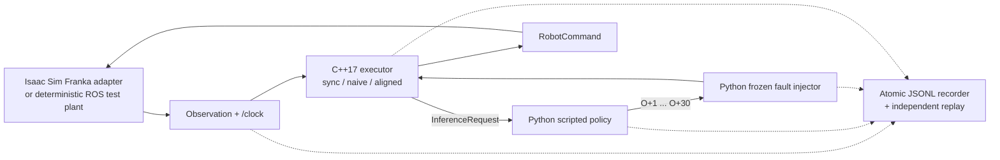
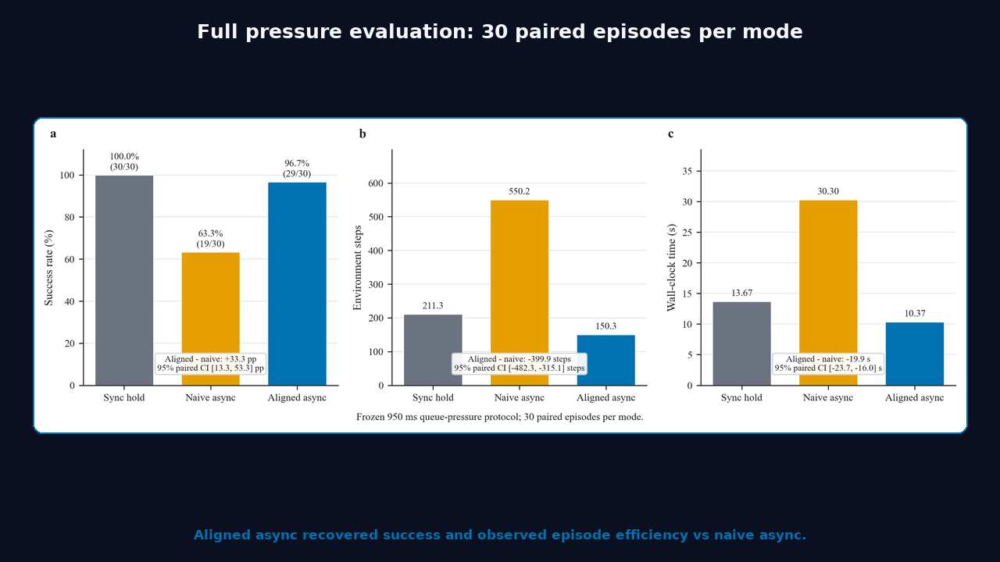

# ActionStream

ActionStream is a minimal closed-loop LIBERO benchmark for a frozen
[`lerobot/xvla-libero`](https://huggingface.co/lerobot/xvla-libero) policy. It
tests whether compensating for observation age when an asynchronous action
chunk arrives is safer and more efficient than replacing the queue with the
entire stale chunk.

## M7-G0: ROS 2 / Isaac Sim runtime integration — NO-GO

M7 adds a mixed C++17/Python ROS 2 Jazzy runtime and an official Isaac Sim
6.0.1 Franka adapter. The implementation is auditable and the native end-to-end
path runs, but the predeclared reliability hypothesis did not pass: on the
frozen 36-seed Profile B ROS test-plant holdout, `naive_async` and
`aligned_async` both succeeded 36/36. Their paired difference is 0.0 percentage
points (95% paired-bootstrap CI [0.0, 0.0]). A bounded policy-driven Isaac run
also reached step 180 without lifting the object. M7 is therefore **NO-GO**, not
an Isaac task-success or production-readiness claim.

The failure mode is temporal, not a policy-learning problem. A reasonable
naive asynchronous queue executes chunks in response-arrival order, so source
actions can be applied at later actual timesteps. Aligned execution retains the
explicit source observation and target step, removes the expired prefix,
rejects stale episodes/generations/plans, and atomically rebuilds the executable
queue. No model was trained for M7.



The five packages are `action_stream_msgs`, `action_stream_policy`,
`action_stream_executor`, `action_stream_benchmark`, and
`action_stream_isaac`. C++ owns the thread-safe strategy state machines,
freshness ordering, queue mutation, command selection, and diagnostics. Python
owns the deterministic policy, simulator glue, fault traces, orchestration,
atomic recording, replay, statistics, and plotting. The executor uses explicit
callback groups under a ROS `MultiThreadedExecutor`; observation callbacks do
not wait for inference.

### Frozen M7 contract

- Observation `O` is the last completed 20 Hz control step. Every returned
  30-action chunk explicitly targets `O+1` through `O+30`.
- Final commands are absolute seven-vectors
  `[x, y, z, axis-angle x, axis-angle y, axis-angle z, gripper]`, with exactly
  `+1` open and `-1` closed.
- `generation_id` is an invalidation epoch, not a request ID. Within one
  generation, plan freshness is ordered lexicographically by
  `(source_observation_step, request_id)`.
- A target is expired if it precedes insertion or has already executed. The
  first duplicate target in a chunk wins; aligned queue replacement is atomic.
- The deterministic reach/lift task requires a grasped object at least 0.12 m
  above its initial height for 20 consecutive steps, with a 180-step limit.
- Profile A is fixed 950 ms latency. Frozen Profile B is 900 ms base,
  +/-250 ms jitter, 5% drops, 12% additional 1000 ms delay, 2% duplicates, and
  5% 300 ms communication pauses. Eight development seeds and 36 disjoint
  holdout seeds are version controlled. One bounded Profile B adjustment was
  made on development data before the holdout lock; none followed.

### Frozen holdout results (`ros_cpp_test_plant`)

| Profile | Method | Success | Median steps | Median wall time | Mean hold time |
|---|---|---:|---:|---:|---:|
| A | `sync_hold` | 36/36 | 47 | 4.350 s | 1.908 s |
| A | `naive_async` | 36/36 | 88 | 5.956 s | 0.000 s |
| A | `aligned_async` | 36/36 | 57 | 4.456 s | 0.000 s |
| B | `sync_hold` | 34/36 | 47 | 4.375 s | 2.800 s |
| B | `naive_async` | 36/36 | 88 | 5.708 s | 0.125 s |
| B | `aligned_async` | 36/36 | 57 | 4.262 s | 0.318 s |

Profile A was fully saturated and did not reproduce the historical success
separation. On Profile B, aligned reduced hold time 88.6% versus sync and used
31 fewer median steps than naive, but it did not improve reliability over
naive. The primary gate failed its >=20 point success and positive-CI
conditions; the >=50% hold-reduction and semantic/replay conditions passed.
Strong GO was ineligible, and aligned reduced median wall time only 2.6% versus
sync rather than the required 20%.

Independent replay passed 216/216 episodes with matching metrics and zero
aligned invariant violations. The deliberately naive baseline executed 3,857
expired source actions across the matrix; aligned executed none and removed
3,937 expired actions before queue installation. All 72 seed/profile blocks
used one identical pre-generated trace across the three methods.

The official native Windows path passed the Isaac 6.0.1 compatibility check,
loaded the shipped experimental Franka API, enabled `isaacsim.ros2.bridge`
before importing `rclpy`, and exchanged custom messages with the native C++
executor. The single aligned Profile A policy episode was replay-clean but
failed the task: 0/1 success, 180 steps, 18 requests, 165 executed policy
actions, and 0.75 s hold time. It is integration evidence, not a paired Isaac
benchmark.

### Reproduce and inspect M7

From PowerShell with Docker available, one command creates a fresh output root,
builds the pinned ROS image if needed, runs all 216 test-plant episodes, replays
them, analyzes 20,000 paired bootstrap samples, and writes three PNG/PDF figure
pairs:

```powershell
.\scripts\m7_run_ros_holdout.ps1 `
  -OutputSubdirectory outputs/m7_g0/reproductions/ros_holdout_001
```

Native Isaac build, launch, policy-smoke, and recording commands are pinned in
[`docs/m7_environment.md`](docs/m7_environment.md); the architecture and timing
contract are in [`docs/m7_architecture.md`](docs/m7_architecture.md). A bounded
visual safe-hold MP4 can be recorded with:

```powershell
.\scripts\m7_record_demo.ps1
```

The script refuses overwrite/stale frame reuse, captures one framed viewport
image per 20 Hz control tick, encodes H.264 at 1280x720/20 fps, verifies the
non-empty MP4, and stops its owned process tree. `-Headless` is supported; the
default output is ignored `outputs/m7_g0/demo/<episode>.mp4`. The validated
recording audit is
[`demo_capture_validation.json`](outputs/m7_g0/audit/demo_capture_validation.json).

Evidence: [holdout manifest](outputs/m7_g0/holdout/manifest.json),
[paired analysis](outputs/m7_g0/holdout/analysis.json),
[independent replay](outputs/m7_g0/holdout/replay_validation.json),
[Isaac episode summary](outputs/m7_g0/isaac_smoke/aligned_async.summary.json),
[Isaac replay audit](outputs/m7_g0/isaac_smoke/aligned_async.audit.json), and
[result figures](outputs/m7_g0/figures/README.md).

Limitations: the paired matrix uses a deterministic ROS test plant rather than
Isaac physics; the one Isaac task episode failed; standalone pre-Kit Windows
`rclpy`/`ros2` CLI loading remains blocked, so no rosbag was captured; the
validated video path is only a safe-hold demo and no video is used as benchmark
evidence; the policy is scripted; only one reach/lift task and two fault
profiles were tested; stale-generation execution is covered by deterministic
tests but no generation transition occurred in the holdout; this is neither
real-robot nor hard-real-time validation.

M4 extends the completed 0/200 ms matrix into a calibrated 950 ms
queue-pressure regime. Against naive asynchronous replacement at that pressure,
alignment improved paired success by 0.333 (95% bootstrap CI 0.133 to 0.533)
and substantially reduced environment steps and wall time. The full hypothesis
is still not supported: alignment produced 14.867 more queue-hold steps per
episode than naive (95% CI 9.533 to 24.400), so the predicted underrun reduction
is contradicted in this regime. No fully stale chunk occurred, leaving that
boundary untested. Aligned async succeeded in 29/30 pressure episodes, with one
task-1 failure.

## v1.0.0 release



- [Watch the 38-second captioned demonstration](release/v1.0.0/media/actionstream_v1_demo.mp4).
- Core figures:
  [M4 pressure headline](release/v1.0.0/figures/m4_pressure_headline.pdf),
  [M3 paired latency effects](release/v1.0.0/figures/m3_latency_effects.pdf),
  and
  [queue-pressure calibration](release/v1.0.0/figures/queue_pressure_calibration.pdf).
- [Machine-readable release summary](release/v1.0.0/evidence_summary.json) and
  [asset manifest](release/v1.0.0/asset_manifest.json).
- [Release notes](release/v1.0.0/RELEASE_NOTES.md) and
  [third-party provenance](THIRD_PARTY_NOTICES.md).

Regenerate and verify the release layer without running the benchmark:

```bash
python -m pip install -r requirements-release.txt
python scripts/release/generate_figures.py
python scripts/release/generate_release_summary.py
python scripts/release/generate_demo_video.py
python scripts/release/verify_release.py
```

The generated assets read the frozen evidence but never invoke the benchmark
runtime or write under `outputs/`. Recorded outputs retain capture-time paths as
provenance instead of rewriting historical evidence. In particular, frozen
M3/M4 paths remain byte-for-byte unchanged because their source files are part
of the validated SHA-256 chain. Portable validators resolve trace files by
condition directory and filename rather than depending on recorded host paths.

## Hypothesis

For a frozen X-VLA policy, dropping the stale prefix of a newly generated
action chunk according to the age of its source observation will reduce queue
underruns and preserve task success better than synchronous execution and
naive asynchronous chunk replacement.

## Frozen protocol

- Suite: `libero_object`; task IDs `0,1,2`.
- Ten episodes per task and condition, with initial-state indices
  `0,2,...,18` and paired policy/environment seeds `142,...,151`.
- Absolute control, episode length 800, batch size 1.
- X-VLA checkpoint revision
  `12e8783e996944f5c97e490d37d4c145484ed70a`.
- Checkpoint defaults: `chunk_size=30`, `n_action_steps=30`; the official
  baseline has no `n_action_steps` override.
- LIBERO reports a 20 Hz controller frequency. M3 uses monotonic-clock pacing
  and records coalesced whole missed ticks and dispatch lateness.
- Async modes request a new chunk every 10 executed control steps. Sync is the
  parity runner and consumes each 30-step chunk before replanning.
- One persistent local inference worker; at most one inference call is in
  flight. Pending observations are coalesced to the latest request.
- Injected delay is scheduled after inference and does not occupy the worker.
  The full matrix uses 0 and 200 ms; 100 and 300 ms are configurable.
- The policy, processors, environments, action queue, worker counters, and all
  Python/NumPy/Torch RNGs are reset at episode boundaries. No training,
  fine-tuning, demonstrations, RPC, or upstream LeRobot patch is used.

The three modes are:

1. `sync`: infer a 30-action chunk on the control thread, wait for optional
   delivery delay, then execute the complete chunk.
2. `async_naive`: infer from the latest requested observation in the
   background and replace the pending queue with the complete returned chunk.
3. `async_aligned`: compute
   `age_steps = current_control_step - observation_control_step`, drop that
   many actions, and replace the queue with the remainder. A chunk whose age
   is at least 30 steps is discarded as fully stale.

Before the first asynchronous result, the environment waits. If a queue later
underruns, it repeats the last finite, nonzero, final 7D absolute command; an
all-zero absolute hold is rejected.

## Processor and action contract

The custom runner reuses the public LeRobot 0.6.0 environment and checkpoint
processor factories in evaluator order:

```text
preprocess_observation
-> task-description insertion
-> X-VLA LIBERO environment preprocessor
-> checkpoint policy preprocessor
-> predict_action_chunk()
-> checkpoint policy postprocessor, once per time step
-> X-VLA LIBERO environment postprocessor, once per time step
```

The model emits finite `[1,30,20]` `float32` actions. Official postprocessing
converts each time step to a finite `[1,7]` LIBERO absolute action, producing a
final `[1,30,7]` chunk. Only these final 7D commands enter the external queue.
Image rotation/normalization, `domain_id`, state conversion, 6D rotation
conversion, and 20D-to-7D conversion are therefore not reimplemented here.

## Environment and commands

The measured environment was Ubuntu 24.04.4 under WSL2, Python 3.12.3,
LeRobot 0.6.0, PyTorch 2.11.0+cu130, CUDA runtime 13.0, and an NVIDIA RTX 4090
with 24,563.5 MiB VRAM. ActionStream uses an isolated canonical hf-libero
configuration at `$HOME/.cache/actionstream/libero-config` so an unrelated
global LIBERO checkout cannot affect the tasks or initial states.

Run from the repository root in Linux. On this machine, enter the intended WSL
distribution explicitly because `docker-desktop` is the Windows default:

```bash
wsl.exe -d Ubuntu-24.04
git clone https://github.com/Yanagisawa2002/ActionStream.git
cd ActionStream
```

Bootstrap or verify the pinned environment. Preserve the checked-in evidence
by selecting a fresh output root, then execute the gates in order:

```bash
bash scripts/bootstrap_wsl.sh
export ACTIONSTREAM_OUTPUT_ROOT="$PWD/reproduced_outputs"

bash scripts/run_preflight.sh
bash scripts/run_official_smoke.sh
bash scripts/run_official_baseline.sh
bash scripts/run_custom_sync_smoke.sh
bash scripts/run_custom_sync_parity.sh
bash scripts/run_m3_smoke.sh
bash scripts/run_m3_matrix.sh

$HOME/.venvs/actionstream/bin/python -m actionstream.results \
  "$ACTIONSTREAM_OUTPUT_ROOT"/m3/*/episodes.jsonl \
  --output-dir "$ACTIONSTREAM_OUTPUT_ROOT/summary"

$HOME/.venvs/actionstream/bin/python -m pytest
$HOME/.venvs/actionstream/bin/python -m compileall -q src tests
$HOME/.local/bin/uv pip check \
  --python $HOME/.venvs/actionstream/bin/python
```

The gate scripts create the official and custom-parity manifests after their
evaluations pass. The benchmark refuses to overwrite episode JSONL, and
`ACTIONSTREAM_OUTPUT_ROOT` makes a repeat run independent of the checked-in
evidence. To run the two additional configured delay levels:

```bash
ACTIONSTREAM_OUTPUT_ROOT="$PWD/delay_sweep_outputs" \
ACTIONSTREAM_DELAYS_MS="0 100 200 300" \
  bash scripts/run_m3_matrix.sh
```

## Gate results

| Gate | Result | Evidence |
|---|---|---|
| M0 preflight | Passed | Canonical environment reset/step, official model/processors loaded, raw and final action contracts verified |
| M1 official baseline | Passed | 30/30 overall; task 0: 10/10, task 1: 10/10, task 2: 10/10 |
| M2 custom sync parity | Passed | 30/30 versus official 30/30; absolute difference 0, allowed difference 2 |
| M3 local executor | Passed | Six fixed conditions, 180/180 successful episodes, 180 traces and 29,073 final 7D actions validated |

M0 measured a 1.231 s first CUDA inference and 3,524.0 MiB peak allocated
VRAM after model load. Across M3, steady-state median peak allocation was
3,522.0-3,522.6 MiB. Each fresh condition process had a first-episode CUDA
warm-up peak of 12,252.0 MiB; later episodes returned to about 3.5 GiB.
The evidence does not isolate which CUDA subsystem requested that transient
workspace. The official 30-episode baseline took 563.61 s total
(18.79 s/episode).

## M3 aggregate results

Values are means across the same 30 paired episodes. `infer` is pure model
latency; `delivery` includes inference, scheduling, and injected delay.

| mode | delay | success | steps mean +/- sd | wall mean | infer p50 / p95 | delivery p50 / p95 | holds | stale prefix mean / max |
|---|---:|---:|---:|---:|---:|---:|---:|---:|
| `sync` | 0 ms | 30/30 | 126.9 +/- 11.9 | 8.83 s | 0.112 / 0.332 s | 0.151 / 0.379 s | 0 | 0 / 0 |
| `async_naive` | 0 ms | 30/30 | 189.7 +/- 19.8 | 11.95 s | 0.113 / 0.175 s | 0.128 / 0.192 s | 0 | 0 / 0 |
| `async_aligned` | 0 ms | 30/30 | 136.6 +/- 13.0 | 9.23 s | 0.115 / 0.236 s | 0.131 / 0.255 s | 0 | 2.57 / 3 |
| `sync` | 200 ms | 30/30 | 126.9 +/- 11.9 | 10.43 s | 0.210 / 0.321 s | 0.490 / 0.624 s | 0 | 0 / 0 |
| `async_naive` | 200 ms | 30/30 | 246.3 +/- 26.6 | 15.22 s | 0.239 / 0.260 s | 0.452 / 0.477 s | 0 | 0 / 0 |
| `async_aligned` | 200 ms | 30/30 | 142.7 +/- 54.9 | 10.08 s | 0.244 / 0.400 s | 0.457 / 0.615 s | 0 | 8.11 / 10 |

Paired aligned-versus-naive results:

- At 0 ms, alignment reduced environment steps by 53.1
  (95% paired bootstrap CI 50.0 to 56.3), or 28.0%, and wall time by 2.71 s
  (22.7%). It won all 30 step-count pairs.
- At 200 ms, alignment reduced environment steps by 103.5
  (95% CI 79.9 to 118.7), or 42.0%, and wall time by 5.14 s (33.8%). It won
  29 of 30 step-count pairs.
- Against sync, alignment used 9.7 more steps at 0 ms and 15.8 more at 200 ms
  on average. Thus this result supports stale-prefix alignment over naive
  async replacement, not superiority over synchronous execution.

Two aligned-200 ms task-1 trajectories account for much of its variance:
initial-state 8/seed 146 took 204 steps and initial-state 16/seed 150 took 417
steps. Both succeeded. Their inference and delivery medians were normal,
with zero holds, fully stale chunks, request replacements, or cross-episode
leaks. Trace-only inspection suggests repeated gripper-sign changes clustered
near queue replacements, especially in the 417-step trajectory; without video
this is a diagnostic clue, not a scene-level causal claim. The events and
action traces are retained rather than filtered.

## Evidence

- [M0 preflight](outputs/preflight/preflight.json)
- [M1 official manifest](outputs/xvla_baseline/manifest.json)
- [M2 parity manifest](outputs/custom_sync_parity/manifest.json)
- [Final M3 aggregate report](outputs/summary/summary.md)
- [Final M3 machine-readable summary](outputs/summary/summary.json)
- [Final M3 validation manifest](outputs/summary/manifest.json)
- Episode rows: `outputs/m3/<mode>_delay<ms>/episodes.jsonl`
- Per-step action/timing traces:
  `outputs/m3/<mode>_delay<ms>/traces/*.npz`

Only `outputs/m3` and `outputs/summary` are final M3 evidence. Directories with
`pre_fixes`, `pre_rng`, `pre_math`, or `pre_persistent_worker` in their names
are intentionally preserved development evidence and must not be pooled with
the final matrix.

## M3 limitations that motivated M4

The following was the M3 conclusion and motivation for the M4 evaluation
reported below.

The primary unresolved limitation is task/delay saturation: every condition
succeeded and the 30-action queue absorbed the tested inference and delivery
latencies without an underrun or fully stale chunk. The benchmark therefore
exercised alignment but not its intended safety boundary. The 20 Hz controller
was also paced in a WSL-hosted simulator rather than a hard real-time system;
missed ticks and lateness are measurements, not real-time guarantees.

The next justified step is a preregistered stress sweep that keeps the frozen
policy, tasks, states, and seeds fixed while running the already-supported
100/300 ms delays and a smaller queue/replan headroom chosen to produce some
underruns without changing model actions. That directly tests the still-open
queue-underrun and success-preservation claims before adding more tasks or
models.

## M4 paired statistical hardening of M3

M4 treats the episode—not the 29,073 individual actions—as the statistical
unit. Episodes are paired by task, episode/initial-state index, and seed. Every
confidence interval below uses 10,000 paired bootstrap resamples with fixed
seed `20260730`; differences are estimate minus reference.

| Comparison | Metric | Paired difference [95% CI] |
|---|---|---:|
| aligned − naive, 0 ms | Environment steps | -53.100 [-56.367, -50.067] |
| aligned − naive, 0 ms | Wall time | -2.712 s [-2.921, -2.511] |
| aligned − naive, 200 ms | Environment steps | -103.533 [-118.833, -79.999] |
| aligned − naive, 200 ms | Wall time | -5.142 s [-6.232, -3.679] |
| aligned − blocking sync, 0 ms | Environment steps | +9.700 [7.933, 11.667] |
| aligned − blocking sync, 200 ms | Environment steps | +15.833 [3.100, 37.967] |
| naive, 200 − 0 ms | Environment steps | +56.567 [53.367, 59.633] |
| aligned, 200 − 0 ms | Environment steps | +6.133 [-6.400, 28.168] |

All M3 success differences remain exactly zero because every M3 episode
succeeded. This is a success-rate ceiling, not evidence of equal robustness.
The historical M3 traces also lack explicit accepted-chunk replacement
indices, so M3 replacement-boundary position, rotation, and gripper metrics
were not reconstructed.

## M4 blocking sync versus `sync_hold`

Historical `sync` is a blocking evaluator baseline: inference and injected
delay stop simulator progress. `sync_hold` instead waits for the first valid
chunk without stepping, executes that full chunk, and then keeps the 20 Hz
control loop and simulator advancing while the next inference is pending by
repeating the last finite environment-ready 7D absolute command. Every such
repeated step is a queue hold.

| Mode | Delay | Success | Steps mean / median | Wall mean | Holds mean / median | Delivery age mean / median | Fully stale |
|---|---:|---:|---:|---:|---:|---:|---:|
| `sync_hold` | 0 ms | 30/30 | 138.3 / 135.0 | 8.90 s | 12.30 / 13.0 | 3.19 / 3.16 steps | 0 |
| `sync_hold` | 200 ms | 30/30 | 156.0 / 155.5 | 9.93 s | 29.53 / 31.0 | 8.17 / 8.00 steps | 0 |

Paired 200-minus-0 ms effects for `sync_hold` were +17.700 environment steps
(95% CI 16.533 to 18.900), +1.030 s wall time (0.951 to 1.109), and +17.233
hold steps (16.333 to 18.100), with no success change. Thus blocking simulation
time and real-time control holds are empirically different quantities.

## M4 queue-pressure calibration

The queue headroom was derived from the runtime configuration, not hardcoded:
`chunk_size - replan_interval = 30 - 10 = 20` steps. The measured M3 control
step was 52.75 ms at the median and 62.04 ms at p95, giving 1.055 s of nominal
headroom at the median step. Model inference was 188 ms at the median and
262 ms at p95. Median observation-to-delivery latency was 129 ms at 0 ms
injected delay and 456 ms at 200 ms.

The task-3 calibration used three fixed states for both async modes:

| Target headroom | Delay | Predicted age | Measured pooled median age | Hold steps | Fully stale | Pressure? |
|---:|---:|---:|---:|---:|---:|---|
| 0.50× | 400 ms | 10.02 steps | 10.44 steps | 0 | 0 | No |
| 0.75× | 650 ms | 14.76 steps | 15.49 steps | 0 | 0 | No |
| 1.00× | 950 ms | 20.45 steps | 21.51 steps | 42 | 0 | Yes |
| 1.20× | 1150 ms | 24.24 steps | 25.42 steps | 574 | 0 | Yes |

The frozen rule selected the smallest tested delay whose pooled median delivery
age reached the 20-step headroom or produced a hold or fully stale chunk:
**950 ms**. The configured 300 ms point was excluded because its predicted
delivery age was only 8.13 steps and a derived candidate was closer to each
target. The one-time 1450 ms extension was not needed.

## M4 full 950 ms pressure result

The full pressure matrix uses the original paired task IDs, states, and seeds:

| Mode | Success | Steps mean / median | Wall mean | Holds mean / median | Delivery age mean / median | Incoming stale fraction | Fully stale |
|---|---:|---:|---:|---:|---:|---:|---:|
| `sync_hold` | 30/30 | 211.3 / 213.0 | 13.67 s | 84.87 / 87.5 | 24.13 / 24.04 steps | 0.000 | 0 |
| `async_naive` | 19/30 | 550.2 / 439.5 | 30.30 s | 1.50 / 1.0 | 21.10 / 21.06 steps | 0.000 | 0 |
| `async_aligned` | 29/30 | 150.3 / 128.0 | 10.37 s | 16.37 / 12.5 | 20.96 / 20.95 steps | 0.644 | 0 |

Against naive async, aligned async had:

- A paired success gain of **+0.333** (95% CI **0.133 to 0.533**).
- 399.900 fewer environment steps (CI 315.066 to 482.336 fewer) and
  19.926 s less wall time (CI 16.034 to 23.672 s less).
- **14.867 more hold steps** (CI **9.533 to 24.400 more**). This directly
  contradicts the hypothesis that stale-prefix alignment reduces underruns
  relative to naive replacement at the selected pressure point.
- Lower adjacent-action discontinuity by 0.110 (CI 0.065 to 0.157), lower
  replacement position jump by 0.0326 (CI 0.0217 to 0.0402), lower replacement
  rotation jump by 0.0346 radians (CI 0.0259 to 0.0433), and 9.767 fewer
  replacement gripper switches (CI 4.767 to 14.401).

Against `sync_hold`, aligned async used 61.000 fewer steps
(CI 12.533 to 87.200 fewer), 3.304 s less wall time
(CI 0.957 to 4.589 s less), and 68.500 fewer holds
(CI 57.099 to 75.833 fewer). Its success difference was -0.033
(CI -0.100 to 0.000): `sync_hold` succeeded 30/30, while aligned succeeded
29/30.

The primary step/time effects include 11 naive and one aligned 800-step
timeout endpoints. As a post-hoc sensitivity check, the 18 pairs where both
modes succeeded still favored alignment by 274.8 steps and 14.39 s on average;
this outcome-conditioned subset is diagnostic rather than the primary
estimate.

### Task-level heterogeneity

| Task | Naive → aligned success | Paired success difference [95% CI] | Step difference [95% CI] | Hold difference [95% CI] |
|---:|---:|---:|---:|---:|
| 0 | 5/10 → 10/10 | +0.500 [0.200, 0.800] | -481.3 [-595.4, -364.9] | +11.7 [10.7, 13.0] |
| 1 | 8/10 → 9/10 | +0.100 [-0.200, 0.400] | -280.6 [-424.2, -121.2] | +26.3 [12.8, 52.5] |
| 2 | 6/10 → 10/10 | +0.400 [0.100, 0.700] | -437.8 [-562.6, -312.8] | +6.6 [5.4, 7.8] |

The sole aligned failure was task 1, episode 8, initial-state index 16,
seed 150. It reached the 800-step limit with 144 holds. The task-1 success
effect crosses zero, and its hold penalty is substantially larger than on
tasks 0 and 2.

## M4 claim status

Supported:

- **Success preservation versus naive async under selected pressure:** aligned
  succeeded 29/30 versus 19/30, with paired CI excluding zero.
- **Efficiency:** aligned reduced steps and wall time versus both naive async
  and `sync_hold` at 950 ms; the paired CIs exclude zero.
- **Smoother action sequences and accepted replacement boundaries versus
  naive:** the episode-level paired adjacent-action, position-jump,
  rotation-jump, and gripper-switch effects all favor alignment.
- **A genuine pressure point:** 950 ms exceeded measured queue headroom and
  produced holds in calibration and full evaluation.

Contradicted or unsupported:

- **Reduced underruns versus naive async:** contradicted for queue holds.
  Aligned incurred significantly more holds than naive at 950 ms.
- **The original cross-comparator underrun claim:** not supported as stated
  because the evidence is mixed by comparator; aligned had more holds than
  naive but 68.500 fewer than `sync_hold` (CI 57.099 to 75.833 fewer).
- **Success superiority over `sync_hold`:** unsupported; `sync_hold` was 30/30
  and aligned was 29/30.
- **Equal robustness at 0/200 ms:** unsupported because M3 success was
  ceilinged.

Still untested:

- **Fully stale chunk handling:** no fully stale chunk occurred in calibration
  or the full pressure matrix, despite the 950/1150 ms pressure conditions.
- Generalization beyond the frozen X-VLA checkpoint, three evaluated pressure
  tasks, fixed initial states, LIBERO simulation, WSL-hosted pacing, and the
  tested hardware.
- Scene-level causality for the task-1 aligned failure; the logged trajectory
  identifies the episode but does not replace video or physical diagnosis.

## M4 commands

After reproducing M0-M3 above, continue with the same independent output root:

```bash
export ACTIONSTREAM_OUTPUT_ROOT="$PWD/reproduced_outputs"
VENV="$HOME/.venvs/actionstream"

"$VENV/bin/python" -m actionstream.m4_analysis \
  "$ACTIONSTREAM_OUTPUT_ROOT"/m3/*/episodes.jsonl \
  --output-dir "$ACTIONSTREAM_OUTPUT_ROOT/m4/paired_m3"

bash scripts/run_m4_sync_hold.sh
bash scripts/run_m4_calibration.sh
bash scripts/run_m4_pressure.sh

"$VENV/bin/python" -m actionstream.m4_report \
  --m3-paired "$ACTIONSTREAM_OUTPUT_ROOT/m4/paired_m3/paired_analysis.json" \
  --sync-hold "$ACTIONSTREAM_OUTPUT_ROOT"/m4/sync_hold/*/episodes.jsonl \
  --calibration-plan \
    "$ACTIONSTREAM_OUTPUT_ROOT/m4/calibration/calibration_plan.json" \
  --calibration-selection \
    "$ACTIONSTREAM_OUTPUT_ROOT/m4/calibration/selection.json" \
  --calibration-runs \
    "$ACTIONSTREAM_OUTPUT_ROOT"/m4/calibration/runs/*/episodes.jsonl \
  --pressure "$ACTIONSTREAM_OUTPUT_ROOT"/m4/pressure/*/episodes.jsonl \
  --output-dir "$ACTIONSTREAM_OUTPUT_ROOT/m4/report"

"$VENV/bin/python" -m pytest
"$VENV/bin/python" -m compileall -q src tests
```

The M4 scripts refuse to overwrite existing episode JSONL. The calibration
script freezes its plan before running candidates, records the selection before
the full pressure matrix, and extends at most once only if the initial
candidates fail to create pressure.

## M4 evidence

- [Paired M3 statistical report](outputs/m4/paired_m3/paired_analysis.md)
- [Paired M3 machine-readable evidence](outputs/m4/paired_m3/paired_analysis.json)
- [Calibration plan](outputs/m4/calibration/calibration_plan.json)
- [Frozen pressure selection](outputs/m4/calibration/selection.json)
- [Final M4 report](outputs/m4/report/m4_report.md)
- [Final M4 machine-readable report](outputs/m4/report/m4_report.json)
- `sync_hold` episode rows and traces:
  `outputs/m4/sync_hold/<mode>_delay<ms>/`
- Calibration episode rows and traces:
  `outputs/m4/calibration/runs/<mode>_delay<ms>/`
- Full pressure episode rows and traces:
  `outputs/m4/pressure/<mode>_delay950/`

The final M4 validator covers 60 `sync_hold` episodes and traces, 24
calibration episodes and traces, and 90 pressure episodes and traces. It
validates exact matrix coverage, finite nonzero 7D actions, telemetry lengths
and counts, commit/model consistency, and pressure-selection provenance.

## M5-G0 oracle scene-shift gate

M5-G0 tests a different failure mode from M4. M4's stale-prefix alignment
compensates for delivery age while the scene is unchanged; M5-G0 physically
moves a normally stationary, task-critical entity while a policy result is in
flight. An independent oracle detector reads only the entity pose, invalidates
queued and late-arriving actions generated from the old scene epoch, holds a
finite environment-ready action while the queue is empty, and requests a fresh
chunk. The perturbation flag and evaluator-only `world_epoch` are not visible
to the detector.

The primary candidate is LIBERO Object task 0, “pick up the alphabet soup and
place it in the basket.” The manipulated object remains `alphabet_soup_1`; the
moved entity is the normally stationary `basket_1` body
`basket_1_main`/free joint `basket_1_joint0`. Task 2, which places the salad
dressing in the same basket, is the single permitted backup. The predeclared
shift translates the basket along negative x during the first replenishment
request with a non-empty queue. Static audit covered both tasks, 20 initial
states, both x directions, and 30/50/70 mm: all 120 configurations met the
declared workspace, displacement, and non-floor-collision checks.

### M5-G0 calibration result

Five immutable seed/state pairs were run once for each condition and tested
magnitude. Every perturbation was physically valid and every aligned/gated
pair used the same shift step and displacement.

| Task | Shift | Aligned success | Oracle-gated success | Gate-only success |
|---:|---:|---:|---:|---:|
| 0 | 50 mm | 5/5 | 3/5 | 0/5 |
| 0 | 30 mm | 5/5 | 2/5 | 0/5 |
| 2 | 50 mm | 2/5 | 3/5 | 1/5 |
| 2 | 30 mm | 5/5 | 2/5 | 0/5 |

The frozen challenge rule required gated success of at least 4/5, aligned
success of at most 3/5, and at least two gate-only successes. No candidate and
magnitude qualified, so no displacement was selected. The protocol therefore
froze `calibration_no_go` and `sealed_permitted=false`. Per the hard-stop rule,
the 10-pair no-shift control and 30-pair sealed evaluation were not run.
McNemar and paired-bootstrap sealed estimates are consequently unavailable,
not zero. The predeclared final classification is **NO-GO**.

A calibration-only mechanism diagnostic is retained but is not treated as a
sealed estimate: aligned executed 405 actions from the pre-shift world epoch,
whereas the gated runtime executed zero. The gated traces contain 85 independent
pose-change triggers: 20 at the scripted shift and 65 later, from steps
106–778, when the dynamic basket again moved relative to newly captured pose
references. Those later changes are not duplicate firings on the unchanged
scripted pose, but they show that the receptacle does not remain stationary
throughout task interaction and contributed 868 gate-hold steps. This overhead
and the lower gated calibration success are material limitations of the
candidate, not grounds for retuning it.

The formal run used the unchanged M4 settings (950 ms injected delay, 20 Hz,
30-action chunks, replanning every 10 control steps, and an 800-step episode
limit), the frozen X-VLA revision above, and starting commit
`0a2412625b858af8d507be6650612b13a28b91a5`. The fresh M4 task-0 smoke
succeeded in 143 steps. Formal producer source hash
`fc920da5221cbe7d7039fc87512b6757fd476ba33a92535f2fb63d42a3d6fd35`
binds the 40 calibration episodes.

After calibration had hard-stopped, downstream-only reporting defects were
found: the validator checked an absent M4 field named `condition` instead of
the recorded `runtime_mode`; the shell driver supplied inconsistent no-go
wording and omitted the report's explicit M4 flag; and the paper-style
Markdown omitted the calibration table and source-drift disclosure. Only
`src/actionstream/m5_validation.py`, `src/actionstream/m5_report.py`, and the
post-calibration reporting portion of `scripts/run_m5_g0.sh` were corrected.
No benchmark runtime, detector, calibration/selection logic, raw evidence,
seed, or outcome changed, and no seed was rerun. The formal validation artifact
records both frozen and current hashes for this disclosed source drift.

### M5-G0 commands and evidence

Run the smoke path or a full reproduction from the repository root in the
pinned WSL environment. Use a fresh output root so the checked-in formal
evidence remains immutable:

```bash
export ACTIONSTREAM_OUTPUT_ROOT="$PWD/reproduced_outputs"
export ACTIONSTREAM_VENV="$HOME/.venvs/actionstream"

bash scripts/run_m5_g0_smoke.sh
bash scripts/run_m5_g0.sh
```

The full driver performs task/magnitude calibration in the frozen order and
automatically stops before no-shift/sealed evaluation when calibration is a
no-go. It writes transactional per-episode bundles, JSONL aggregates,
run/attempt manifests, exact request/action/event provenance, source hashes,
formal validation, statistics, Markdown, and PNG/PDF figures.

- [Task/entity and perturbation audit](outputs/m5_g0/audit/task_entity_audit.md)
- [Frozen protocol decision](outputs/m5_g0/protocol/frozen_experiment.json)
- [Formal M5-G0 report](outputs/m5_g0/report/m5_g0_report.md)
- [Machine-readable aggregate](outputs/m5_g0/report/aggregate_summary.json)
- [Acceptance decision](outputs/m5_g0/report/acceptance.json)
- [Formal evidence validation](outputs/m5_g0/report/formal_validation.json)
- Calibration raw evidence:
  `outputs/m5_g0/calibration/task{0,2}/magnitude{50,30}/`

## M6-G0 LeRobot async-runtime audit

M6-G0 is a CPU-only, synthetic pre-hardware gate. It compares the fixed
ActionStream stale-prefix rule with every registered ACT-compatible
aggregation behavior in official LeRobot at commit
`62600065cdb349c1e41b0403c511f12ebfa686eb` (source/package version `0.6.1`).
The adapter calls the frozen upstream `PolicyServer._time_action_chunk` and
`RobotClient._aggregate_action_queues` methods directly. It does not train a
policy, use a GPU, or control a robot.

Clone the exact upstream source into the ignored audit directory and install it
in an isolated environment. Use a fully resolved LeRobot environment for a
fresh physical deployment; the checked-in
[`pinned_upstream.json`](outputs/m6_g0/upstream/pinned_upstream.json) records
the exact CPU-only environment used for the formal source/queue audit.

```powershell
git clone https://github.com/huggingface/lerobot.git .external/lerobot
git -C .external/lerobot checkout 62600065cdb349c1e41b0403c511f12ebfa686eb

py -3.12 -m venv .external/m6_venv
.\.external\m6_venv\Scripts\python.exe -m pip install --upgrade pip
.\.external\m6_venv\Scripts\python.exe -m pip install `
  torch==2.7.1 torchvision==0.22.1 `
  --index-url https://download.pytorch.org/whl/cpu
.\.external\m6_venv\Scripts\python.exe -m pip install `
  -e .external/lerobot pytest matplotlib transformers grpcio protobuf

$env:PYTHONPATH=(Resolve-Path src).Path
.\.external\m6_venv\Scripts\python.exe -m pytest `
  tests/test_m6_conformance.py tests/test_m6_report.py -q

.\.external\m6_venv\Scripts\python.exe -m actionstream.m6_conformance `
  --manifest configs/m6_g0.json `
  --lerobot-root .external/lerobot `
  --output-root outputs/m6_g0

.\.external\m6_venv\Scripts\python.exe -m actionstream.m6_report `
  --manifest configs/m6_g0.json `
  --lerobot-root .external/lerobot `
  --output-root outputs/m6_g0
```

The frozen matrix uses a 12-action horizon at 20 Hz, seven latency families,
four deterministic traces for fixed cases, 50 seeded traces for bounded
jitter, six runtimes, and identical request/chunk inputs. ActionStream removed
all stale-prefix execution and improved temporal error, but its queue-underrun
worsening reached 47.92 percentage points in the fully stale family and 29.17
points in the out-of-order family. This fails the predeclared 5-point gate, so
the final M6-G0 classification is **NO-GO** and the recommended next step is
**termination of this direction**.

- [Paper-style M6-G0 report](outputs/m6_g0/report/m6_g0_report.md)
- [Source-level semantic crosswalk](outputs/m6_g0/report/source_semantic_crosswalk.md)
- [SO-101 + ACT portability audit](outputs/m6_g0/report/portability_audit.md)
- [Frozen scenario](outputs/m6_g0/scenario/frozen_manifest.json)
- [Aggregate metrics](outputs/m6_g0/metrics/aggregate_metrics.json)
- [Machine-readable decision](outputs/m6_g0/decision.json)
- [Formal artifact validation](outputs/m6_g0/report/report_validation.json)
