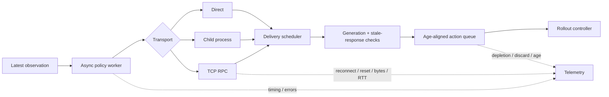
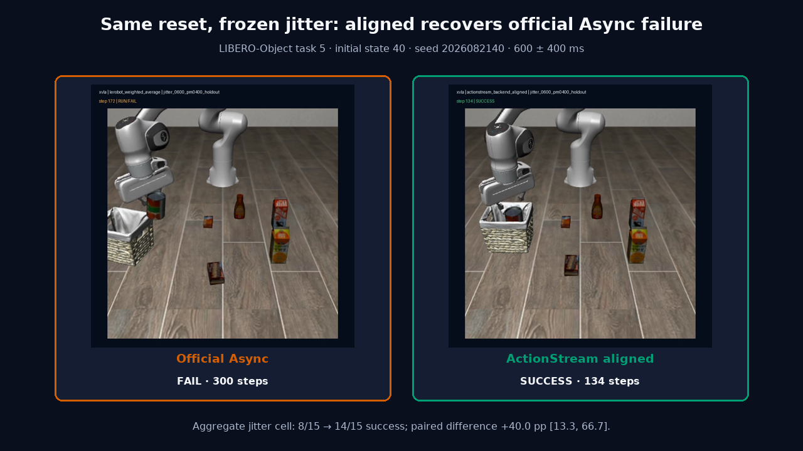

# ActionStream

**Fault-aware asynchronous inference runtime for chunked robot policies.**

ActionStream is a LeRobot-compatible runtime that decouples policy inference from
action delivery, rejects stale work across episode boundaries, manages age-aligned
action chunks, and supports direct, child-process, and real TCP inference
transports with inspectable failure telemetry.

[](https://github.com/Yanagisawa2002/ActionStream/actions/workflows/ci.yml)
[](LICENSE)
[](pyproject.toml)

The maintained runtime is intentionally separated from frozen research evidence.
Negative results remain part of the repository rather than being rewritten into
success claims.

## Why ActionStream exists

Chunked robot policies become difficult to reason about once inference, transport,
delivery, controller timing, reset, and episode ownership stop being synchronous.
ActionStream makes those boundaries explicit.



The core runtime handles:

- latest-observation ownership instead of unbounded inference fan-out;
- cancellable delivery scheduling and stale-response rejection;
- reset generations, task revisions, pause/resume, and stop lifecycle boundaries;
- expired-prefix discard and age-aligned action-chunk replacement;
- bounded hold and optional latest-only fallback during queue depletion;
- direct, restartable child-process, and persistent TCP inference transports;
- JSONL telemetry for latency, queue pressure, reconnects, deadlines, and failures.

## Measured results

The repository includes frozen case studies that exercise the runtime without
promoting narrow or failed experiments into general claims.

| Study | Result | What the evidence supports |
|---|---:|---|
| 950 ms delayed-delivery pipeline | **GO for the bottleneck mechanism** | Request supply increased **11.43×** and **1,407 observed depletion pulls** disappeared when delivery waiting stopped blocking inference |
| Five-step compute budget | **NO-GO** | Inference calls fell **61.6%**, but the preregistered success gate failed |
| Two-host TCP/RPC replication v2 | **PARTIAL SUPPORT · 7/8 hard gates · overall NO-GO** | 51 valid runs, 47 task successes; persistent execution removed the observed reconnect/cold-start amplification within the tested deployment |
| Injected disconnect recovery | **97/100 hard gate: FAIL** | 100 injected disconnects, 99 actual reconnects, 97 demonstrated later recoveries; terminal-edge post-hoc analysis does not rewrite the frozen gate |
| RGB completion + continuous confirmation | **GO only for one frozen LIBERO Object protocol** | 19/19 physically completed fresh trajectories stopped correctly; one noncompletion was not falsely stopped |

One important systems result is deliberately negative: under the v2 delayed
delivery condition, roughly **88% post-first-action polling depletion** persisted
despite high task success. Application-level success therefore did not establish
healthy request/queue supply.

Detailed gates, historical failures, preregistrations, and limitations are in
[docs/evidence-index.md](docs/evidence-index.md).

## Maintained RPC semantics

The current TCP runtime is stricter than the frozen v2 implementation:

- the server CLI defaults to `127.0.0.1`;
- non-loopback exposure requires `--allow-unauthenticated-remote`;
- that flag adds **no authentication or encryption**;
- a new TCP client requires a successful remote reset ACK before inference;
- reset invalidates old responses immediately and is serialized through the
  persistent executor;
- reset error, timeout, EOF, invalid ACK, or cancellation leaves inference
  fail-closed until a later explicit reset succeeds;
- reconnecting or recreating a client cannot silently clear uncertain state;
- TCP deadlines invalidate the client-side request but do **not** claim to preempt
  an already-running remote CUDA kernel.

See [docs/rpc-runtime-hardening.md](docs/rpc-runtime-hardening.md) for the exact
contract and migration notes.

## Demo

[](release/v1.1.0/media/actionstream_v1_1_demo.mp4)

The demo is a review aid, not evidence by itself. Frozen reports and replayable
artifacts remain the source of experimental claims.

## Install and verify

Requirements are Python 3.12, Git, and `uv` 0.11.32. Model weights, LIBERO assets,
and simulator dependencies retain their upstream terms and are not redistributed.

```bash
git clone https://github.com/Yanagisawa2002/ActionStream.git
cd ActionStream
uv sync --locked --all-packages
uv run lerobot-rollout --help
```

The installed CLI should expose `actionstream` as an inference-engine choice.

Run the main review checks:

```bash
uv run ruff check src tests scripts/release scripts/engineering integrations/lerobot

uv run pytest \
  tests/test_lerobot_inference.py \
  tests/test_lerobot_lifecycle.py \
  tests/test_lerobot_lifecycle_boundaries.py \
  tests/test_lerobot_plugin.py \
  tests/test_rpc_transport.py \
  tests/test_rpc_reset.py

uv run actionstream-rpc-matrix \
  --config configs/rpc_fault_matrix_v1.json \
  --output /tmp/actionstream-rpc-matrix

uv run python scripts/release/audit_public_release.py
```

## Review the implementation

For a first code review, start here:

| Area | Entry point |
|---|---|
| Async inference lifecycle | [`src/actionstream/lerobot_inference.py`](src/actionstream/lerobot_inference.py) |
| Transport abstraction + process isolation | [`src/actionstream/inference_transport.py`](src/actionstream/inference_transport.py) |
| TCP client/server + persistent executor | [`src/actionstream/rpc_transport.py`](src/actionstream/rpc_transport.py) |
| RPC server CLI | [`src/actionstream/rpc_server.py`](src/actionstream/rpc_server.py) |
| Deterministic real-socket fault matrix | [`src/actionstream/rpc_matrix.py`](src/actionstream/rpc_matrix.py) |
| Episode ownership contract | [`docs/lifecycle_contract.md`](docs/lifecycle_contract.md) |
| RPC reset/security hardening | [`docs/rpc-runtime-hardening.md`](docs/rpc-runtime-hardening.md) |
| Core failure-path tests | [`tests/test_lerobot_inference.py`](tests/test_lerobot_inference.py) |
| RPC/reset tests | [`tests/test_rpc_transport.py`](tests/test_rpc_transport.py), [`tests/test_rpc_reset.py`](tests/test_rpc_reset.py) |
| Two-host case study | [`docs/case-studies/actionstream-remote-inference-case.md`](docs/case-studies/actionstream-remote-inference-case.md) |

## Running a trusted RPC worker

The server defaults to loopback:

```bash
uv run actionstream-rpc-server \
  --factory my_package.worker:make_worker
```

Explicit remote exposure requires acknowledgement that the transport is
unauthenticated:

```bash
uv run actionstream-rpc-server \
  --factory my_package.worker:make_worker \
  --host 0.0.0.0 \
  --port 50051 \
  --allow-unauthenticated-remote
```

The pinned X-VLA development worker is available as
`actionstream.xvla_rpc_worker:make_xvla_remote_worker`.

## LeRobot integration boundary

ActionStream packages a third-party `lerobot-rollout` backend. The repository
pins a small LeRobot registry patch because the upstream factory surface has
historically dispatched only built-in inference config types. CI applies the
pinned patch, verifies plugin discovery through the real CLI path, and runs both
downstream lifecycle tests and upstream rollout tests.

The historical upstream proposal is
[huggingface/lerobot#4466](https://github.com/huggingface/lerobot/pull/4466).
An unmerged proposal is not described here as upstream support.

## Evidence discipline

Frozen protocols and negative outcomes remain visible. Historical result commits
are not rewritten when the maintained runtime changes. Raw traces, full episode
videos, model weights, simulator assets, and machine-local archives stay outside
ordinary Git when licensing or size makes that necessary.

Start with:

- [Evidence index](docs/evidence-index.md)
- [Completed remote replication v2 report](reports/rpc_remote_transport_replication_v2/report.md)
- [Remote inference technical case](docs/case-studies/actionstream-remote-inference-case.md)
- [H1-R2 delayed-delivery report](reports/actionstream_transport_h1_r2/report.md)
- [H2 compute-budget report](reports/actionstream_transport_h2_budget_holdout/report.md)
- [Completion acceptance](reports/completion_acceptance_v3_20260915/README.md)

## Boundaries

ActionStream is not a physical-robot safety controller. Current evidence does not
establish E-stop behavior, production security, general external validity, or
CUDA-kernel preemption. The major GPU studies use X-VLA and LIBERO simulation;
short deterministic transport tests are not production soak, GPU-driver recovery,
or CUDA-OOM certification.

## License

ActionStream source is Apache-2.0. LeRobot, X-VLA, LIBERO, simulator assets, and
all policy weights remain under their own terms; see
[THIRD_PARTY_NOTICES.md](THIRD_PARTY_NOTICES.md).
