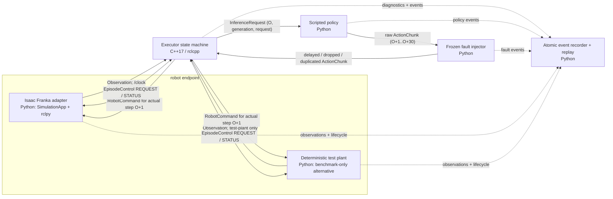

# M7 runtime architecture

This document describes the implemented M7 ROS 2 runtime contract. It is an
interface and provenance document, not a scorecard: the deterministic ROS test
plant, a native Isaac safe-hold smoke, and a policy-driven Isaac benchmark are
different evidence classes. Refer to [m7_environment.md](m7_environment.md)
for the installed native environment and its recorded readiness limits.

## Runtime graph



The Isaac adapter and the deterministic test plant are mutually exclusive robot
endpoints. The latter is a deterministic fault-injection and replay target; it
must never be described as an Isaac Sim execution.

## Logical time and freshness

At control step `O`, `Observation` describes the state **after** step `O` has
completed. A request snapshots that observation and a policy response must
label all actions explicitly, rather than relying on arrival order.

```mermaid
sequenceDiagram
    participant Robot as "Robot endpoint"
    participant Exec as "C++ executor"
    participant Policy as "Python policy"
    participant Faults as "Python fault injector"

    Robot->>Exec: "Observation O (completed state)"
    Exec->>Policy: "InferenceRequest(O, request r, generation g, H=30)"
    Policy->>Faults: "raw ActionChunk: targets O+1 ... O+30"
    Note over Faults,Exec: "Frozen delay/drop/duplicate schedule; arrival is not logical time"
    Faults->>Exec: "ActionChunk(r, g, source O)"
    Exec->>Robot: "RobotCommand(actual_target_step=O+1)"
    Robot->>Robot: "apply command or explicit hold for 3 physics ticks"
    Robot->>Exec: "Observation O+1"
```

The frozen public action has seven absolute components:
`[x, y, z, axis-angle-x, axis-angle-y, axis-angle-z, gripper]`. The gripper is
exactly `+1` for open or `-1` for closed. `H=30` and the control cadence is
20 Hz. Requests are issued every 10 control steps by the supplied test harness;
request interval is not a second clock for action labels.

`generation_id` is an explicit invalidation epoch, not a request identifier.
Routine periodic requests remain in the active generation. Reset or another
explicit invalidation advances the generation; a chunk for any other generation
is rejected. Within one generation, the executor rejects a stale plan using the
lexicographic provenance key `(source_observation_step, request_id)`. An action
is expired if its target is before the insertion step or has already executed;
for a duplicated target, the first accepted action wins. The executor also
validates a request's embedded observation before registering it, closing the
normal cross-topic ROS arrival race without dispatching a command from the
request callback.

The three comparison strategies are deliberately distinct:

- `sync_hold` waits for an inference response and holds safely while waiting.
- `naive_async` appends delivered chunks in response-arrival order and executes
  them sequentially with only basic bounds checks.
- `aligned_async` rebuilds the queue from valid, current-generation,
  explicitly-targeted actions.

## ROS interfaces and ownership

All runtime data uses reliable QoS unless noted otherwise. The lifecycle topic
uses reliable, transient-local QoS; `/clock` uses the standard best-effort
clock-compatible QoS.

| Topic | Type | Producer | Consumer | Responsibility |
|---|---|---|---|---|
| `/clock` | `rosgraph_msgs/Clock` | Isaac adapter | simulated-time consumers | completed simulation time |
| `/action_stream/episode_control` | `EpisodeControl` | endpoint or orchestrator | endpoint and executor | `REQUEST` (`START`, `RESET`, `TERMINATE`) and `STATUS`; status messages cannot be treated as requests |
| `/action_stream/observation` | `Observation` | endpoint | executor, policy harness, recorder | immutable post-step state and provenance |
| `/action_stream/inference_request` | `InferenceRequest` | executor/test harness | policy | observation snapshot, request id, generation, expected horizon |
| `/action_stream/raw_action_chunk` | `ActionChunk` | policy | fault injector | unfaulted, explicitly-targeted policy result |
| `/action_stream/action_chunk` | `ActionChunk` | fault injector or direct policy | executor, recorder | delivered response with source and timing provenance |
| `/action_stream/robot_command` | `RobotCommand` | executor | endpoint, recorder | the only command accepted for next actual step; includes source provenance and hold flag |
| `/action_stream/diagnostics` | `ExecutorDiagnostics` | executor | recorder | queue, generation, rejection, deadline, and hold counters |
| `/action_stream/events` | `RuntimeEvent` | executor, policy, fault injector | recorder | structured audit events and reason codes |

`Observation` contains the simulator state after a completed step. An
`InferenceRequest` repeats the source observation step and embeds the
observation so it can be independently audited. `ActionChunk` repeats response
and source provenance and carries `TargetAction[]`; every `TargetAction` owns a
logical `target_step`. `RobotCommand` preserves both `actual_target_step` and
`source_target_step` so the deliberately arrival-ordered naive strategy remains
auditable.

## Implementation boundaries

| Component | Language/runtime | Owns | Does not own |
|---|---|---|---|
| `action_stream_msgs` | ROS IDL | fixed schemas and lifecycle constants | strategy logic |
| `action_stream_executor` | C++17, `rclcpp`, multi-threaded executor | state transitions, freshness, queueing, command selection, diagnostics | simulator physics, policy inference, synthetic faults |
| `action_stream_policy` | Python, `rclpy` | deterministic reach/lift chunks and pure contract validation | action scheduling or endpoint state |
| `action_stream_benchmark` | Python, `rclpy` | frozen fault traces, deterministic test plant, atomic JSONL, independent replay and analysis | Isaac claims |
| `action_stream_isaac` | Python, Isaac Sim 6 + `rclpy` after Kit bridge | Franka scene, `/clock`, observations, command application, task termination | queue freshness and benchmark fault injection |

The production executor deliberately owns command scheduling. The endpoint
accepts only one finite, correctly-shaped command whose
`actual_target_step == latest_observation_step + 1`; a duplicate, stale,
malformed, cross-episode, or wrong-step command is rejected. A hold retains the
last accepted endpoint pose and gripper state. The executor requires an explicit
finite, nonzero canonical safe-hold command at startup, rather than silently
using a zero vector.

The Isaac adapter starts `SimulationApp`, enables `isaacsim.ros2.bridge`,
updates Kit, and only then imports `rclpy` and generated ActionStream messages.
That ordering is intentional on the audited Windows Pixi installation and is
not replaceable with a private-DLL preload. Its public adapter boundary uses the
official Isaac Franka experimental interface; joint and contact details remain
inside the adapter.

## Evidence boundary

The repository can establish several facts independently, but they should not
be conflated:

| Evidence | What it can support | What it cannot support |
|---|---|---|
| Unit/ROS integration tests | schema, executor, policy, fault, and recorder behavior in their test environments | physical task success in Isaac |
| ROS C++ deterministic test-plant episode | ROS topic wiring, fault delivery, event capture, and replay for the test plant | native Isaac timing or robot-task performance |
| Native Isaac safe-hold smoke | installed Isaac/ROS bridge, official Franka endpoint, lifecycle progression, bounded failure behavior | policy-driven reach/lift success, a paired benchmark, or a performance comparison |
| Frozen development/holdout evaluation with independent replay | only the endpoint and trial set actually recorded | a different endpoint, unrecorded bag, video, or a historical release number |

Consequently, benchmark results must name the endpoint used, preserve the
event log and frozen fault trace, and report replay-validation status. Historical
ActionStream results are not M7 ROS or Isaac measurements.
