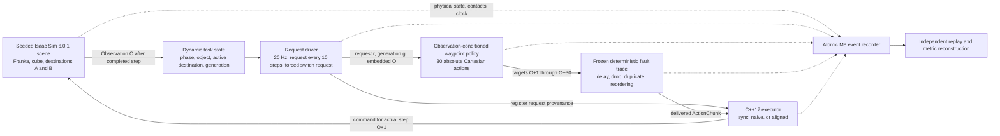

# M8-G0 dynamic-recovery architecture

M8-G0 evaluates a new causal hypothesis.  It does not revise the M7-G0
result: M7's static ROS test plant saturated at 36/36 success for both naive
and aligned execution, its reliability gate failed, and M7 remains NO-GO.
Only event logs whose evidence class is `ros_cpp_isaac_sim` may contribute to
the M8 reliability result.

## Runtime graph



The three methods share the scene, policy, request cadence, disturbance step,
fault trace, thresholds, and safety limits. Every episode retains an exact raw
reset-state digest for byte-integrity. Paired physical-reset fairness is tested
separately with preregistered tight tolerances for joints, Cartesian poses, and
quaternion geodesic angle. A sign-invariant quantized reset digest is retained
as a diagnostic, but a harmless quantization-bin crossing cannot override a
passing direct numeric comparison. The methods differ only in queue scheduling:

ROS preserves order within a topic, not across the request and response topics.
The C++ state machine therefore retains at most one response per unknown
request in a bounded pre-registration buffer. When the provenance-carrying
request callback registers, that response follows the normal validation path
before any command can use it. This closes the zero-latency transport race
equally for all three methods; it does not provide aligned execution with a
fresher observation or a different fault trace.

- `sync_hold` clears the remaining plan at a periodic replan, holds a finite
  last command, and resumes when the required response arrives.
- `naive_async` continues and appends complete responses in arrival order.  It
  deliberately does not invalidate older generations.
- `aligned_async` immediately invalidates the executable queue when the
  observation generation advances, rejects older responses, removes expired
  prefixes, and atomically installs the freshest valid future plan.

In Profile 2, a sampled dropped `sync_hold` response remains the one in-flight
request until terminal drain; the method does not fabricate a cancellation or
retry. Such a drop may therefore produce an episode-long hold. This pessimistic
but explicit transport semantics is supplementary to the primary no-drop
Profile-1 comparison and is reported separately.

## Destination-switch timeline

```mermaid
sequenceDiagram
    participant I as "Isaac task"
    participant E as "C++ executor"
    participant P as "Policy"
    participant F as "Fault injector"

    I->>E: "Observation O, destination A, generation 1"
    E->>P: "old request r1, generation 1"
    P->>F: "old plan toward A"
    Note over I,E: "Object is grasped and transport has begun"
    I->>E: "Destination switch at frozen step S; destination B; generation 2"
    E->>E: "aligned: invalidate every queued generation-1 action"
    E->>P: "forced new request r2, generation 2"
    P->>F: "new plan redirected toward B"
    F-->>E: "r2 response completes first (out of request order)"
    E->>E: "remove expired prefix; atomic queue replacement"
    E->>I: "execute generation-2 action toward B"
    F-->>E: "delayed r1 response arrives after r2"
    E->>E: "aligned rejects obsolete r1 as stale_generation"
```

The switch is physical, not a visual relabel: success requires the released
cube to remain inside destination B for 20 control steps.  Placement at A is a
failure.

## Observation and action contract

`O` is the last completed control step.  Every response from `O` contains 30
finite seven-dimensional absolute commands with target labels `O+1` through
`O+30`.  The policy input includes current end-effector and object state,
gripper/contact state, task phase, both destination poses, the active
destination, and disturbance generation.  Its output uses a fixed downward
Franka orientation and bounded Cartesian interpolation through approach,
grasp, lift, carry, lower, release, and retract phases.

Generation is an invalidation epoch rather than a request counter.  Routine
requests retain their current generation.  The switch observation advances it
before command selection, avoiding a ROS cross-topic race between an
observation and its forced request.

## Evidence and validation boundary

M8 event logs record simulation and wall clocks separately, complete task and
queue state, source provenance for every command, scene and fault hashes, and
structured termination reasons.  Independent replay reconstructs success,
obsolete-destination exposure, recovery, queue mutations, and paired fairness
without trusting episode summaries.

The execution gates are ordered:

1. M4-to-M7 differential replay and executor regression tests.
2. Native no-fault synchronous controller baseline on at least 20 development
   seeds, requiring at least 90% success.
3. At most two development-only calibrations, each using at most 12 seeds.
4. Frozen Profile 0 ceiling and paired Profile 1/2 evaluation on disjoint
   holdout seeds.
5. Independent replay, paired statistics, archive verification, and report
   regeneration.

If native Isaac cannot pass gate 2, no ROS test-plant result may replace the
headline evaluation.
