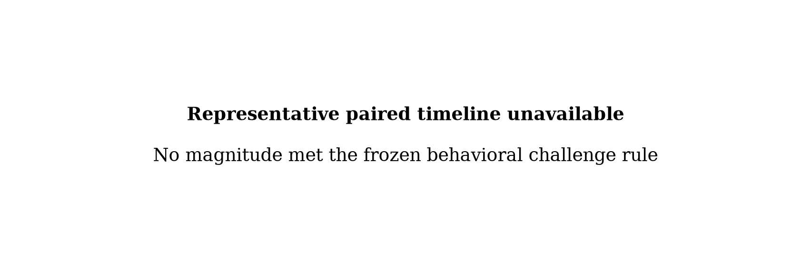
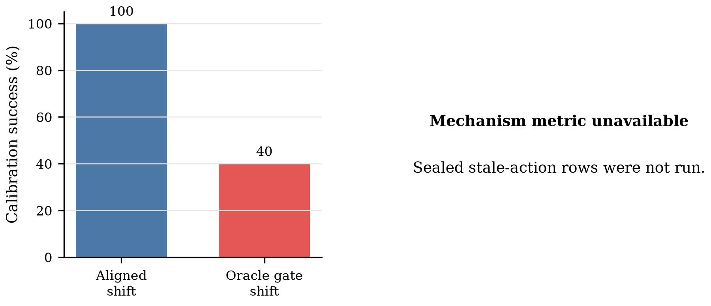

# ActionStream M5-G0: Oracle Scene-Shift Gate

## Abstract

M5-G0 asks whether invalidating actions after a task-critical simulator entity moves, then requesting a fresh policy chunk, improves closed-loop behavior beyond ActionStream's existing stale-prefix alignment.
The predeclared classification is **NO-GO**. This is a simulator oracle upper-bound result.

## 1. Experimental boundary

- Task: `0` — pick up the alphabet soup and place it in the basket.
- Moved entity: `basket_1` (`basket_1_main`).
- Temporal staleness is handled by ActionStream stale-prefix alignment; semantic scene invalidation is handled by the oracle pose gate.
- The detector sees ground-truth pose displacement and uses no perturbation flag or world epoch. `world_epoch` is evaluator-only and labels an executed action stale exactly when its observation epoch is older than the live epoch.

## 2. Calibration and frozen protocol

- Calibration status: **no_go**.
- Selected displacement: not selected mm.
- Detector translation threshold: 0.010 m.
- Injected delivery delay: 950 ms.
- Hard-stop reason: No magnitude met the frozen behavioral challenge rule

| Task | Shift | Pairs | Aligned success | Oracle-gated success | Gate-only | Physically valid | Qualifies |
|---:|---:|---:|---:|---:|---:|---:|---|
| 0 | 50 mm | 5 | 5/5 | 3/5 | 0/5 | True | False |
| 0 | 30 mm | 5 | 5/5 | 2/5 | 0/5 | True | False |
| 2 | 50 mm | 5 | 2/5 | 3/5 | 1/5 | True | False |
| 2 | 30 mm | 5 | 5/5 | 2/5 | 0/5 | True | False |

## 3. Sealed paired evaluation

- Status: **not_run_due_to_calibration_hard_stop**.
- Valid pairs: 0/30.
- No sealed outcome or stale-action statistic is reported because the calibration gate did not authorize sealed rows.
- Invalid/excluded evidence: 0 invalid episode(s), 0 excluded pair(s).

## 4. Mechanism and task outcome

The mechanism metric is stale action duration, computed from action-level world-epoch provenance rather than elapsed time. The task metric is paired episode success under an identical physical shift.

## 5. No-shift safety control

- Not run because calibration did not authorize a frozen task/magnitude; no no-shift outcome is inferred.

## 6. Acceptance decision

**NO-GO**

- Calibration no-go: No magnitude met the frozen behavioral challenge rule

The classification uses the predeclared M5-G0 thresholds and is not revised from visual inspection of the figures.

## 7. Source provenance

| role | path | SHA-256 | rows |
|---|---|---|---:|
| config | `configs/m5_g0.json` | `e70bc7850f4ffa265f5cc575cfbc8f9762292b517d44201bd12a61cf5b4e83b9` | n/a |
| task_audit | `outputs/m5_g0/audit/task_entity_audit.json` | `a49d8eeb09ea1e7d4bb12e6b9c67a7957c26e32d71987ee266191ff621d973c0` | n/a |
| calibration_decision | `outputs/m5_g0/calibration/task0/decision_after_50_30.json` | `0400e19b401e42a59a7a0eb0fe2b22eb5e5866e51585cce2476f49e96a90d6c3` | n/a |
| calibration_decision | `outputs/m5_g0/calibration/task2/decision_after_50_30.json` | `ad2455dfff82ef3b4d5cbddb49dc6d7a2a6ca4cffd94ae3df2174c5c1f41e99c` | n/a |
| seed_manifest | `outputs/m5_g0/protocol/calibration_seed_manifest.json` | `25aaf0d3afd2e73706671a226070ecf6adcf7f5a1ac9afc70e3b78109a9f3c11` | n/a |
| seed_manifest | `outputs/m5_g0/protocol/no_shift_seed_manifest.json` | `ff972719d03b8c21f1e1dd88030982a4bb16f4ff98993bf2894c5af31e0b8bad` | n/a |
| seed_manifest | `outputs/m5_g0/protocol/sealed_seed_manifest.json` | `e8ef5efb18c07c5facb6e634e319f8266d61aa2ed6fb56192a0cb27c3ba9f215` | n/a |
| reviewed_statistics | `outputs/m5_g0/report/statistical_tests_input.json` | `f35507afa439033dab5444abb3d2daae61b4c2cf4f94e16217317bf26c6b057d` | n/a |
| frozen_protocol_decision | `outputs/m5_g0/protocol/frozen_experiment.json` | `62b4883b47c2cb04c0734fc38fe1e46c22bcada9f36a1b67fbcb465d729d46c2` | n/a |
| formal_evidence_validation | `outputs/m5_g0/report/formal_validation.json` | `d2d9473a176cfd02a8f51449720d7da4e036576789b23c6798c2d04d743c00be` | n/a |

All hashes above are computed over the exact input bytes consumed by this report.

- Post-calibration source-binding mode: `post_calibration_validation_and_reporting_patch`.
- Disclosed downstream-only changed files: `src/actionstream/m5_report.py`, `src/actionstream/m5_validation.py`, `scripts/run_m5_g0.sh`.
- Benchmark runtime and calibration/selection files remained unchanged: **True**.

## 8. Limitations

- The oracle detector reads exact simulator entity pose. It is an upper-bound mechanism test, not deployable RGB/RGB-D perception.
- The experiment covers one frozen policy, at most two pre-audited calibration candidates, one moved task-critical entity class, and one scripted planar perturbation family; sealed evaluation remains limited to one selected task.
- world_epoch is evaluator-only ground truth for labeling stale actions; the runtime gate is permitted to read pose displacement only.
- ActionStream stale-prefix alignment handles temporal delivery age, whereas the oracle gate handles semantic invalidation after the physical scene moves.
- Paired bootstrap intervals treat episode pairs, not individual actions, as independent statistical units.
- The dynamic receptacle can move again during task interaction; later oracle detections therefore represent additional measured pose changes and can introduce gate holds beyond the single scripted shift.
- No FoundationPose, PoseLoop, ROS 2, physical robot, new model, or training is included.
- Static collision and reach checks do not prove that the frozen policy solves the shifted scene after a fresh observation; the five-pair calibration is the behavioral gate.
- The oracle detector reads exact simulator pose and is not deployable perception.
- Floor support contacts are expected and explicitly allowed; any other moved-entity contact invalidates the perturbation.
- The fixed first-replenishment timing is selected before calibration and is not tuned after observing outcomes.
- Sealed evidence is unavailable or incomplete: No magnitude met the frozen behavioral challenge rule.
- No standalone event rows were supplied; timeline markers are reconstructed only from episode and action provenance where available.
