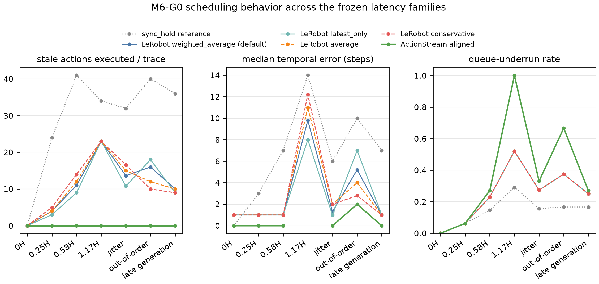
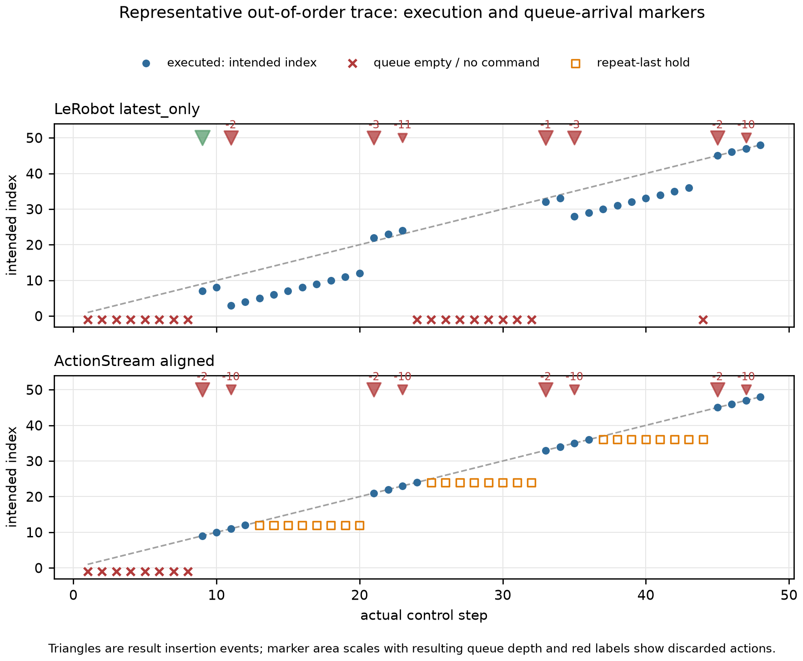

# M6-G0: LeRobot async-runtime overlap and port-value audit

## Abstract

M6-G0 asks whether ActionStream's stale-prefix alignment is materially different and better than the current official ACT-compatible LeRobot asynchronous runtime, before any real-robot work. The answer is mixed: ActionStream eliminated stale-prefix execution and reduced temporal index error, but fully stale and out-of-order conditions caused excessive queue underrun/hold. The frozen decision is therefore **NO-GO**, with recommended next step **termination of this direction**.

No policy was trained, no GPU was required, and no physical robot was controlled. M4 and M5 artifacts were not modified.

## Frozen upstream and executable evidence

The comparison uses official LeRobot source commit [`62600065cdb349c1e41b0403c511f12ebfa686eb`](https://github.com/huggingface/lerobot/tree/62600065cdb349c1e41b0403c511f12ebfa686eb), source/package version `0.6.1`, retrieved 2026-07-31. The checkout was clean. The official async unit subset passed 22 tests. The M6 adapter directly invoked [`PolicyServer._time_action_chunk`](https://github.com/huggingface/lerobot/blob/62600065cdb349c1e41b0403c511f12ebfa686eb/src/lerobot/async_inference/policy_server.py#L312-L320) and [`RobotClient._aggregate_action_queues`](https://github.com/huggingface/lerobot/blob/62600065cdb349c1e41b0403c511f12ebfa686eb/src/lerobot/async_inference/robot_client.py#L224-L267) rather than reproducing their behavior from documentation.

The audit venv used Python `3.12.10` and torch `2.7.1+cpu`. The frozen source declares torch `>=2.7,<2.12.0`, so the CPU build lies inside the declared bound. The environment contains LeRobot base dependencies and audit/report tools, not hardware-specific deployment extras.

## Source-level semantic result

Official async LeRobot gives each action a timestamp and timestep, derived from the observation ([`TimedData, TimedAction, TimedObservation`](https://github.com/huggingface/lerobot/blob/62600065cdb349c1e41b0403c511f12ebfa686eb/src/lerobot/async_inference/helpers.py#L202-L235), [`PolicyServer._predict_action_chunk`](https://github.com/huggingface/lerobot/blob/62600065cdb349c1e41b0403c511f12ebfa686eb/src/lerobot/async_inference/policy_server.py#L330-L387), [`PolicyServer._time_action_chunk`](https://github.com/huggingface/lerobot/blob/62600065cdb349c1e41b0403c511f12ebfa686eb/src/lerobot/async_inference/policy_server.py#L312-L320)). At arrival, the client filters labels at or before the latest executed action, creates a new queue from the incoming chunk, and aggregates only equal labels ([`RobotClient._aggregate_action_queues`](https://github.com/huggingface/lerobot/blob/62600065cdb349c1e41b0403c511f12ebfa686eb/src/lerobot/async_inference/robot_client.py#L224-L267)). It has no explicit request generation. ActionStream instead uses observation-to-arrival age to discard an elapsed prefix and rejects stale generations. These are observable semantic differences, not naming differences.

The complete point-by-point table is in [source_semantic_crosswalk.md](source_semantic_crosswalk.md).

## Frozen synthetic protocol

- Chunk horizon: H=12 at 20 Hz (dt=0.05 s).
- Episode: 48 execution steps; requests every 6 steps at [0, 6, 12, 18, 24, 30, 36, 42].
- Actions: 6D, with the first component encoding the intended absolute execution step `O+1..O+H`.
- Latencies: 0H, 0.25H, 0.58H, 1.17H, seeded bounded jitter, out-of-order arrival, and a late result after a newer generation.
- Traces: 4 repeats for each fixed family and 50 seeded jitter traces per runtime.
- Runtimes: fixed-schedule sync_hold reference, all four registered official aggregate functions, and ActionStream aligned.

`sync_hold` is a fixed-request, full-replacement/hold conformance reference under the identical schedule. It is not a remeasurement of M4's dynamically timed sync policy.

The exact metrics are `abs(actual_execution_step - intended_execution_step)` and stale prefix iff `intended_execution_step < queue_insertion_step`. Validation confirms 48,122 action records, 3,552 request/result records, 444 runtime traces, identical inputs across runtimes, 50 jitter traces per runtime, and direct upstream method calls.

## Results

The predeclared lexicographic official baseline selector chose **LeRobot latest_only**. Against it, ActionStream reduced delayed stale-prefix actions executed by 100.0% and met the median-error reduction threshold in 5 non-zero families. At 1.17H, ActionStream executed no action, so temporal error is unavailable rather than zero.

| Non-zero family | Median-error reduction vs best official | Underrun worsening |
|---|---:|---:|
| 0.25H | 100.0% | 0.00 pp |
| 0.58H | 100.0% | 4.17 pp |
| 1.17H | unavailable | 47.92 pp |
| jitter | 100.0% | 5.67 pp |
| out-of-order | 71.4% | 29.17 pp |
| late generation | 100.0% | 2.08 pp |

The decisive failure was queue availability: maximum underrun worsening was 47.92 percentage points, above the frozen 5 pp limit. The 1.17H family reached 100% underrun, and out-of-order arrivals worsened underrun by 29.17 pp. Zero-latency behavior did not regress.



The representative timeline's result-transition records explicitly contain observations, requests, arrival/insertion, old queue, new chunk, discarded prefix, resulting queue, and executed indices.



### Complete runtime-by-family metrics

| Runtime | Family | Stale executed / trace | Median / p95 error | Underrun | Hold | Max queue | Median / p95 scheduler us |
|---|---|---:|---:|---:|---:|---:|---:|
| sync_hold reference | 0H | 0.000 | 0.000 / 0.000 | 0.00% | 0.00% | 12 | 3.900 / 6.090 |
| sync_hold reference | 0.25H | 24.000 | 3.000 / 3.000 | 6.25% | 0.00% | 12 | 3.500 / 7.450 |
| sync_hold reference | 0.58H | 41.000 | 7.000 / 7.000 | 14.58% | 0.00% | 12 | 2.700 / 14.930 |
| sync_hold reference | 1.17H | 34.000 | 14.000 / 14.000 | 29.17% | 0.00% | 12 | 4.200 / 19.000 |
| sync_hold reference | jitter | 31.960 | 6.000 / 10.000 | 15.71% | 0.00% | 12 | 3.000 / 13.805 |
| sync_hold reference | out-of-order | 40.000 | 10.000 / 10.000 | 16.67% | 0.00% | 12 | 2.900 / 5.305 |
| sync_hold reference | late generation | 36.000 | 7.000 / 14.000 | 16.67% | 0.00% | 12 | 3.250 / 13.760 |
| LeRobot weighted_average (default) | 0H | 0.000 | 1.000 / 1.000 | 0.00% | 0.00% | 12 | 44.400 / 108.495 |
| LeRobot weighted_average (default) | 0.25H | 4.000 | 1.000 / 3.000 | 6.25% | 0.00% | 12 | 46.600 / 112.025 |
| LeRobot weighted_average (default) | 0.58H | 11.000 | 1.000 / 7.000 | 22.92% | 0.00% | 12 | 8.100 / 70.185 |
| LeRobot weighted_average (default) | 1.17H | 23.000 | 9.800 / 14.000 | 52.08% | 0.00% | 12 | 13.350 / 132.505 |
| LeRobot weighted_average (default) | jitter | 13.640 | 1.300 / 8.000 | 27.38% | 0.00% | 12 | 14.700 / 91.575 |
| LeRobot weighted_average (default) | out-of-order | 16.000 | 5.200 / 6.200 | 37.50% | 0.00% | 12 | 19.550 / 105.620 |
| LeRobot weighted_average (default) | late generation | 10.000 | 1.000 / 6.200 | 25.00% | 0.00% | 12 | 13.600 / 81.190 |
| LeRobot latest_only | 0H | 0.000 | 1.000 / 1.000 | 0.00% | 0.00% | 12 | 11.900 / 20.460 |
| LeRobot latest_only | 0.25H | 3.000 | 1.000 / 3.000 | 6.25% | 0.00% | 12 | 14.050 / 21.460 |
| LeRobot latest_only | 0.58H | 9.000 | 1.000 / 7.000 | 22.92% | 0.00% | 12 | 7.750 / 14.860 |
| LeRobot latest_only | 1.17H | 23.000 | 8.000 / 14.000 | 52.08% | 0.00% | 12 | 17.900 / 43.135 |
| LeRobot latest_only | jitter | 10.800 | 1.000 / 8.000 | 27.38% | 0.00% | 12 | 9.850 / 24.515 |
| LeRobot latest_only | out-of-order | 18.000 | 7.000 / 8.000 | 37.50% | 0.00% | 12 | 9.550 / 16.310 |
| LeRobot latest_only | late generation | 9.000 | 1.000 / 8.000 | 25.00% | 0.00% | 12 | 8.400 / 14.990 |
| LeRobot average | 0H | 0.000 | 1.000 / 1.000 | 0.00% | 0.00% | 12 | 55.650 / 105.280 |
| LeRobot average | 0.25H | 4.000 | 1.000 / 3.000 | 6.25% | 0.00% | 12 | 41.650 / 116.495 |
| LeRobot average | 0.58H | 12.000 | 1.000 / 7.000 | 22.92% | 0.00% | 12 | 8.250 / 68.350 |
| LeRobot average | 1.17H | 23.000 | 11.000 / 14.000 | 52.08% | 0.00% | 12 | 17.700 / 135.275 |
| LeRobot average | jitter | 15.040 | 2.000 / 8.000 | 27.38% | 0.00% | 12 | 13.250 / 93.635 |
| LeRobot average | out-of-order | 12.000 | 4.000 / 5.000 | 37.50% | 0.00% | 12 | 13.700 / 97.070 |
| LeRobot average | late generation | 10.000 | 1.000 / 5.000 | 25.00% | 0.00% | 12 | 12.350 / 75.220 |
| LeRobot conservative | 0H | 0.000 | 1.000 / 1.000 | 0.00% | 0.00% | 12 | 55.400 / 100.400 |
| LeRobot conservative | 0.25H | 5.000 | 1.000 / 3.000 | 6.25% | 0.00% | 12 | 40.600 / 100.065 |
| LeRobot conservative | 0.58H | 14.000 | 1.000 / 7.000 | 22.92% | 0.00% | 12 | 7.950 / 64.005 |
| LeRobot conservative | 1.17H | 23.000 | 12.200 / 14.000 | 52.08% | 0.00% | 12 | 17.000 / 109.115 |
| LeRobot conservative | jitter | 16.600 | 2.000 / 8.200 | 27.38% | 0.00% | 12 | 14.100 / 89.200 |
| LeRobot conservative | out-of-order | 10.000 | 2.800 / 3.800 | 37.50% | 0.00% | 12 | 15.550 / 96.195 |
| LeRobot conservative | late generation | 9.000 | 1.000 / 3.800 | 25.00% | 0.00% | 12 | 14.300 / 67.715 |
| ActionStream aligned | 0H | 0.000 | 0.000 / 0.000 | 0.00% | 0.00% | 12 | 3.800 / 8.335 |
| ActionStream aligned | 0.25H | 0.000 | 0.000 / 0.000 | 6.25% | 0.00% | 9 | 3.500 / 6.725 |
| ActionStream aligned | 0.58H | 0.000 | 0.000 / 1.000 | 27.08% | 12.50% | 5 | 2.700 / 14.465 |
| ActionStream aligned | 1.17H | 0.000 | n/a / n/a | 100.00% | 0.00% | 0 | 2.900 / 22.310 |
| ActionStream aligned | jitter | 0.000 | 0.000 / 3.000 | 33.04% | 17.33% | 8 | 2.800 / 13.505 |
| ActionStream aligned | out-of-order | 0.000 | 2.000 / 8.000 | 66.67% | 50.00% | 10 | 3.850 / 7.790 |
| ActionStream aligned | late generation | 0.000 | 0.000 / 1.000 | 27.08% | 10.42% | 10 | 3.050 / 15.050 |

## Predeclared decision

| Predeclared gate | Result |
|---|---:|
| `materially_distinct_from_best_official_act_async` | PASS |
| `stale_prefix_execution_reduction_at_least_50pct` | PASS |
| `median_error_reduction_in_at_least_three_nonzero_families` | PASS |
| `queue_underrun_or_hold_worsening_within_5pp` | FAIL |
| `zero_latency_no_material_regression` | PASS |
| `no_policy_retraining_required` | PASS |
| `no_act_architecture_modification_required` | PASS |
| `integration_isolated_and_maintainable` | PASS |

Classification: **NO-GO**.

- The predeclared PORT GO conjunction failed.
- Official scheduling was not equivalent-or-better in enough families to justify an algorithm-overlap tooling classification.
- Failed gates: queue_underrun_or_hold_worsening_within_5pp

This does not support a stable net advantage under the frozen acceptance rule: stronger temporal alignment trades into excessive blocking or repeat-last behavior. The formal next step is **termination of this direction**.

## RTC applicability

RTC is semantically related: it estimates inference delay, passes leftover actions into compatible policies, and its queue removes a measured-delay prefix ([`RTCInferenceEngine._rtc_loop`](https://github.com/huggingface/lerobot/blob/62600065cdb349c1e41b0403c511f12ebfa686eb/src/lerobot/rollout/inference/rtc.py#L288-L327), [`ActionQueue.merge, _replace_actions_queue`](https://github.com/huggingface/lerobot/blob/62600065cdb349c1e41b0403c511f12ebfa686eb/src/lerobot/policies/rtc/action_queue.py#L147-L188)). It was not included in the ACT matrix because the rollout gate requires `supports_rtc()` and an extended prediction signature ([`supports_rtc_inference`](https://github.com/huggingface/lerobot/blob/62600065cdb349c1e41b0403c511f12ebfa686eb/src/lerobot/rollout/inference/rtc.py#L66-L80), [`make_rollout_context RTC guard`](https://github.com/huggingface/lerobot/blob/62600065cdb349c1e41b0403c511f12ebfa686eb/src/lerobot/rollout/context.py#L227-L238)), while ACT offers `predict_action_chunk(batch)` only ([`ACTPolicy.predict_action_chunk`](https://github.com/huggingface/lerobot/blob/62600065cdb349c1e41b0403c511f12ebfa686eb/src/lerobot/policies/act/modeling_act.py#L125-L135)). Forcing RTC here would not be an ACT-compatible comparison.

## SO-101 + ACT portability

A registered aggregate function is insufficient. The smallest credible port is an opt-in, localized extension to timed data/config, PolicyServer provenance echo, and RobotClient arrival scheduling; ACT weights and architecture do not change. SO-101 deployment would additionally require bounded holds, watchdogs, resets, joint/workspace limits, emergency stop, and relative-target clipping. See [portability_audit.md](portability_audit.md) for the exact insertion point, files, telemetry, risks, and estimated surface.

## Limitations and scope guards

- This is a deterministic synthetic scheduling audit, not task-success, network-stack, actuator, or human safety validation.
- Scheduler overhead is a CPU microbenchmark inside this process; it is reported for completeness, not as a deployment latency bound.
- Official wall-clock timestamps and local simulated control-step timing are not evidence of cross-host clock synchronization.
- Fully stale rejection preserves the current queue but can block when no safe command has ever been established; this caused the 1.17H failure.
- M5-G0 remains **NO-GO**.
- PoseGuard is not being revived.
- FoundationPose is not part of M6-G0.
- RTC was audited but not forced into the ACT-compatible benchmark.

## Reproduction

From the repository root, with the exact ignored LeRobot checkout and audit environment described in the README:

```powershell
$env:PYTHONPATH=(Resolve-Path src).Path
.\.external\m6_venv\Scripts\python.exe -m actionstream.m6_conformance `
  --manifest configs/m6_g0.json --lerobot-root .external/lerobot `
  --output-root outputs/m6_g0
.\.external\m6_venv\Scripts\python.exe -m actionstream.m6_report `
  --manifest configs/m6_g0.json --lerobot-root .external/lerobot `
  --output-root outputs/m6_g0
```
