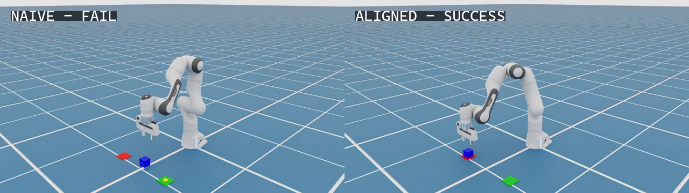

# M8-G0 technical report: positive native development result

## Decision

M8-G0 now has a strong positive native Isaac Sim development result. After a
source-matched 20/20 Profile-0 baseline, `candidate_0` completed 48 native
episodes across 12 paired seeds and two asynchronous fault profiles. Aligned
execution succeeded 10/12 versus 0/12 under fixed 850 ms latency and 8/12
versus 0/12 under 850 ms plus jitter and response faults. Both profile-level
paired-bootstrap confidence intervals exclude zero.

This is not a headline GO. The calibration ledger remains open, no candidate
has been selected or frozen, and the disjoint holdout has not run. The current
classification remains **IN PROGRESS**.

| Boundary | Result |
|---|---|
| Current-source native environment/build | Passed |
| Source-matched Profile-0 baseline | 20/20 task success; 20/20 replay |
| Development candidate | 48/48 replay-valid native episodes |
| Profile 1 paired task success | 0/12 naive vs 10/12 aligned |
| Profile 2 paired task success | 0/12 naive vs 8/12 aligned |
| Calibration lifecycle | `candidate_0` recorded; `development_open` |
| Candidate selection / freeze | Not performed |
| Frozen holdout | Not run |
| Headline classification | Not available |

## Native task and policy

The benchmark uses Isaac Sim 6.0.1 native physics and the supported
experimental Franka articulation/controller API. A cube must be approached,
grasped, lifted, carried to the destination active after a seeded mid-episode
switch, released within tolerance, and remain stable for 20 control steps.

The shared policy is deterministic and observation-conditioned. Every request
uses live end-effector and object poses, grasp state, task phase, active
destination, and generation to produce a bounded 30-step absolute Cartesian,
axis-angle, and gripper chunk. This is a genuine policy-driven closed loop, not
a recorded-trajectory replay. It is not a learned VLA and it is not real-robot
evidence.

## Environment and source provenance

- GPU: NVIDIA GeForce RTX 5090, 32,607 MiB, driver 595.71.05.
- Isaac Sim: 6.0.1.0.
- Official Isaac/ROS workspace commit:
  `dd3eeede7912755996a18f4884285d9f50843f79`.
- Pixi 0.75.0 with the frozen workspace manifest and lock.
- ROS 2 Jazzy with `rmw_zenoh_cpp` 0.2.9.
- Current-source manifest: 101 files, SHA-256
  `1648d72d2c0a539a4f5f64a4ff870c5428d491b0242c68feec3905034749f945`.
- Profile-1 run source commit: `b89442e`.
- Profile-2 run source commit: `e640083`.
- Combined candidate/lifecycle record source commit: `2b68c7a`.

The earlier baseline receipt no longer matched the exact 101-file source
manifest after two protocol-test files changed. The behavior implementation
was unchanged, but the frozen provenance contract includes tests. The old
ledger was preserved; a parallel v2 ledger was created and the full 20-seed
native baseline was rerun from the current source before candidate recording.
No source mismatch was waived.

Completion receipts bind GPU snapshots, source manifests, the installed
dynamic adapter and C++ executor, the runner and support helper, Pixi evidence,
process-log manifests, matrices, and replay results.

## Source-matched Profile-0 baseline

All 20 preregistered `sync_hold` seeds completed with
`correct_destination_stable_placement`. Completion ranged from 201 to 251
steps with median 231. Independent replay passed 20/20 logs, and the native,
seed, profile, fairness, and provenance checks passed.

This establishes task/controller viability with current source. It is a
prerequisite rather than a comparison between asynchronous runtimes.

## Full development candidate

The development candidate uses the same 12 seeds under both profiles and the
same reset/scenario/fault trace within each naive/aligned pair. There are 24
paired blocks and 48 episodes.

| Profile | Naive success | Aligned success | Difference | Paired bootstrap 95% CI | Exact two-sided McNemar |
|---|---:|---:|---:|---:|---:|
| Profile 1: fixed 850 ms | 0/12 | 10/12 | +83.3 pp | [+58.3, +100.0] pp | p=0.001953 |
| Profile 2: 850 ms, +/-200 ms jitter, 3% drop, 10% extra 900 ms delay, 2% duplicate, 3% pause | 0/12 | 8/12 | +66.7 pp | [+41.7, +91.7] pp | p=0.007812 |

Confidence intervals use the preregistered 20,000-resample nonparametric
bootstrap over paired seed-level success differences. McNemar p-values use
the exact two-sided binomial test over discordant task-success pairs. Because
this is the open development split, these are exploratory candidate statistics
rather than confirmatory holdout tests.

| Profile / metric | Naive async | Aligned async | Relative change |
|---|---:|---:|---:|
| Profile 1 grasp success | 0/12 | 12/12 | -- |
| Profile 1 switch recovery | 0/12 | 12/12 | -- |
| Profile 1 expired executed | 846 | 0 | -100% |
| Profile 1 mean action age | 40.433 steps | 17.427 steps | -56.9% |
| Profile 1 mean max target delta | 0.2294 m | 0.1349 m | -41.2% |
| Profile 2 grasp success | 0/12 | 11/12 | -- |
| Profile 2 switch recovery | 0/12 | 11/12 | -- |
| Profile 2 expired executed | 842 | 0 | -100% |
| Profile 2 mean action age | 41.767 steps | 18.747 steps | -55.1% |
| Profile 2 mean max target delta | 0.2238 m | 0.1697 m | -24.2% |

Across the 24 profile/seed blocks, the descriptive total is 0/24 versus 18/24
task success, 0/24 versus 23/24 grasp and recovery success, and 1,688 versus 0
expired actions executed. Mean action age fell 56.0% and mean maximum applied
target discontinuity fell 32.8%. These pooled numbers are descriptive only:
the profiles reuse the same seeds, so inference is reported separately by
profile.

The aligned failures are bounded and visible. Profile 1 has two
`joint_or_workspace_limit` failures. Profile 2 has three such failures and one
`switch_precondition_missed` failure. Naive completes no full task in either
profile.

## Concrete paired visualization

Development seed `2026081101` was recaptured under the exact Profile-1
scenario/fault hashes with viewport video enabled:

| Metric | Naive async | Aligned async |
|---|---:|---:|
| Task success | 0/1 | 1/1 |
| Completion | `failed_approach`, step 81 | stable final placement, step 227 |
| Grasp / recovery | No / no | Yes / 13 steps |
| Expired actions executed | 70 | 0 |
| Mean action age | 39.357 steps | 17.176 steps |
| Maximum applied target delta | 0.2283 m | 0.1313 m |

Visual inspection confirms that naive approaches but never grasps the cube.
Aligned grasps and lifts it, recovers the destination switch, places it on the
active red target, releases it, and maintains stable placement. The green
marker visible at the end is the obsolete destination. Both raw captures and
the labelled side-by-side composite decode completely as H.264 at 20 fps.

## Validation

- Source-matched baseline task success and replay: 20/20.
- Full development candidate replay: 48/48.
- Candidate paired-reset fairness: 24/24 blocks.
- Candidate seed, profile, fault-trace, and native provenance checks: passed.
- Candidate matrix SHA-256:
  `deb16f17fa7d8a874f318cd14ae5a768664bbd4201325f84c4f94594c732e4b2`.
- Candidate replay SHA-256:
  `77c91b14a704eb9de1c845ec8f5be64d9dd3a31f556e5e059590fcb6c0d3b14c`.
- Successful visual pair replay: 2/2.
- Three successful-pair MP4s: full FFmpeg 8.1.1 decode passed.
- Current v2 ledger schema/source/candidate integrity: passed.
- Relevant local M8 protocol/replay tests: passed.

## Gate evaluation

The >=90% native baseline prerequisite passed. The registered development
candidate has a large positive task-success separation in both delay profiles,
positive paired-bootstrap lower bounds, zero aligned expired executions, and
complete replay/fairness/provenance evidence. This is enough to call the
development result positive.

It is not enough to call M8 GO. Selecting `candidate_0`, closing the calibration
ledger, creating the immutable freeze manifest, and running the disjoint
holdout are deliberate next-stage actions. None is performed automatically in
this report.

## Evidence index

- [Current machine-readable status](m8_g0_current.json)
- [V2 calibration ledger](../../../configs/m8_calibration_ledger_v2.json)
- [Source-matched baseline replay](../baseline_gate/source_v2/replay_validation.json)
- [Source-matched baseline completion receipt](../baseline_gate/source_v2/native_run_logs/20260815T223133928879658Z/completion_receipt.json)
- [Full candidate findings](../development/candidate_0_full/CANDIDATE_FINDINGS.md)
- [Full candidate analysis](../development/candidate_0_full/candidate_analysis.json)
- [Full candidate replay](../development/candidate_0_full/replay_validation.json)
- [Successful paired findings](../development/policy_pair_success_0/PAIRED_FINDINGS.md)
- [Successful paired replay](../development/policy_pair_success_0/replay_validation.json)
- [Successful paired video validation](../development/policy_pair_success_0/video_validation.json)
- [Environment and reproduction guide](../../../docs/m8_environment.md)

The original baseline ledger, one-seed directional pair, unavailable report,
and RTX-4090 refusal remain immutable historical records. They are not the
current result.

## Honest resume bullet

- Built and replay-validated a native Isaac Sim 6.0.1 Franka asynchronous
  action-stream benchmark: after a 20/20 source-matched baseline, aligned queue
  semantics improved development task success from 0/12 to 10/12 at fixed 850
  ms latency and from 0/12 to 8/12 with added jitter/faults, with both paired
  95% confidence intervals excluding zero and 48/48 replay audits passing;
  results remain simulator-only, deterministic-policy development evidence
  pending a frozen holdout.
