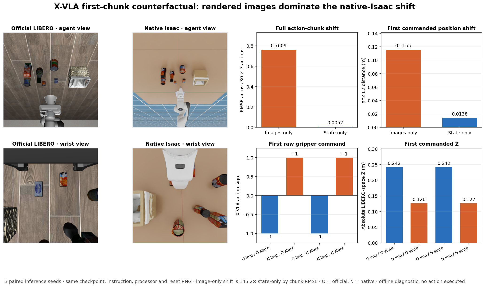

# X-VLA native-Isaac input counterfactual

Status: **completed positive attribution diagnostic; native task-capability gate remains blocked**.

This frozen offline experiment explains the observed all-zero native result at
the first action chunk. It does not execute an episode and is not task-success
evidence.

## Main result

The dominant immediate cause is the rendered camera input, not the async queue
and not primarily the mapped robot state. Holding the official LIBERO state
fixed while replacing only the two images with the native Isaac images changes
the full 30x7 chunk by **0.760888 RMSE**. Replacing only the state while keeping
the official images changes it by **0.005239 RMSE**. The image effect is 145.25x
larger on this metric.

| Frozen paired comparison (3 inference seeds) | Full chunk RMSE, mean +/- SD | First action XYZ L2, mean +/- SD | First action 7D L2, mean +/- SD |
|---|---:|---:|---:|
| Native vs official images, official state held | 0.760888 +/- 0.000004 | 0.115453 +/- 0.000162 m | 2.003562 +/- 0.000008 |
| Native vs official state, official images held | 0.005239 +/- 0.000009 | 0.013787 +/- 0.000011 m | 0.013822 +/- 0.000015 |
| Fully native vs fully official | 0.761172 +/- 0.000004 | 0.115221 +/- 0.000099 m | 2.003541 +/- 0.000005 |

The image/state contrast is 145.25x by full-chunk RMSE, 8.37x by first-action
XYZ distance, and 144.96x by first-action 7D distance. The mean image-state
interaction RMSE is only 0.002358, so the large image effect persists under
either state rather than being created by one condition order.

## Concrete policy behavior

| Images / state | Mean first raw X-VLA action | Gripper sign over all 30 chunk rows |
|---|---|---:|
| Official / official | `[-0.1473, -0.0041, 0.2416, -2.1858, -2.2038, 0.0627, -1]` | 30/30 negative |
| Native / official | `[-0.1446, -0.0113, 0.1264, -2.2025, -2.1847, 0.0796, +1]` | 30/30 positive |
| Official / native | `[-0.1486, 0.0096, 0.2417, -2.1853, -2.2044, 0.0633, -1]` | 30/30 negative |
| Native / native | `[-0.1454, 0.0025, 0.1266, -2.2029, -2.1853, 0.0791, +1]` | 30/30 positive |

Changing the images alone reproduces the two critical features of the failed
native rollout: commanded Z drops from about 0.242 m to 0.126 m and the raw
gripper sign flips from -1 to +1 for the entire first chunk. Under the current
native adapter, the +1 raw sign becomes a closing command, matching the observed
premature empty close. Changing the state alone leaves both features intact.

The visual inspection is consistent with the intervention result. The native
agent view has different surface appearance, lighting, robot silhouette,
framing and object pixel scale. The native wrist view is dominated by a large
white hand body, while the official wrist view exposes a much wider wood-surface
context with thin dark gripper geometry near the image boundaries.

## Why this result is credible

- The checkpoint, revision, instruction, LeRobot processors and official reset
  are identical across all cells. Only image source and robot-state source vary.
- Each cell resets all policy RNG sources to the same seed within its paired
  block. Three predeclared seeds use balanced condition orders.
- The captured official image hashes are exactly the previously audited LIBERO
  reference hashes: `5e4c...92ac5` and `5b3e...24caa`.
- The official/official mean first action is only 0.000399 L2 (0.000089 m in
  XYZ) from the first action of the prior successful official task-0 trace.
- The large mapped-state mismatch is real (native-vs-official joint-position L2
  is 1.988671 and EEF-position L2 is 0.013452 m), but its controlled first-chunk
  action effect is much smaller than the visual effect.

## Interpretation boundary and next gate

This supports a causal statement about **first-chunk model output sensitivity**,
not a causal success-rate estimate. State mismatch may still compound later in
an episode, and this experiment uses one development reset. It does establish
why opening sync/latest-only/LeRobot async/RTC/ActionStream on the current
native scene would likely give an all-zero table: every runtime would receive
the same visually misconditioned action chunks before queue semantics matter.

The next development priority is therefore visual-domain and camera parity:
match official wrist/agent intrinsics, extrinsics, robot occlusion, surface and
lighting statistics, or use an Isaac-domain-adapted learned policy. Joint-state
calibration should still be corrected, but it is secondary for this first
chunk. After development, a fresh disjoint sync capability gate must show real
target contact and nonzero success before the paired runtime holdout is opened.

## Provenance

- Frozen protocol commit: `28b04dc`
- Config: `configs/xvla_isaac_input_counterfactual_v1.json`
- Raw summary SHA-256: `ffa7f87147e7b659229e0cf05eeb8acc291e77180dacf3737d9a01034e7df29d`
- Figure SHA-256: `6812e7f61974fcdc35034929a312edd8839c5d53c2af9b084764d22ed1d5cb48`
- Remote evidence root: `/root/autodl-tmp/results/xvla_isaac_input_counterfactual_v1`
- Peak allocated CUDA memory: 12,250.56 MiB
- Process exit code: 0
