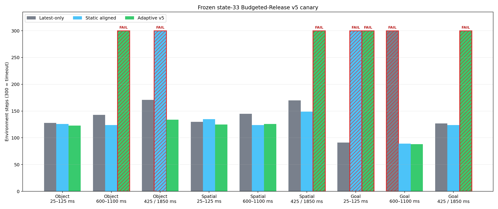
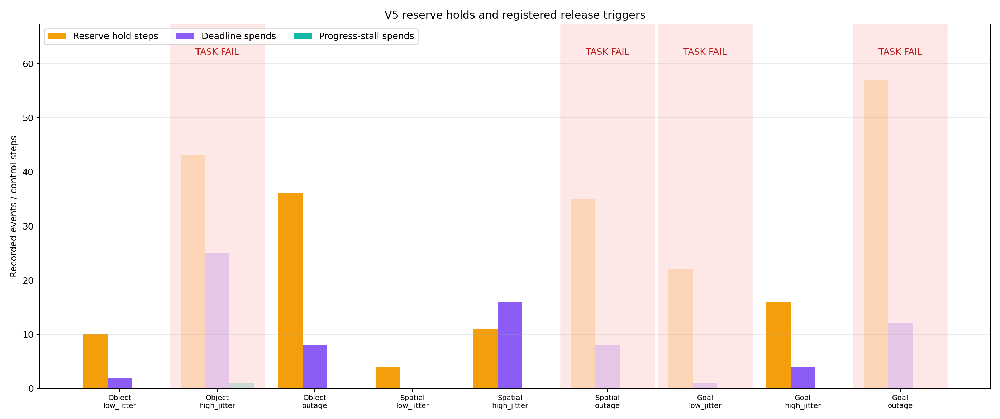
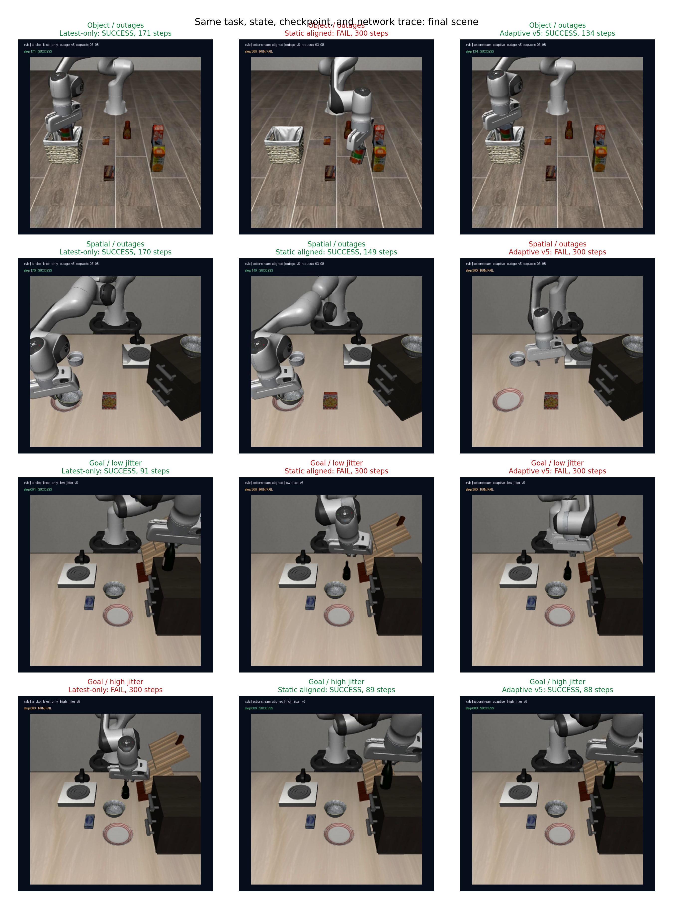
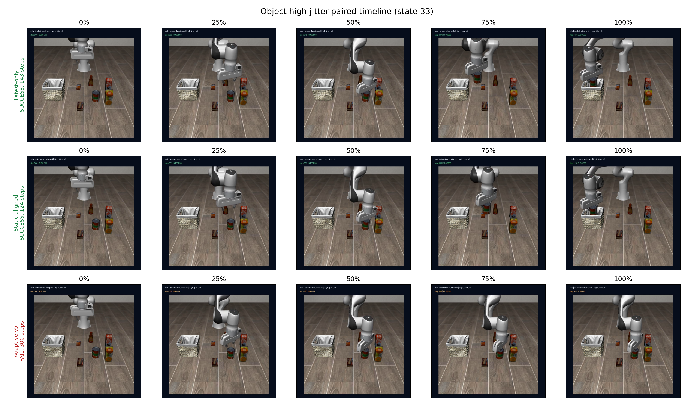
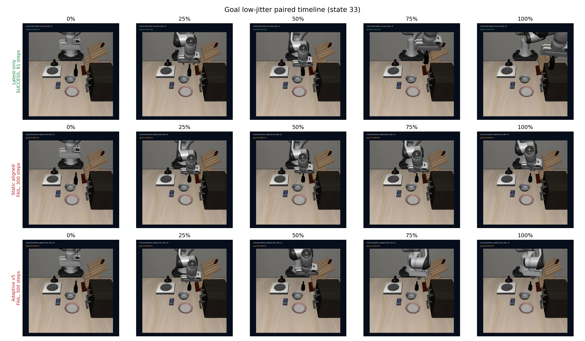

# ActionStream Adaptive Budgeted-Release v5 result

**Verdict: NO-GO.** Adaptive v5 succeeded on 5/9 conditions versus 8/9 for official latest-only and 7/9 for static aligned. The registered spend budget and protected floor worked structurally, but release behavior was strongly task-dependent.

## Frozen state-33 canary

`PASS/FAIL steps`; sync is a policy-capability reference, not a latency-runtime competitor.

| Task | Profile | Sync | Latest-only | Static aligned | Adaptive v5 | Adaptive - latest | Adaptive - aligned |
|---|---|---:|---:|---:|---:|---:|---:|
| Object | 25–125 ms | PASS 128 | PASS 128 | PASS 126 | PASS 123 | -5 | -3 |
| Object | 600–1100 ms | PASS 128 | PASS 143 | PASS 124 | FAIL 300 | +157 | +176 |
| Object | 425 / 1850 ms | PASS 128 | PASS 171 | FAIL 300 | PASS 134 | -37 | -166 |
| Spatial | 25–125 ms | PASS 123 | PASS 130 | PASS 135 | PASS 125 | -5 | -10 |
| Spatial | 600–1100 ms | PASS 123 | PASS 145 | PASS 124 | PASS 126 | -19 | +2 |
| Spatial | 425 / 1850 ms | PASS 123 | PASS 170 | PASS 149 | FAIL 300 | +130 | +151 |
| Goal | 25–125 ms | PASS 88 | PASS 91 | FAIL 300 | FAIL 300 | +209 | +0 |
| Goal | 600–1100 ms | PASS 88 | FAIL 300 | PASS 89 | PASS 88 | -212 | -1 |
| Goal | 425 / 1850 ms | PASS 88 | PASS 127 | PASS 124 | FAIL 300 | +173 | +176 |

## Findings

1. **Low jitter regressed:** Adaptive succeeded 2/3 with 548 total steps, versus latest-only 3/3 and 349. Goal timed out for both Adaptive and aligned while latest-only succeeded in 91 steps.
2. **High jitter had crossed failures:** Adaptive and latest-only were each 2/3, but Adaptive failed Object while latest-only failed Goal. Aligned was 3/3 with 337 total steps and was the strongest runtime in this profile.
3. **Outage generalization failed:** Adaptive was 1/3 and 734 steps, versus latest-only 3/3 and 468. Adaptive recovered Object in 134 steps while aligned timed out, but Adaptive timed out on Spatial and Goal where latest-only succeeded.
4. **The implementation honored its bounds:** 77 commands were spent, maximum per activation was 4, minimum active reserve depth was 1, and guard discards were 0.
5. **Progress awareness was almost inactive:** 76 of 77 spends came from service deadlines and only 1 from measured EEF stall. The method therefore behaved mostly as a bounded deadline scheduler, not a robust progress controller.
6. **Failure interpretation is bounded:** four Adaptive timeouts occurred without runtime exceptions or reserve-floor violations. The trace supports task-dependent release mismatch, but one reset per condition cannot identify a causal threshold or phase.
7. **Statistical boundary:** this is one paired state per task/profile. No IID-seed 95% CI or generalization claim is reported.

## Content-level paired visualization

The videos use the same task, state 33, checkpoint, observation/action spaces, success predicate, and paired network trace within each row group.

## Decision

Do not open a v5 formal holdout and do not retune this selector. Preserve this exact candidate as `NO-GO`. A future candidate should first use frozen replay to test phase-aware reserve value (queued-command novelty, gripper boundary, and action disagreement) rather than changing deadline or progress thresholds on these results; it requires a new selector ID and split.

Resume-safe claim: *Built and froze a bounded reserve-spending scheduler for X-VLA; it enforced a four-command budget and one-command floor, recovered one Object outage case, but achieved only 5/9 canary successes and exposed task-dependent deadline-release failures.*

Do not claim formal holdout superiority, universal latency robustness, Isaac Lab-Arena, or real-robot validation.
