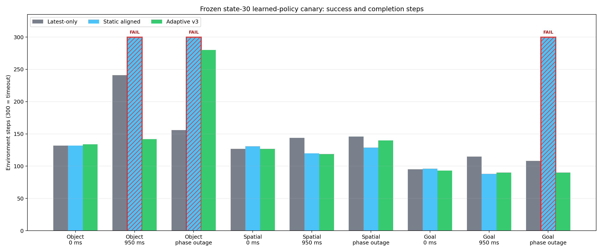
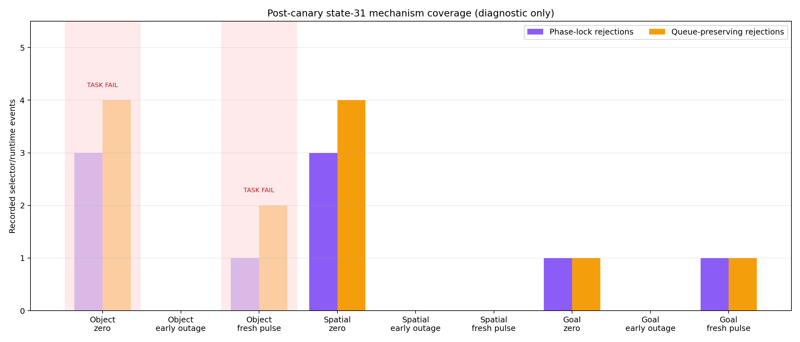
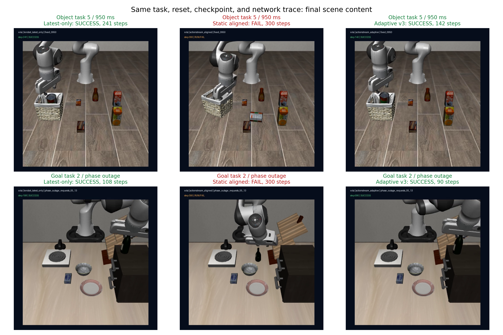

# ActionStream Adaptive Phase-Stable v3 result

**Verdict: PARTIAL_POSITIVE.** The learned-policy canary has a strong positive fixed-950-ms result, but the formal holdout remains unopened. The separate mechanism-coverage probe is **NO-GO** and cannot be used as a performance claim.

## Frozen canary main table

`PASS/FAIL steps`; sync blocks the environment during inference and is a task-capability reference, not a latency-runtime competitor.

| Task | Profile | Sync | Latest-only | Static aligned | Adaptive v3 | Adaptive - latest |
|---|---|---:|---:|---:|---:|---:|
| Object | 0 ms | PASS 136 | PASS 132 | PASS 132 | PASS 134 | +2 |
| Object | 950 ms | PASS 136 | PASS 241 | FAIL 300 | PASS 142 | -99 |
| Object | phase outage | PASS 136 | PASS 156 | FAIL 300 | PASS 280 | +124 |
| Spatial | 0 ms | PASS 121 | PASS 127 | PASS 131 | PASS 127 | +0 |
| Spatial | 950 ms | PASS 121 | PASS 144 | PASS 120 | PASS 119 | -25 |
| Spatial | phase outage | PASS 121 | PASS 146 | PASS 129 | PASS 140 | -6 |
| Goal | 0 ms | PASS 87 | PASS 95 | PASS 96 | PASS 93 | -2 |
| Goal | 950 ms | PASS 87 | PASS 115 | PASS 88 | PASS 90 | -25 |
| Goal | phase outage | PASS 87 | PASS 108 | FAIL 300 | PASS 90 | -18 |

## Findings

1. **Positive at 950 ms:** Adaptive succeeded on 3/3 tasks and used 351 total steps versus 500 for official latest-only, a 29.8% reduction. It beat latest-only on every task (99, 25, and 25 fewer steps). Static aligned failed Object while Adaptive succeeded.
2. **No aggregate zero-delay tax in this canary:** Adaptive and latest-only both succeeded 3/3 with exactly 354 total steps. Per-task differences were +2, 0, and -2 steps.
3. **Outage trade-off remains:** Adaptive and latest-only both succeeded 3/3, while aligned succeeded only 1/3. Adaptive used 510 versus 410 total steps because Object was 124 steps slower, despite being 6 and 18 steps faster on Spatial and Goal.
4. **This is not a formal effect size:** there is only one paired reset per task/profile. The nine conditions are heterogeneous operating points, not nine IID seeds, so no 95% CI or generalization claim is reported.
5. **The original canary is PARTIAL_POSITIVE, not GO:** all 36 hashes/videos and all nine Adaptive successes passed, but success termination censored request ordinal 13 in two async rows. The manifests were not altered after inspection.

## Mechanism coverage

The post-canary state-31 probe is **NO-GO**: 7/9 task successes, zero-delay capability only 2/3, and the frozen fresh pulse triggered a phase-lock rejection on 2/3 tasks. Across all nine rows, the runtime nevertheless recorded 9 phase-lock rejections and 12 queue-preserving rejections with 0 guard discards.

The early-outage rows executed both 1700 ms events on all three tasks and succeeded 3/3. However, every hard outage arrived after the active queue had already drained, so the non-destructive outage guard did not preserve useful slack. Its next real method step is a slack-aware prefetch/reserve scheduler, not another age threshold tweak.

## Content-level paired visualization

These are final RGB frames from the recorded paired episodes. The complete MP4s and traces remain outside ordinary Git; their hashes are recorded in the source rows and validation summary.

## Claim boundary and next decision

Resume-safe claim: *Built and froze a task-label-blind phase-stable VLA runtime; on a three-task X-VLA canary at 950 ms, it matched 3/3 success while reducing completion steps 29.8% versus official latest-only, with zero aggregate 0-ms regression; branch-targeted coverage exposed the remaining outage-slack failure boundary.*

Do not claim a formal holdout win, universal superiority, Isaac Lab-Arena, or real-robot validation. The v3 formal holdout stays closed. Register v4 only after adding observable queue-slack prediction/early request, then use new tasks, states, and traces. A minimum real-robot paired A/B remains separately blocked by hardware, driver, calibration, operator, and E-stop availability.
