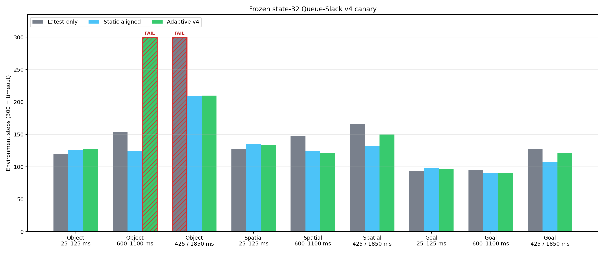
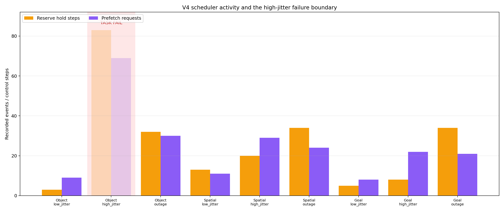
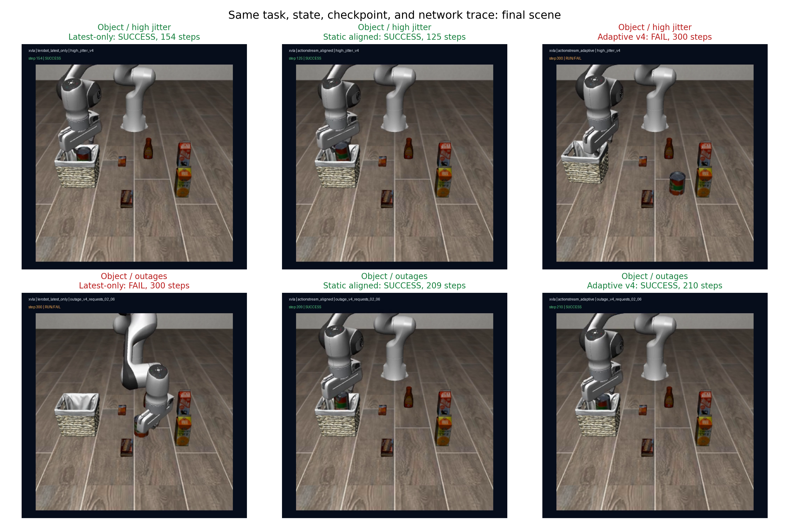
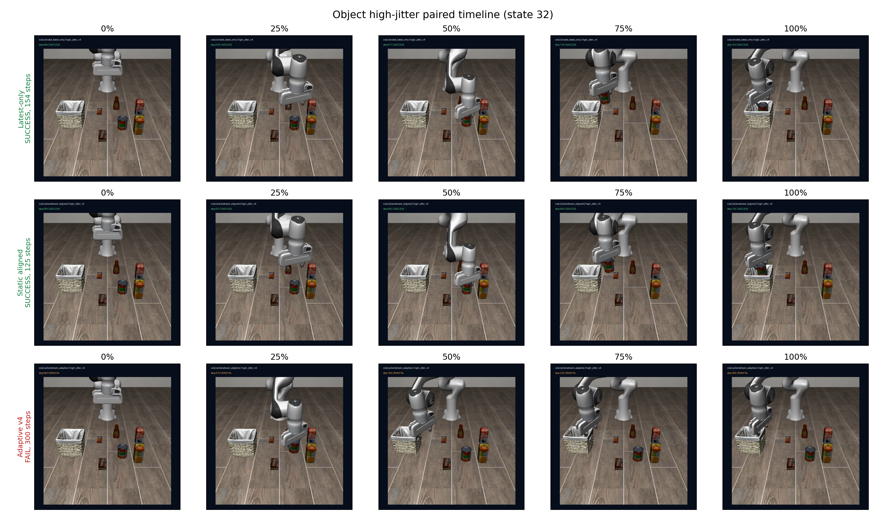

# ActionStream Adaptive Queue-Slack v4 result

**Verdict: NO-GO.** The predeclared 9/9 Adaptive success gate failed on Object/high-jitter. The outage mechanism worked and recovered a latest-only failure, but static aligned remained the stronger overall runtime.

## Frozen state-32 canary

`PASS/FAIL steps`; sync is a policy-capability reference, not a latency-runtime competitor.

| Task | Profile | Sync | Latest-only | Static aligned | Adaptive v4 | Adaptive - latest | Adaptive - aligned |
|---|---|---:|---:|---:|---:|---:|---:|
| Object | 25–125 ms | PASS 124 | PASS 120 | PASS 126 | PASS 128 | +8 | +2 |
| Object | 600–1100 ms | PASS 124 | PASS 154 | PASS 125 | FAIL 300 | +146 | +175 |
| Object | 425 / 1850 ms | PASS 124 | FAIL 300 | PASS 209 | PASS 210 | -90 | +1 |
| Spatial | 25–125 ms | PASS 125 | PASS 128 | PASS 135 | PASS 134 | +6 | -1 |
| Spatial | 600–1100 ms | PASS 125 | PASS 148 | PASS 124 | PASS 122 | -26 | -2 |
| Spatial | 425 / 1850 ms | PASS 125 | PASS 166 | PASS 132 | PASS 150 | -16 | +18 |
| Goal | 25–125 ms | PASS 90 | PASS 93 | PASS 98 | PASS 97 | +4 | -1 |
| Goal | 600–1100 ms | PASS 90 | PASS 95 | PASS 90 | PASS 90 | -5 | +0 |
| Goal | 425 / 1850 ms | PASS 90 | PASS 128 | PASS 107 | PASS 121 | -7 | +14 |

## Findings

1. **Low jitter is not a win:** all three runtimes succeeded 3/3. Adaptive used 359 total steps versus 341 for latest-only (+5.3%) and exactly matched aligned's 359 steps.
2. **High jitter is the decisive regression:** Adaptive succeeded 2/3 and timed out on Object, while latest-only and aligned were both 3/3. Adaptive accumulated 512 steps versus 397 and 339.
3. **Outage robustness improved relative to latest-only:** Adaptive was 3/3 versus latest-only 2/3, recovering the Object failure. Aligned was still 3/3 and faster in aggregate (448 versus Adaptive 481).
4. **The registered mechanism fired:** every Adaptive outage row observed both 1850 ms events, preserved a nonempty five-command reserve through rejected stale results, and recorded zero guard discards. Across the three rows there were 100 reserve-hold steps and 21 queue-preserving rejections.
5. **Failure boundary:** Object/high-jitter had 25 reserve activations and 83 reserve-hold steps, versus 9/20 on Spatial and 6/8 on Goal. This supports an over-conservative reserve-fragmentation hypothesis, but one reset cannot prove causality.
6. **Statistical boundary:** this is one paired state per task/profile. No IID-seed 95% CI or generalization claim is reported.

## Content-level paired visualization

The videos use the same task, state 32, checkpoint, observation/action spaces, success predicate, and paired network trace within each row group.

## Decision

Do not open the v4 formal holdout and do not retune this selector. Preserve this exact candidate as `NO-GO`. The next candidate should replace the binary five-command freeze with a bounded reserve budget or deadline-aware release that can spend reserve when repeated holds stop making task progress; it requires a new selector ID and new state/trace split.

Resume-safe claim: *Built and froze an online service-time/queue-slack scheduler for X-VLA; on three disjoint state-32 task families it preserved nonempty action reserves through all registered outages and recovered a latest-only Object failure, while a high-jitter Object timeout exposed an over-conservative reserve boundary.*

Do not claim formal holdout superiority, universal latency robustness, Isaac Lab-Arena, or real-robot validation.
