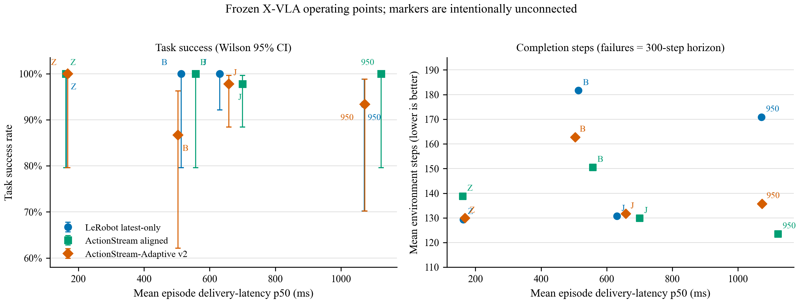
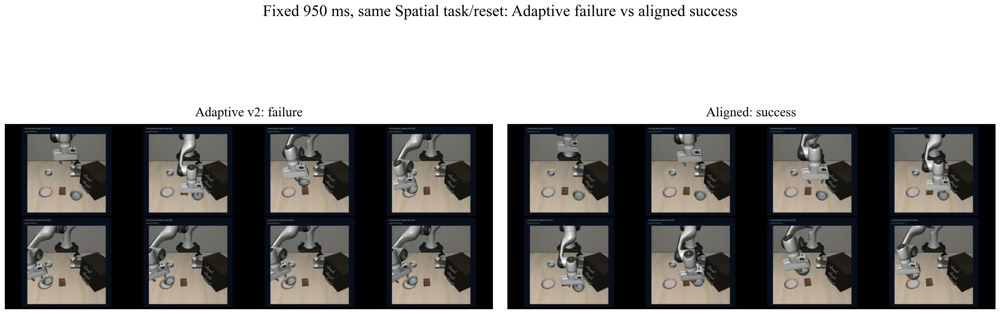
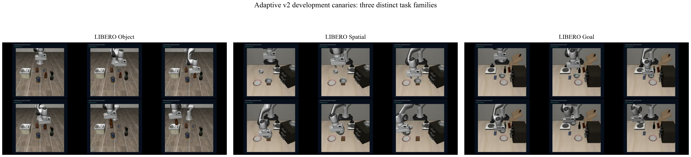

# ActionStream-Adaptive v2 frozen X-VLA holdout

**Formal selector verdict: NO-GO.** The result contains a strong bounded positive, but it does not support a universal Adaptive-runtime claim.

At fixed 950 ms, Adaptive matched official latest-only success (14/15 versus 14/15) and used 35.1 fewer control steps on average (20.6% reduction; paired 95% CI for Adaptive minus latest-only -35.13 [-40.34, -28.47]). Under pooled jitter, however, Adaptive was 44/45 versus latest-only 45/45 and its mean completion-step reduction was -0.75%, below the frozen 8% gate. Under burst/outage it fell to 13/15 versus latest-only 15/15. Static aligned was also the strongest fixed-950 runtime at 15/15 success and 123.47 mean steps, so the bounded Adaptive-versus-latest result is not evidence that Adaptive beats the best static choice.

## Protocol and evidence boundary

- Frozen learned policy: `lerobot/xvla-libero` at revision `12e8783e996944f5c97e490d37d4c145484ed70a`.
- Three genuinely different task families: LIBERO Goal task 0, Object task 4, and Spatial task 6; states 20--24 are disjoint from the development canary.
- Three runtimes share the same checkpoint, reset, observation/action contract, network trace, horizon, and success predicate: pinned LeRobot latest-only, static ActionStream aligned, and Adaptive v2.
- Six frozen network traces per task/runtime: zero, three independently seeded 500 +/- 250 ms jitter traces, fixed 950 ms, and burst/outage.
- Total: 270 paired episodes, 264 successes, 270 verified traces, and 54 representative videos. Canary before opening the holdout was 9/9.
- This holdout tests one X-VLA checkpoint in LIBERO simulation. It is not a learned selector, RTC, safety certification, native-Isaac holdout, or real-robot result.

`Z`, `J`, `950`, and `B` denote zero, pooled jitter, fixed 950 ms, and burst/outage. The markers are not connected because jitter and outage profiles are not points on one continuous causal latency curve.

## Main table

| Network condition | Runtime | Success | Mean steps | Mean delivery p50 | Mean hold |
|---|---|---:|---:|---:|---:|
| Zero injected delay | LeRobot latest-only | 15/15 (100.0%) | 129.33 | 163.0 ms | 0.0% |
| Zero injected delay | ActionStream aligned | 15/15 (100.0%) | 138.80 | 161.3 ms | 0.0% |
| Zero injected delay | ActionStream-Adaptive v2 | 15/15 (100.0%) | 129.93 | 167.6 ms | 0.0% |
| 500 +/- 250 ms jitter (3 traces pooled) | LeRobot latest-only | 45/45 (100.0%) | 130.76 | 630.8 ms | 0.4% |
| 500 +/- 250 ms jitter (3 traces pooled) | ActionStream aligned | 44/45 (97.8%) | 129.89 | 700.3 ms | 0.0% |
| 500 +/- 250 ms jitter (3 traces pooled) | ActionStream-Adaptive v2 | 44/45 (97.8%) | 131.73 | 658.3 ms | 0.4% |
| Fixed 950 ms | LeRobot latest-only | 14/15 (93.3%) | 170.87 | 1071.4 ms | 4.1% |
| Fixed 950 ms | ActionStream aligned | 15/15 (100.0%) | 123.47 | 1122.3 ms | 21.4% |
| Fixed 950 ms | ActionStream-Adaptive v2 | 14/15 (93.3%) | 135.73 | 1072.7 ms | 7.8% |
| Burst/outage | LeRobot latest-only | 15/15 (100.0%) | 181.67 | 513.3 ms | 21.5% |
| Burst/outage | ActionStream aligned | 15/15 (100.0%) | 150.47 | 557.4 ms | 19.5% |
| Burst/outage | ActionStream-Adaptive v2 | 13/15 (86.7%) | 162.73 | 503.5 ms | 14.9% |

Failures count as the frozen 300-step horizon in the completion-step mean; no post-hoc success-only filtering is used.

## Paired Adaptive effects

Differences are Adaptive minus reference. Negative steps are better; positive success is better. Intervals are paired 10,000-resample percentile bootstrap 95% CIs.

| Network condition | Reference | n | Success delta | Steps delta | Mean step reduction |
|---|---|---:|---:|---:|---:|
| Zero injected delay | LeRobot latest-only | 15 | 0.00 [0.00, 0.00] pp | 0.60 [-0.60, 1.67] | -0.46% |
| Zero injected delay | ActionStream aligned | 15 | 0.00 [0.00, 0.00] pp | -8.87 [-11.67, -6.33] | 6.39% |
| 500 +/- 250 ms jitter (3 traces pooled) | LeRobot latest-only | 45 | -2.22 [-6.67, 0.00] pp | 0.98 [-5.11, 10.89] | -0.75% |
| 500 +/- 250 ms jitter (3 traces pooled) | ActionStream aligned | 45 | 0.00 [-6.67, 6.67] pp | 1.84 [-10.71, 14.42] | -1.42% |
| Fixed 950 ms | LeRobot latest-only | 15 | 0.00 [0.00, 0.00] pp | -35.13 [-40.34, -28.47] | 20.56% |
| Fixed 950 ms | ActionStream aligned | 15 | -6.67 [-20.00, 0.00] pp | 12.27 [-1.13, 38.00] | -9.94% |
| Burst/outage | LeRobot latest-only | 15 | -13.33 [-33.33, 0.00] pp | -18.93 [-41.80, 10.07] | 10.42% |
| Burst/outage | ActionStream aligned | 15 | -13.33 [-33.33, 0.00] pp | 12.27 [-12.47, 44.27] | -8.15% |

## Frozen gate verdict

| Gate | Verdict | Evidence |
|---|---|---|
| `zero_delay_no_family_regression` | PASS | Adaptive and latest-only are 5/5 in each of the three families. |
| `moderate_jitter_success_and_8pct_speed_gain` | FAIL | Adaptive 44/45, best static 45/45; completion-step gain vs latest-only -0.75% (required >=8%). |
| `fixed950_no_additional_failures_vs_latest` | PASS | Adaptive 14/15 and latest-only 14/15. |
| `burst_no_additional_failures_vs_latest` | FAIL | Adaptive 13/15 and latest-only 15/15. |
| `risk_and_replay_provenance` | PASS | 270 trace hashes verified; 2062 selector decisions; zero unsafe accepted merges and zero forbidden profile/task-result inputs. |
| `frozen_source_and_thresholds` | PASS | One source commit and selector hash; no post-holdout threshold change. |

The overall verdict is NO-GO because success/safety dominate speed and both the moderate-jitter gate and burst/outage gate fail. Thresholds were not changed after the formal results were opened.

## What the failures look like

This is a same-task, same-reset fixed-950 comparison. Adaptive approaches, grasps, and moves the object, but the spatial success predicate remains false at the horizon; aligned reaches the successful end state. The failure is a late placement/release stall, not a black render, scene explosion, or failure to produce policy actions.

The three panels are content-level canary evidence for distinct Object, Spatial, and Goal suites. Each also passed jitter and fixed-950 canaries (9/9 total).

The six formal failures are listed in `failure_taxonomy.csv`. Four are Spatial late-stage placement/release stalls at the 300-step horizon, one is an Object burst/outage transfer failure, and one additional Spatial aligned jitter failure occurred. The Object burst failure reproduced with the same seed and nine outage safe-holds. The aligned Spatial jitter failure did not reproduce: the same-seed replay succeeded in 101 steps, which exposes wall-clock asynchronous timing sensitivity rather than deterministic replay equivalence of task outcome.

## Minimal real-robot A/B status

**BLOCKED / not run.** Neither inspected machine exposed a usable robot driver or camera endpoint: the local machine only exposed Bluetooth virtual COM ports and no usable camera, while the GPU server exposed no `ttyUSB`, `ttyACM`, or video device. Issuing robot actions without a named robot, calibrated limits, operator, and E-stop would be unsafe, so simulation was not relabeled as real-robot evidence.

The minimum execution gate remains: two named manipulation tasks, 20 paired resets per task, matched reset fixtures, frozen real network traces, workspace/joint/velocity limits, an operator/E-stop receipt, synchronized video, and an immutable episode ledger. The comparison is the best frozen static runtime versus Adaptive.

## Resume-safe claim

> Built a latency/risk-aware runtime that switches between official latest-only, age-aligned execution, and safe-hold from live queue age and frame-local action risk.
> Evaluated a frozen 270-episode X-VLA paired holdout across three LIBERO task suites and six network traces, reducing mean completion steps 20.6% at fixed 950 ms versus official latest-only while isolating the burst/outage failure boundary with hashed traces, paired CIs, replay, and video.

Do not claim universal superiority or a completed real-robot A/B: the preregistered selector is NO-GO overall, and physical hardware was unavailable.

## Provenance

- Formal source commit: `b259ef2f73dd2cea21dc71a2d44b391efac2e8fd`
- Adaptive selector SHA-256: `8679606e12b85accc26bd1ad1a1d710bade6682c738cebc031a4196d4a367572`
- X-VLA revision: `12e8783e996944f5c97e490d37d4c145484ed70a`
- LeRobot checkout: `6adf51511b7625090eade8d82d9f61a1846ebe56`
- Raw episode CSV SHA-256: `bb67ae956f87e75e13751715c01a59135828e944a2b13d49f354cfec72583deb`
- Source analysis JSON SHA-256: `9831e6f60b48d45c5d89de656bea8ef3cc28b5ac2d8b3155922b6582e3e3d1e6`
- `canary` archive SHA-256: `4bdd547631d226595898798ca18a72d93f5ece18ca9ba7aa9e5028ee2aec1bbe`
- `holdout_object` archive SHA-256: `c891bd8223160c050861d757069c96690abe10e60c7ed620b2b7f4c40c377ed3`
- `holdout_spatial` archive SHA-256: `4b8267c213b665dbce1acfd848145f09f57b483a08e905e845946ea028556afc`
- `holdout_goal` archive SHA-256: `47947ceda298d47825ef7b57f2ce11f9615c7e6112977695652bfa3666d8e180`
- `failure_replays` archive SHA-256: `4315f5e734a1bf6c03ee9abe9c4c9e9e0675631d5822d7e06886bafdb6adebee`
- `summary.json` contains the machine-readable condition table, paired effects, gate decisions, trace audit, figure-input hashes, and evidence archive hashes.
- `artifact_manifest.json` hashes binary files byte-for-byte and text files after CRLF-to-LF normalization so verification is stable across Git checkouts.
- Raw traces, representative MP4s, and transfer archives remain outside ordinary Git; their hashes are retained here instead of committing large artifacts.

The figure uses operating points rather than a connected curve, and all post-holdout failure replays are excluded from the 270-episode formal denominator.
