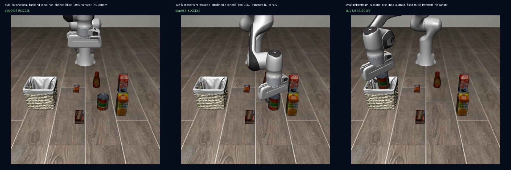

# Transport H0 prerequisite canary closeout

Status: **H0 PASS; H1 UNRESOLVED / NOT PAIRED**.

This closeout separates two claims that must not be combined:

1. **H0 engineering prerequisite:** the learned-policy worker imports the exact frozen LeRobot checkout and the pipelined ActionStream backend can drive one GPU LIBERO episode end to end. This passed.
2. **H1 method effect:** moving response delivery off the inference worker improves fixed-950-ms queue depletion across three task families. This was not tested fairly because the formal matrix produced no paired pipelined rows.

## Answer-first result

The exact-checkout GPU canary passed all 14 frozen engineering gates. The X-VLA policy completed the tomato-sauce-to-basket task in 126 environment steps. The worker completed 59 inferences at 8.02 requests/s, with 87.9/146.7 ms p50/p95 steady inference latency. Steady process VRAM peaked at 4,754 MiB and GPU utilization was 50.0% p50, 67.6% p95, and 71.0% max. The delivery scheduler recorded 58 scheduled and 49 delivered responses, with zero hold/depletion steps, fallback activations, inference errors, and out-of-order rejections.

Task success was observed but deliberately was not an H0 gate. This is a one-episode prerequisite canary, not a success-rate or method-superiority experiment.

| Frozen H0 field | Result |
|---|---:|
| Exact LeRobot checkout | `73e1584473028a2d53ecfc856f5290db84507f90` |
| Imported `InferenceEngine` | frozen checkout `src/lerobot/rollout/inference/base.py` |
| Learned policy / task | X-VLA / LIBERO Object task 5 |
| Development reset | 47 |
| Delay / runtime | fixed 950 ms / pipelined aligned |
| Episode completion | PASS; success, 126 steps |
| Completed inference / request rate | 59 / 8.02 requests/s |
| Inference latency p50 / p95 | 87.9 / 146.7 ms |
| Startup / post-startup warmup | 6.371 s / 84.0 ms |
| Queue age p50 / p95 | 22 / 25 control steps |
| Responses scheduled / delivered | 58 / 49 |
| Hold / depletion-safe-hold steps | 0 / 0 |
| Fallback / inference errors / out-of-order | 0 / 0 / 0 |
| Steady process VRAM max | 4,754 MiB |
| GPU utilization p50 / p95 / max | 50.0% / 67.6% / 71.0% |

The 6.371-second first request confirms why startup and steady state must remain separate. The second warmup request was 84.0 ms, consistent with the scored steady-state distribution; raising the frozen 5-second deadline was not needed for the episode and was not performed.

## Content-level visual check

The locally decoded 640×640, 20 FPS video contains 127 frames and decodes without error. The progression visibly shows the robot starting above the scene, approaching and manipulating the tomato-sauce can, and finishing with the can inside the basket. The final overlay reports `step 125 | SUCCESS`. This is actual policy-driven scene behavior, not a metric-only visualization.

## Why the formal H1 result is unavailable

The frozen H1 matrix planned 45 episodes: three task families × three runtimes × five paired resets. Only the first serialized-aligned cell completed (5 rows). The first pipelined-aligned child produced 0 rows, so there is no paired contrast, confidence interval, or defensible H1 verdict.

The decisive failure was an import-binding defect: `--lerobot-root` verified checkout `73e158`, but the child process imported the older installed LeRobot `InferenceEngine`, whose constructor did not accept `task`. This caused `TypeError: object.__init__() takes exactly one argument` before the first pipelined episode. It is an engineering prerequisite failure, not evidence for or against the delivery scheduler.

Two earlier receipt validators also failed closed after the completed serialized cell. They changed neither runtime behavior nor results. The exact-checkout H0 canary then exposed one preflight-only venv-symlink bug; that attempt started no GPU child and consumed no reset. All four incidents and their scopes are preserved in `failure_taxonomy.csv`.

## Gate outcome

| Claim | Verdict | Evidence boundary |
|---|---|---|
| Exact frozen LeRobot source reaches the worker | PASS | import path and constructor checked before child |
| Pipelined backend performs learned GPU inference | PASS | one X-VLA development episode |
| Delivery worker schedules and delivers responses | PASS | 58 scheduled, 49 delivered |
| GPU systems telemetry is real and process-resident | PASS | 159 `nvidia-smi` samples; 49 steady resident samples |
| Policy-driven qualitative behavior is visible | PASS | decoded 127-frame video and progression image |
| H1 reduces depletion versus serialized aligned | UNAVAILABLE | 0 paired pipelined rows |
| H1 preserves success across three families | UNAVAILABLE | formal matrix not run |
| Production soak / real remote service / real robot safety | NOT CLAIMED | out of scope |

## Validation

- Focused H0/H1 protocol and closeout tests: 15/15 passed locally and remotely.
- Remote full repository suite: passed after binding the existing clean LeRobot checkout as an editable 0.6.2 dependency with exact commit provenance. Existing marked skips and warnings remained; there were no failures.
- Dependency preflight returned `install_mode=editable_git`, version `0.6.2`, commit `73e1584473028a2d53ecfc856f5290db84507f90`, and a clean local checkout.
- The local Windows full suite has one environment-only failure because that local venv does not expose `lerobot-rollout`; all other local tests passed. This is not represented as a clean-install pass.
- The H0 video was fully decoded with `ffmpeg`; its 127 frames, dimensions, FPS, and content were checked locally.

The dependency binding used the already cloned checkout with `--no-deps`; it did not change candidate source bytes or rerun the GPU canary. The binding log SHA-256 is `66b5353e53952de15a6701b304eb482546d0c8d255c10c9aa78bc4917548bab9`; the final full-suite log SHA-256 is `0dea090b8d856314f74469cc71ba52685453a788dc239cb9e90b569fe0dbc50d` and ends with `FULL_SUITE_EXIT=0`.

## Provenance

- ActionStream candidate bytes: `1268bcc5237422ae80bbb88b57e5efc155a8936b`.
- Exact LeRobot checkout: `73e1584473028a2d53ecfc856f5290db84507f90` (`feat(rollout): allow third-party inference engines`).
- X-VLA revision: `12e8783e996944f5c97e490d37d4c145484ed70a`.
- H0 protocol SHA-256: `9710c0a54ceee346150a5ca5458f3ac910cd3c0de7fdf6f659603d04a381d9de`.
- H0 episode JSONL SHA-256: `efaee44616e825ebfd43c898c36b4f9bc6ffaf87f00dfea5ca0a49a98a42ed06`.
- H0 video SHA-256: `cf9f2401d30fb763df8a0ba90ef6c6487735af8a0d8bcedb4fafcb6f1fb7f0a3`.
- Raw local/remote closeout archive SHA-256: `c8742250c1248b8e1793060fd677a72dab79a8e59191f723d1cc4bd422cea7ae`.
- Post-archive dependency-binding log SHA-256: `66b5353e53952de15a6701b304eb482546d0c8d255c10c9aa78bc4917548bab9`.
- Final remote full-suite log SHA-256: `0dea090b8d856314f74469cc71ba52685453a788dc239cb9e90b569fe0dbc50d`.
- Tracked qualitative image SHA-256: `c49ae8301716b55e728a543484dc4f47a45bd8a1d22943d8779d2a493d523af8`.

The raw archive and video remain outside ordinary Git. See `evidence_manifest.json` for paths and hashes.

## Decision

H0 is now closed positively. H1 must remain unresolved. Do not repair the consumed H1 output in place and do not quote the five unpaired serialized rows as a scheduler result.

If another GPU allocation is authorized, the only scientifically valid continuation is a new H1-R2 namespace with a clean output root. Its preflight must assert the exact imported LeRobot file and constructor before consuming any formal reset. Otherwise, this is an honest and useful engineering closeout point: exact-checkout integration works, but the method-effect claim is still absent.
