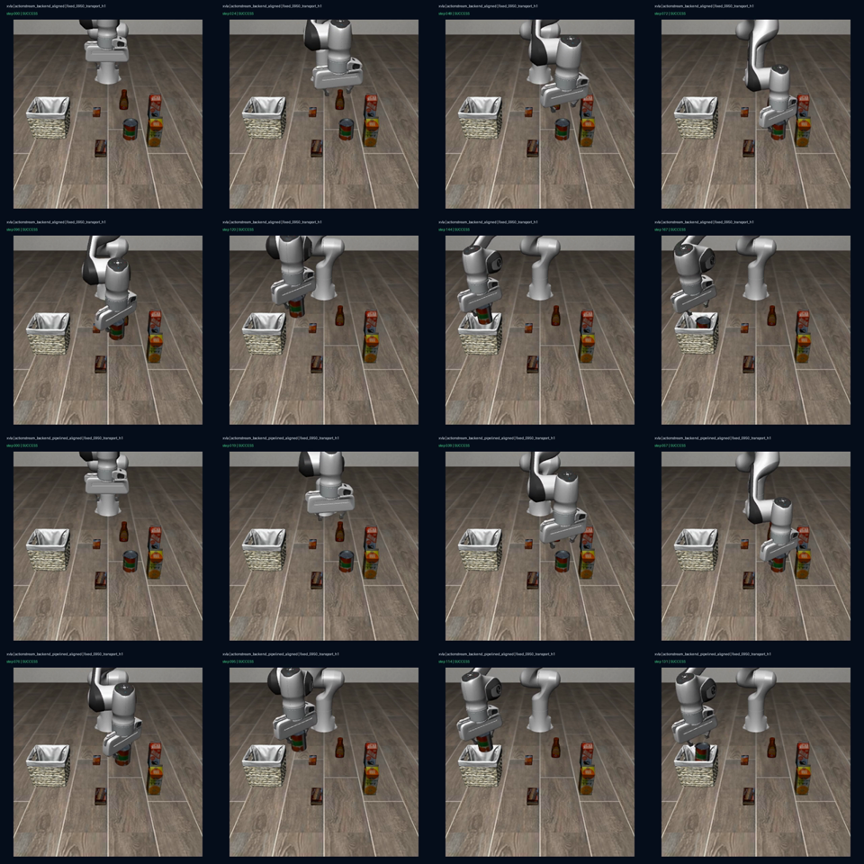

# ActionStream transport H1: frozen fixture and one X-VLA GPU canary

## Verdict

**PASS for the frozen transport hypothesis and its single GPU integration canary.**

At the tested fixed-950-ms operating point, the formal backend's queue depletion
was primarily caused by serializing response delivery inside the only inference
worker. Moving only the injected delivery wait to a cancellable response scheduler
removed depletion in both the three-repeat fixture and the one-state X-VLA CUDA
canary. This is a positive systems result, not evidence of universal policy
superiority.

## One hypothesis, frozen before results

H1 changed exactly one variable: whether the 950-ms delivery delay blocks the
inference worker. Both variants kept the same latest-observation mailbox, one
policy-compute worker, 20-Hz controller, 30-action chunks, elapsed-prefix
alignment, two-step bounded hold, disabled latest-only fallback, and identical
task/checkpoint/reset.

The candidate implementation was fixed at `1268bcc5237422ae80bbb88b57e5efc155a8936b`.
The formal fixture protocol was committed before the A/B result. Its initially
predeclared GPU reset 50 was then invalidated before any CUDA episode because the
official task asset has only 50 states (legal indices 0--49). Reset 39 was selected
and frozen because it was absent from all prior X-VLA task-5 scored and warmup
identities. No policy result was inspected during this correction.

## Engineering/test closure

- Locked LeRobot source: fork commit `73e1584473028a2d53ecfc856f5290db84507f90`.
- Real `lerobot-rollout --help` subprocess discovers the installed ActionStream
  inference plugin.
- Remote clean/isolation checkout: 334 tests collected, 322 passed, 12 skipped,
  exit 0.
- Historical protocol tests now compare hashes to their historical Git commits,
  not the moving working tree.
- M8 raw summaries are explicitly treated as an external archive; tracked
  matrix/replay/analysis/manifest files form the clean-clone verification boundary.
- The old M8 canonical-M4 replay is honestly marked blocked because today's
  `runtime.py` is no longer byte-identical to the accepted M4 commit.
- The new scheduler cancels pending delivery on reset/stop and rejects a response
  that arrives after a newer source step.

## Frozen fixture result

The fixture used three repetitions per variant, 150-ms policy compute, 950-ms
delivery, 20 Hz, 30-action chunks, and 120 scored control pulls.

| Metric | Serialized | Pipelined | Contrast |
|---|---:|---:|---:|
| Median request rate | 1.060 req/s | 6.822 req/s | **6.44x** |
| Median depletion fraction | 40.0% | 0.0% | **100% reduction** |
| Fallback activations | 0 | 0 | unchanged |
| Out-of-order rejections | 0 | 0 | gate passed |

Every predeclared gate passed; the machine-readable result hash is
`9a51267fdc018d3a2994116220aa2e5abd726c58204e6233960a7f6f8a11854d`.

## One-session X-VLA GPU canary

Paired identity: LIBERO Object task 5, reset 39, seed 2026082139, X-VLA revision
`12e8783e996944f5c97e490d37d4c145484ed70a`, fixed 950 ms. Each runtime used a
fresh Python process inside the one authorized GPU session.

| Metric | Serialized aligned | Pipelined aligned | Contrast |
|---|---:|---:|---:|
| Policy success | 1/1 | 1/1 | descriptive only |
| Completion steps | 167 | 131 | **-21.6%** |
| Episode wall time | 9.995 s | 7.635 s | **-23.6%** |
| Request rate | 0.900 req/s | 8.383 req/s | **9.31x** |
| Depletion safe-hold pulls | 74/167 (44.3%) | 0/131 (0%) | **100% reduction** |
| All hold fraction | 52.1% | 0% | **-52.1 pp** |
| Inference p50 / p95 | 131.9 / 186.0 ms | 87.4 / 132.3 ms | fresh-process canary |
| Delivery p50 / p95 | 1093.3 / 1150.4 ms | 1046.8 / 1092.5 ms | measured end-to-end |
| Queue-depth p50 / p95 | 0 / 21.7 | 9 / 23.5 | supply restored |
| Queue-age p50 / p95 | 24 / 29.1 steps | 22 / 24.5 steps | lower age |
| Steady process VRAM max | 4754 MiB | 4754 MiB | equal |
| Steady GPU utilization p50 / p95 | 0 / 38.8% | 57 / 62% | worker kept busy |
| Fallback / out-of-order rejection | 0 / 0 | 0 / 0 | gates passed |

All GPU canary system gates passed. The single paired policy outcome has no
confidence interval and is not used as a success-rate claim.

The videos were decoded and visually inspected locally. Both begin from the same
scene, approach and grasp the tomato-sauce container, carry it leftward, place it
inside the basket, and end with the overlay reporting success. The pipelined run
reaches the same visible terminal state in 131 instead of 167 control steps. No
obvious collision or off-task object manipulation appears in the sampled frames;
this visual inspection is not a hardware-safety assertion.

## Important limitations and remaining blockers

1. This GPU evidence is one task and one reset. It validates CUDA integration and
   the queue-supply mechanism, not a multi-task success-rate improvement.
2. Fixed 950 ms has no trace entropy. The scored reset/seed is new, but this run
   does not answer jitter, burst, outage, or guarded-fallback behavior.
3. Delivery delay is injected in-process. This is not yet a multiplexed remote RPC
   service, disconnect soak, CUDA-OOM recovery test, or production transport.
4. Both fresh processes had a cold first worker call above the frozen 5-s advisory
   deadline (6.385 s and 6.036 s), then recovered. Scored metrics were reset after
   warmup, but production startup readiness must be separated from steady-state
   request deadlines.
5. The warmup event list counts a timed-out computation differently between inline
   and scheduled delivery. Startup wall latency is usable; the warmup model-latency
   list should not be treated as a paired metric.
6. There is no real robot, safety controller, E-stop, or real-network claim.

The evidence supports: **"Implemented a cancellable pipelined response-delivery
backend for LeRobot; on a frozen fixed-950-ms X-VLA/LIBERO GPU canary it increased
request supply 9.31x, eliminated 74 depletion pulls, and reduced completion steps
21.6%, with identical peak process VRAM."** It does not support "universally beats
Async/RTC/aligned baselines."

## Evidence boundary

- Frozen protocols: `configs/actionstream_transport_h1*.json`
- Machine-readable tracked summary: `reports/actionstream_transport_h1/summary.json`
- Raw fixture, episodes, traces, JSONL telemetry, receipts, and both MP4 files:
  `artifacts/transport_h1_20260821/` (intentionally Git-ignored)
- Remote full-suite log SHA-256:
  `b5a9b9e0e7ddc9faa3c9bdcba2c3af7a2dad1342b6a45acdaaf738bdfd0cd90b`
- GPU-session log SHA-256:
  `578222ffa04eb00d59145036b92114dcbd581495e3899bc29606ccb19825b2d0`
