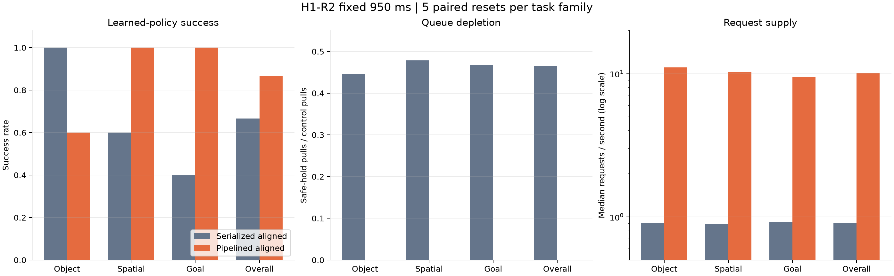
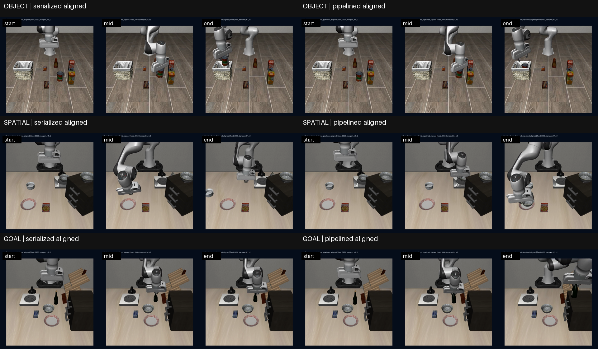

# ActionStream H1-R2: three-family learned-policy delivery-pipeline holdout

## Verdict

**GO. All seven pre-registered gates passed.**

At fixed 950 ms, moving only response delivery out of the single inference worker increased the median paired request rate by **11.43x**, reduced aggregate queue depletion from **46.6%** to **0.0%**, and changed learned-policy success from **10/15** to **13/15**.

The success effect is positive but statistically uncertain: **+20.0 pp**, paired bootstrap 95% CI **[-13.3, +53.3] pp**. This is a strong delivery-pipeline mechanism result, not proof that pipelining universally improves policy success.

## Frozen matrix and integrity

- Three genuinely different LIBERO task families: Object task 5, Spatial task 7, and Goal task 2.
- Five unused paired resets per family (states 10-14), identical policy seed/checkpoint/observation/action contract per pair.
- Two runtimes only: serialized aligned versus pipelined aligned; fixed 950 ms only; 30 scored episodes in six fresh processes.
- Exact LeRobot checkout: `73e1584473028a2d53ecfc856f5290db84507f90`; X-VLA revision: `12e8783e996944f5c97e490d37d4c145484ed70a`.
- Raw artifact manifest verified **99/99**; no missing or mismatched file; 15/15 complete pairs.
- Raw archive SHA-256: `a7871e46485e851bea8f53afbdd55c5cb0653f3c71c6db07c6562c9dbe9374cd` (3099924 bytes).

## Pre-registered gates

| Gate | Actual | Threshold | Result |
|---|---:|---:|:---:|
| aggregate_request_rate_ratio | 11.4274 | >= 4 | PASS |
| aggregate_depletion_reduction_fraction | 1 | >= 0.8 | PASS |
| pipelined_aggregate_depletion_fraction | 0 | <= 0.05 | PASS |
| task_families_with_lower_depletion | 3 | >= 3 | PASS |
| responses_rejected_out_of_order | 0 | <= 0 | PASS |
| fallback_activations | 0 | <= 0 | PASS |
| pipelined_success_count_not_lower | 3 | >= 0 | PASS |

## Main results

| Metric | Serialized aligned | Pipelined aligned | Contrast |
|---|---:|---:|---:|
| Success | 10/15 (66.7%) | 13/15 (86.7%) | +20.0 pp |
| Mean completion steps (failures=300) | 201.33 | 137.93 | -63.40, CI [-118.20, -5.47] |
| Median request rate | 0.902/s | 10.110/s | 11.43x, CI [10.94, 11.81] |
| Depletion safe-hold pulls | 1407/3020 (46.6%) | 0/2069 (0.0%) | 100.0% reduction |
| Inference calls | 159 | 1261 | 7.93x compute calls |
| Dropped elapsed-prefix actions | 2862 | 21623 | 7.56x |
| Median inference p50 / p95 | 122.9 / 221.9 ms | 71.3 / 98.0 ms | fresh-process descriptive |
| Median queue age p50 / p95 | 24.0 / 29.0 steps | 21.0 / 23.9 steps | lower age |
| Steady GPU utilization p50 / p95 | 0.0% / 33.0% | 68.0% / 79.0% | higher utilization |
| Steady process VRAM max | 4844 MiB | 4844 MiB | equal |

## Family breakdown

| Family | Serialized success / mean steps | Pipelined success / mean steps | Direction |
|---|---:|---:|---|
| Object | 5/5 / 160.8 | 3/5 / 197.8 | success -2, steps +37.0 |
| Spatial | 3/5 / 213.2 | 5/5 / 123.8 | success +2, steps -89.4 |
| Goal | 2/5 / 230.0 | 5/5 / 92.2 | success +3, steps -137.8 |

The aggregate GO is not homogeneous. Goal improved 2/5 to 5/5 and Spatial 3/5 to 5/5, but Object regressed 5/5 to 3/5 (failed states 13 and 14). The captured Object video is state 10, so it cannot diagnose those two uncaptured failures.

## Qualitative video review

All six MP4 files decoded successfully and were visually inspected locally. The paired state-10 videos begin from matched scenes. Object reaches the visible basket placement under both runtimes. Spatial and Goal show serialized `RUN/FAIL` at step 300 versus pipelined `SUCCESS` at steps 123 and 93; the terminal states and overlays agree with the episode records. This is simulator-content evidence, not a hardware-safety claim.

## Interpretation and claim boundary

1. **Observation:** the request-supply and depletion gates pass by a wide margin on every family. **Interpretation:** the 950-ms delivery wait was blocking the sole inference worker. **Implication:** delivery scheduling is a real backend bottleneck, not a selector artifact.
2. **Observation:** aggregate success rises by three episodes, but the paired success CI crosses zero and Object loses two successes. **Interpretation:** keeping the action queue full changes closed-loop trajectories in task-dependent ways. **Implication:** claim a mechanism-level GO, not universal policy superiority.
3. **Observation:** inference calls increase 7.93x and steady GPU utilization rises from 0% to 68%. **Interpretation:** the current scheduler buys supply by spending substantially more GPU compute. **Implication:** production use still needs a separately frozen request-budget hypothesis; H1-R2 itself must not be retuned.

Supported claim: **implemented and froze a cancellable delivery-pipeline backend; across 30 X-VLA/LIBERO GPU episodes at fixed 950 ms, it increased median paired request supply 11.43x, eliminated 1,407 depletion pulls, and improved aggregate success from 10/15 to 13/15, while exposing an Object-family regression and a 7.93x compute-call cost.**

Not supported: jitter/burst/outage generalization, RTC/Async superiority, real remote-RPC recovery, real-robot safety, or universal success improvement.

## Evidence files

- `episode_table.csv`: all 30 scored rows.
- `main_table.csv`, `task_table.csv`, `paired_effects.csv`, `gates.csv`, `gpu_systems.csv`, `failure_taxonomy.csv`: curated metrics and decisions.
- `video_review.json`: six-video decode/provenance receipt and human review boundary.
- `raw_artifact_manifest.json`, `remote_orchestrator_receipt.json`: exact remote receipts.
- Raw archive and MP4s remain under the Git-ignored local `artifacts/actionstream_transport_h1_r2/` boundary and on the server; they are not placed in normal Git.
