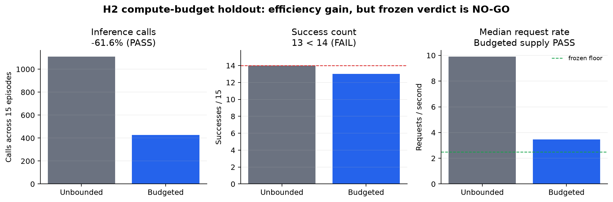
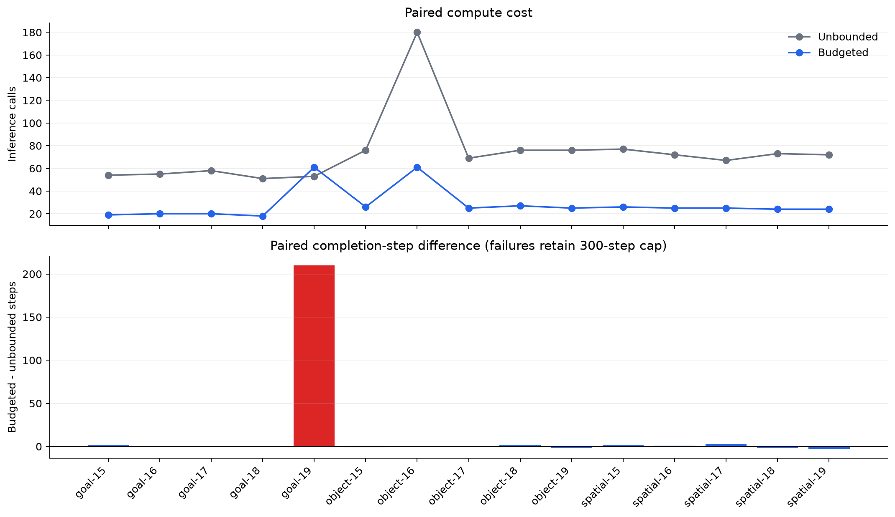
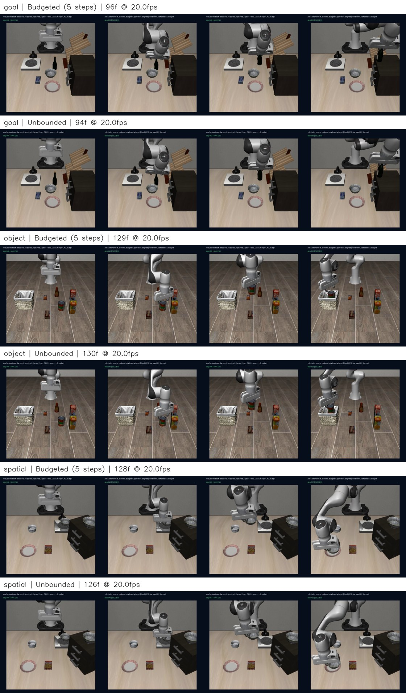

# ActionStream H2 compute-budget holdout — NO-GO

The frozen H2 hypothesis is **not accepted**. A five-step request budget cut aggregate X-VLA inference calls substantially and preserved queue supply, but it lost one paired success relative to the unbounded pipelined aligned runtime. The predeclared success gate therefore fails.

## Frozen result

| Metric | Unbounded pipelined | Budgeted (5 steps) | Frozen verdict |
|---|---:|---:|---|
| Success | 14/15 | 13/15 | **FAIL**: budgeted < unbounded |
| Aggregate inference calls | 1109 | 426 | **PASS**: ratio 0.384, 95% CI [0.341, 0.481] |
| Call reduction | — | 61.6% | Gate requires at least 50% |
| Median request rate | 9.901/s | 3.462/s | **PASS**: budgeted >= 2.5/s |
| Aggregate depletion | 0.00% | 0.00% | **PASS** |
| Mean completion steps | 125.67 | 139.80 | paired delta +14.13, CI [-0.47, +42.53] |
| Out-of-order / fallback / timeout / error | 0/0/0/0 | 0/0/0/0 | **PASS** |

Paired success difference is -6.7 percentage points, bootstrap 95% CI [-20.0, +0.0] pp. The formal decision uses the frozen count gate, not CI significance.

## Family breakdown

| Family | Success U -> B | Calls U -> B | Call reduction | Mean steps U -> B | Depletion B |
|---|---:|---:|---:|---:|---:|
| libero_goal | 5/5 -> 4/5 | 271 -> 138 | 49.1% | 93.2 -> 135.6 | 0.00% |
| libero_object | 4/5 -> 4/5 | 477 -> 164 | 65.6% | 161.8 -> 161.6 | 0.00% |
| libero_spatial | 5/5 -> 5/5 | 361 -> 124 | 65.7% | 122.0 -> 122.2 | 0.00% |

The only paired regression is `libero_goal`, state 19: unbounded succeeds in 90 steps while budgeted reaches the 300-step cap. Object state 16 fails under both runtimes. No failure video exists because the frozen capture contract records episode 0 only; the scored traces and telemetry are retained, so the semantic cause is intentionally left unclaimed.

Goal-family call reduction is 49.1%, below 50%, because the budgeted state-19 failure runs to the full 300-step cap. The formal compute gate was frozen at aggregate level, so this is a heterogeneity warning rather than an additional post-hoc failure gate.

## GPU and runtime evidence

| Metric | Unbounded | Budgeted |
|---|---:|---:|
| Actual-worker startup latency p50 | 4.34 s | 4.41 s |
| Post-startup worker warmup p50 | 72.87 ms | 73.69 ms |
| Pooled steady inference latency p50 / p95 | 72.69 / 111.59 ms | 152.55 / 183.78 ms |
| Steady GPU utilization p50 / p95 | 65.0% / 78.0% | 14.0% / 45.1% |
| nvidia-smi process VRAM max | 4844 MiB | 4844 MiB |
| CUDA allocator peak max | 3521 MiB | 3521 MiB |
| Queue age episode-median p50 / p95 | 21.0 / 23.6 steps | 24.0 / 26.0 steps |
| Dropped aligned prefix steps | 18609 | 7572 |
| Budget-skipped observations | 0 | 1673 |

GPU utilization is descriptive, not a frozen gate. Both runtimes use the same X-VLA checkpoint, tasks, resets, fixed 950 ms delivery, safety limits, alignment, and pipelined delivery scheduler; only the minimum request interval differs (1 versus 5 control steps).

The budgeted steady-state p50 inference latency is 2.10x the unbounded value while GPU utilization is much lower and queue age is about three steps higher. These measurements co-occur with the lower request duty cycle, but this holdout does not isolate GPU clocking or another cause. VRAM residency is unchanged.

The separate non-scored CUDA canary used state 20, advanced zero scored environment steps, and recorded first/second inference latencies of 4.564 s / 62.82 ms with a startup CUDA peak of 12251 MiB.

## Representative video check

All six episode-0 MP4 files decoded successfully; four temporal positions per video were sampled into the contact sheet. This validates playable content and policy-driven scene motion, but does not provide footage for the state-19 paired regression.

## Interpretation

1. **Observation:** the budget saves 61.6% of inference calls, keeps median supply at 3.46 requests/s, and eliminates depletion in all three families, but steady p50 inference latency doubles and queue age rises.
2. **Interpretation:** a fixed five-step budget is inside the operating envelope for 14 of 15 paired identities, but it is too coarse to be a universally safe replacement; the goal state-19 divergence is the decisive counterexample. Lower request duty cycle also does not automatically imply lower per-call latency.
3. **Implication:** the useful engineering result is a measured compute/success trade-off, not a superior default runtime. H2 is a strict NO-GO even though most mechanism gates pass.
4. **Next hypothesis:** do not retune or replay H2. If work continues, test one separately frozen release condition that spends extra requests only when a predeclared progress/deadline signal fires; otherwise close the project around the proven pipelined runtime and this negative boundary.

## Evidence boundary

- 3 distinct LIBERO task families, 15 paired identities, 30 scored episodes, 6 fresh GPU processes, 30 traces, 30 telemetry streams, and 6 representative videos.
- Execution Git HEAD: `5b3e4f1251d9ca5230c8ee7c87e9a3d2963f0111`; candidate source commit: `de93aa2b8c4a6f69b02a19c9435c1073e344f54d`.
- Episodes SHA-256: `d956db00f0f99052bad511718f0dd1efc103011570052cb101af275c75ead53d`; transferred archive SHA-256: `c91e347d3b249aea225aa737b45eb641ffa7dc800da20accdf5eee92dcac6d62`.
- Non-scored GPU canary archive SHA-256: `2eb00ee6a401a79b7166fca67bd57d07592ac46fba0e402a1145f5501fffab33`.
- This result does not establish jitter/burst robustness, real remote RPC behavior, RTC, real-robot safety, production soak, or universal superiority.

Machine-readable details: `summary.json`, `paired_episodes.csv`, `family_table.csv`, `failure_taxonomy.csv`, `video_inventory.csv`.
