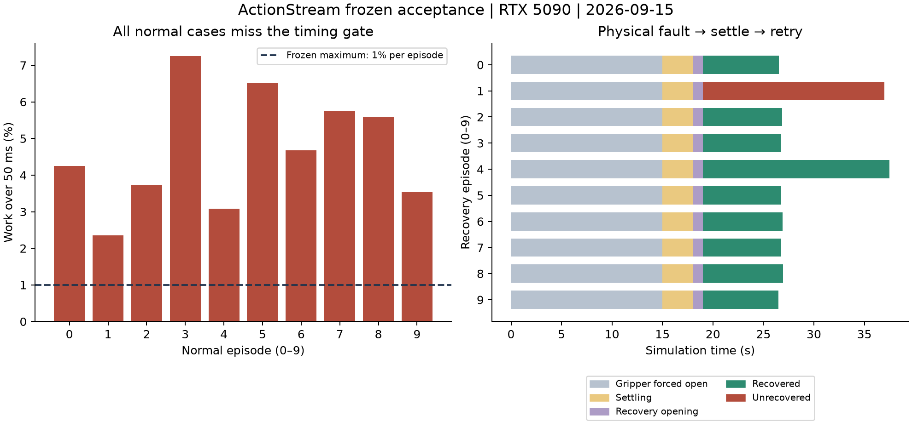
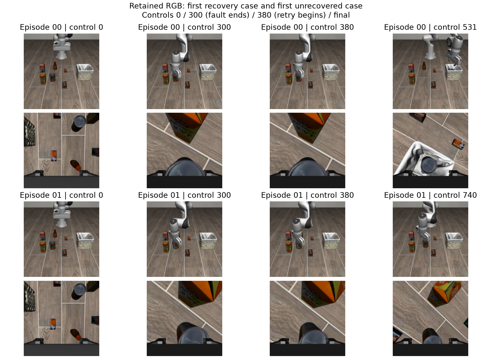

# Frozen asynchronous timing and physical recovery acceptance

**Overall NO-GO:** reproducible delivery passes and the declared physical
recovery gate passes, but asynchronous work-time misses exceed the limit.

Native runtime source: `4570e7caa9fc2e2fcce6094ee40917833f31393c`.
RTX 5090, locked Python 3.12 / CUDA 12.8; protocol and all source hashes were
frozen before the twenty new seeds. Reproducible delivery and independent
backup verification passed first. No acceptance seeds were replaced, rerun for
performance, or used to fit the models or thresholds.

## Normal asynchronous execution: NO-GO

All ten new tasks completed with correct physical truth and stable post-stop
continuation. There were no premature stops, missed completion events, stale
observations or integrity errors. Maximum wall confirmation delay was 1.083 s.

The paced dispatcher did not satisfy the frozen work-time budget:

| Metric | Measured | Frozen requirement |
| --- | --- | --- |
| Safe completions | 10/10 | At least 8/10 |
| Control-period p95, across episodes | 50.38–52.33 ms | Every episode at most 55 ms |
| Maximum control period | 70.62 ms | At most 100 ms |
| Work over 50 ms | 102/2,187 controls (4.66%) | At most 1% in every episode |
| Per-episode work misses | 2.35%–7.25% | At most 1% |

All ten episodes fail the work-miss fraction gate. Safe task completion and
passing automated tests do not make this a timing acceptance pass.



## Physical recovery

Primary result: **GO, 9/10 recovered from 10/10 eligible physical failures**.
There were no premature stops, missed completion events or integrity errors.
The maximum wall confirmation delay was 1.087 s. Seed `2026092201` did not
recover and ended as `unconfirmed_horizon` after the exact 740-control budget;
it was retained in the denominator.

The independent simulator audit restored **7,976 states** and checked **6,916
RGB prediction clips** across all twenty acceptance trajectories. It found 34
contact/containment cache differences after state restoration, with **zero
changes to strict physical-completion labels**. Every difference is retained.
All file hashes and independently recomputed episode scores matched.



The fault clamps physical gripper commands open for controls 1–300. The controller
does not receive the fault schedule. After 300 policy controls and 60 settling
controls, fresh RGB may trigger one retry: twenty opening controls, an invalidated
old action queue, a new request revision and resumed policy in the same scene.
The simulator is never reset between attempts. A case counts as recovered only
when the first attempt physically failed and the second attempt finishes safely.

## Evidence and boundaries

The initial consumed-seed development run failed because CUDA initialization on
the worker remained cold after main-thread warmup. A diagnostic measured 5.19 s
for its first inference and 75 ms for its next inference. The corrected controller
warms its actual worker before controls, discards all warmup actions and refreshes
the unmoved initial observation. Both development runs and the diagnostic remain
in the evidence archive; they are excluded from acceptance rates.

The independent stdlib replay checks original journals, physical truth,
confirmation decisions, action source identities, budgets, clock arithmetic,
layout exclusions and the frozen GO/NO-GO calculation. Full-state restoration and
RGB clip identity are audited separately in a fresh simulator process.

This is finite LIBERO simulation evidence for one task and one injected actuator
fault. Direct CUDA deadlines remain advisory; physical robot hardware and other
failure types have not been validated. CI success means the implementation and
retained report checks pass, and is separate from the native acceptance verdict.

## Download and replay

The full archive `async-acceptance-v2-full.tar.gz` is 1,079,427,385 bytes with
SHA-256 `fe2a65c97c810645a29f014e73824be3b54ba39985e0a019ab27bfc5eb08f230`.
It includes every state/RGB trajectory, source freeze, development failure,
worker diagnostic, physical audit and file manifest. The 6,145,296-byte compact
archive is retained here as `raw_records.tar.gz` with SHA-256
`ffba050b90aeb59a26bbe2c45eb701c1b0e1e4d8c146bb546c090e58a273edef`.

```bash
gh release download agent-delivery-20260915 \
  --repo Yanagisawa2002/ActionStream --pattern async-acceptance-v2-full.tar.gz
python reports/async_agent_20260915/verify_evidence.py
# After checking the archive SHA-256 and extracting into a new directory:
python reports/async_agent_20260915/verify_evidence.py \
  --bundle /absolute/path/to/extracted/async-acceptance-v2-full
python scripts/engineering/plot_async_acceptance.py \
  --run /absolute/path/to/extracted/async-acceptance-v2-full/async-acceptance-v2 \
  --output /absolute/path/to/figures
```

`--bundle` verifies all 470 files. Without it, the replay validates compact
records and the preserved state-audit receipts; it does not read external RGB
arrays. The plotter supports `--skip-frames` for compact-record-only charts.

The full archive was independently downloaded and all 470 files passed; see
`backup-verification.json`. Both this archive and the earlier delivery archive
are retained in the private Draft release and independent local storage.
