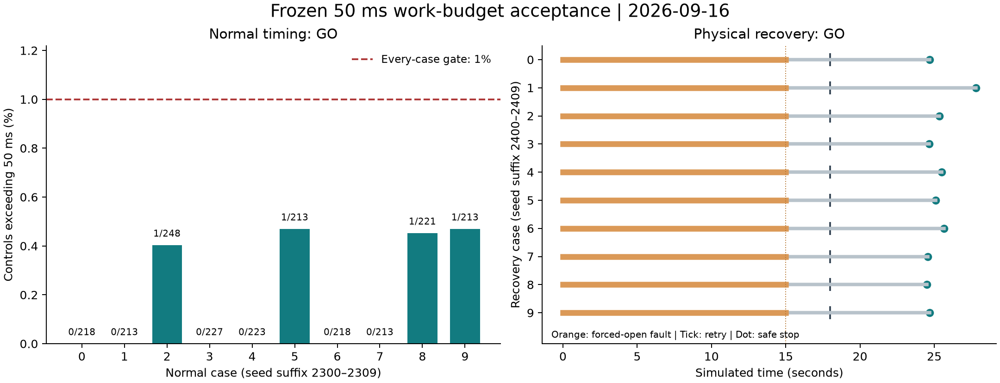

# Frozen 50 ms control-budget acceptance

**GO for the declared finite simulation protocol.** The new normal holdout has
4 work-budget misses in 2,207 controls (0.181%); all ten episodes individually
satisfy the unchanged 1% limit. The independent physical recovery holdout recovers
10/10 eligible failures. All twenty cases complete safely with no premature stop,
missed completion event, stale observation or integrity error.

Runtime: `565f2093505d7fbc7be1b38e122e9a561494f21d`, RTX 5090,
Python 3.12 / Torch 2.8.0 / CUDA 12.8. The
[original timing NO-GO](../async_agent_20260915/README.md) remains unchanged.
The two holdouts use different layouts, so their rates are descriptive results,
not a paired causal estimate or a demonstrated generalization guarantee.

## What consumed-data diagnosis established

The old 2,187 controls averaged 34.78 ms of work. Its 102 misses averaged
54.44 ms, including 39.01 ms in native simulation and 4.12 ms in the recorded
RGB inference span. Detailed new profiling on consumed seeds separates:

| Stage | Detailed development observation |
| --- | --- |
| Simulation advancement | Mean 22.45 ms; 39.95 ms on missed controls; includes 25 physics/control substeps |
| Image preprocessing | Mean 2.86 ms per invocation, originally repeated by recorder and verifier |
| RGB verification | Mean 4.36 ms for prediction; total verifier span includes image/history work |
| GPU transfer/readback | Mean host-to-device 0.137 ms; result readback wait 0.047 ms |
| Journal writes inside measured work spans | Mean 0.095 ms |

These spans are nested and overlap. They cannot be summed. CUDA event duration
includes stream contention, and does not isolate exclusive GPU compute. Recorded
CPU stalls localize the main tail to native simulation during concurrent VLA work;
the measurements do not separately quantify GIL and CUDA-context contributions.
The unchanged work timer ends just before writing its own dispatch event. Full
CPU profiles also retain those later writes; generated development metrics report
work through dispatch-journal completion, including intervening serialization and
lock wait. Control-period measurements include journal overhead and pacing.
For the selected consumed normal cases, including dispatch-log completion adds
0.090 ms on average (0.572 ms maximum) and leaves the miss count at 2/622.

Single-thread BLAS, single-thread Torch, a 1 ms Python switch interval, RGB
caching alone and batched output conversion still left development cases above
the miss limit. All attempted configurations and their full raw profiles remain
in the development backup. The selected process-isolated configuration achieved
2/622 misses on three consumed normal seeds, and recovered both consumed fault
cases with 1/1,081 misses. These are development results, excluded from acceptance.

## Implemented changes

- The ActionStream worker sends public observations to a spawned native VLA
  process; the control thread retains all simulator writes. The existing mailbox,
  action queue, source identities and reset epochs continue to govern dispatch.
- Recorder and verifier share immutable per-observation RGB preprocessing. New
  observations and request revisions cannot reuse another observation's pixels.
- The pinned stateless official action processors operate on flattened batch/time
  rows. CPU tests and the first actual GPU warmup chunk matched the former
  per-timestep outputs exactly; unknown processor pipelines are rejected.
- Recovery retains the warmed child and RNG stream while invalidating the old
  action queue. It does not reset the physical scene. Close reaps the owned child.

Models, thresholds, eleven-observation confirmation, 150 ms observation freshness,
one-second action-source freshness, forty post-stop controls and the retry budget
are unchanged. Thread-count and Python switch-interval experiments were not deployed.

## Fresh acceptance after implementation freeze

Installed CLI delivery passed first. Source, protocol and 142 excluded historical
layouts were then frozen before seeds `2026092300–2309` (normal) and
`2026092400–2409` (recovery). Each seed ran once; none was replaced or retried for
performance. The implementation and all numerical gates remained frozen.

| Metric | Original normal holdout | New normal holdout | Requirement |
| --- | --- | --- | --- |
| Safe completion | 10/10 | 10/10 | At least 8/10 |
| Work over 50 ms | 102/2,187 (4.66%) | 4/2,207 (0.181%) | Every episode ≤1% |
| Worst episode miss fraction | 7.25% | 0.469% | ≤1% |
| Episode control-period p95 | 50.38–52.33 ms | 50.36–50.49 ms | ≤55 ms |
| Maximum control period | 70.62 ms | 57.70 ms | ≤100 ms |
| Timing verdict | NO-GO | GO | All episodes pass |

New recovery: **10/10 eligible physical failures, 10/10 safely recovered**.
There were 2/5,450 work misses (0.037%). Recovery timing is reported descriptively;
its frozen gate requires physical eligibility, successful recovery and correct
stopping. The 1% per-episode timing gate is the normal phase's acceptance gate.



## Independent checks, delivery and limitations

A fresh simulator process restored **7,677 states** and checked **6,577 RGB
prediction clips**. It found 74 state-restoration fact differences, with **zero
changes to strict completion labels**. Every difference is retained. Raw trajectory
hashes, source identities, clock arithmetic and independently recomputed scores
are checked by separate native and stdlib replays.

The current installed environment independently reinstalls this root package and
plugin over hard-linked immutable dependencies from the previously verified
environment; all 151 distribution versions match. Supported CLI execution passes;
an unsupported request exits before backend creation, with empty offline caches.
Fresh network installation attempts failed or were too slow and remain logged.
This receipt proves the installed clone, rather than a completed fresh network install.

An initial acceptance setup failed closed because the delivery receipt builder
looked for a score in the wrong JSON file. It produced only `environment.json`,
before parser calls or new-seed access. That failed namespace remains in the
backup. The corrected delivery receipt predates the successful source freeze.
Early development source snapshots were recovered by their original SHA-256;
an initially misformatted reconstruction was rejected and its failure log retained.

Process loading and warmup happen before paced controls and have separate raw
timing records: worker start/warmup took **20.68–21.80 seconds** across the twenty
cases. The parent still retains its own model for the simulation backend,
so process isolation adds model residency. A 90-second, one-second-interval GPU
sample observed at most **8,850 MiB**; this is not a certified episode peak.
See [generated metrics](metrics.json) for per-phase startup ranges and timing limits.

This is one LIBERO task, one injected forced-open-gripper fault and one GPU.
Direct CUDA deadlines remain advisory. It does not establish hard real-time
execution, real-robot recovery, or performance on other tasks or fault types.
CI checks code and retained evidence; the native protocol determines GO/NO-GO.

## Download and replay

The private Draft release `async-budget-20260916` contains separate full acceptance
and full development archives, plus compact records. Model assets and the verified
base installation remain in the previous `agent-delivery-20260915` delivery archive.
See [acceptance archive identities](evidence_manifest.json),
[development archive identities](development_manifest.json) and the independently
downloaded [acceptance](backup-verification.json) and
[development](development-backup-verification.json) per-file backup receipts.
The 18.7 MB acceptance compact archive is stored in Git as three byte-identical
parts to retain the repository's 10 MiB per-file limit; the replay assembles and
hash-checks them in memory. The downloadable compact archive remains one file.

```bash
python reports/async_budget_20260916/verify_development.py
python reports/async_budget_20260916/verify_evidence.py
python reports/async_budget_20260916/analyze_evidence.py
python reports/async_budget_20260916/plot_evidence.py
gh release download async-budget-20260916 --repo Yanagisawa2002/ActionStream
# Check the manifest's archive SHA-256, then extract into a new directory:
python reports/async_budget_20260916/verify_evidence.py --bundle /path/to/acceptance
```

The compact stdlib replay checks retained journals and the state-audit receipts.
It does not restore physical states or load external NPZ arrays. `--bundle` also
checks every full acceptance file. The [runbook](../../docs/async-budget.md) gives
native execution commands; all listed seeds are now consumed reproduction cases.
