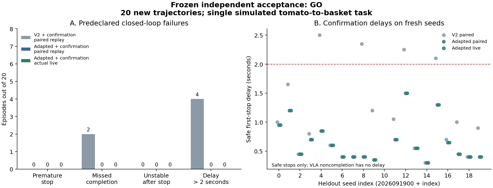

# Frozen completion combination: independent acceptance

**GO within the predeclared single-task simulation protocol.** The adapted RGB verifier plus continuous confirmation passed on 20 previously unused procedural trajectories. Nineteen tasks physically completed and all nineteen stopped correctly; one VLA execution did not complete and never received a success declaration. The original v2 result remains [historically NO-GO](../completion_v2_20260915/README.md).

This is the first independent acceptance after the [development controls and adaptation](../completion_development_20260915/README.md). There was no fitting, checkpoint selection, threshold change, seed replacement or performance-based retry during this acceptance run.

## Freeze and protocol

Implementation and protocol were committed and pushed as `8aacc818458356b07d7a583ab17fbc54c7a4fad5` before the remote freeze and heldout collection.

| Frozen item | Value |
| --- | --- |
| Adapted checkpoint | `28482b40e470d932dfe44312d2dbcb7fa732146a2b2f9c7ebf7683b47cdfa7f9` |
| Protocol SHA-256 | `1854226c0a6a3565647207c66032480a1390f65643b2c15a73264e53f1260e64` |
| Freeze receipt SHA-256 | `0f04e36cea791893d67b12f8b707e2f6a4a50782aad5650c4c44d4b6ff9c5ee6` |
| Input | Three RGB times, offsets 10/5/0; two cameras; 192 x 192 |
| Probability thresholds | Complete >= 0.95; incomplete >= 0.90; otherwise unknown |
| Confirmation | Complete at all eleven consecutive controls spanning 0.5 seconds |
| Interruptions | Negative, unknown or missing control resets confirmation |
| Post-stop behavior | Hold current arm pose, open gripper, execute forty further controls |

The checkpoint was copied into a dedicated immutable run directory and its hash was checked before every phase. The [freeze receipt](freeze.json) binds protocol, implementation, model/confirmation/scorer code, and prior development/consumed-holdout manifests. The inference smoke uses only a previously consumed development clip. It completed before new collection.

The [predeclared protocol](protocol.json) fixes seeds `2026091900` through `2026091919`. Packaged initial states are disabled. The collector rejects duplicate initial object layouts against the original 50 demonstrations, all 20 consumed v2 holdout layouts, all 12 development-control layouts and other current acceptance episodes. Duplicate detection fails the run rather than substituting another seed.

All trajectories use pinned `lerobot/xvla-libero@12e8783e996944f5c97e490d37d4c145484ed70a` on LIBERO Object task 5, tomato sauce into the basket. Each full reference trajectory contains 300 VLA controls plus a uniform 60-control open-gripper settling tail. RGB, physical state, actions and private truth are retained at every 20 Hz control. The verifier is absent during reference collection.

## Primary live acceptance

The physical truth definition remains containment, no finger-pad contact, basket support, linear speed <= 0.03 m/s and angular speed <= 0.3 rad/s, continuously across eleven samples spanning 0.5 seconds. These fields are private scorer inputs. The model sees only RGB; confirmation sees only model decisions and control indices.

| Primary metric | Frozen gate | Actual live result |
| --- | --- | ---: |
| Premature first stops | Zero | **0/20** |
| Missed whole completed events | Zero | **0/19 completed episodes** |
| Confirmation delay | Maximum <= 2 seconds | **Median 0.55 s; maximum 1.50 s** |
| Post-stop stability | All forty controls stable at every stop | **19/19 stable for 2 seconds** |
| Missing post-stop evidence | Zero | **0** |
| Physical task-completion coverage | At least 16/20 | **19/20** |
| Seed coverage | Exactly the declared twenty | **20/20** |

One VLA noncompletion is recorded separately from a missed completed event: no strict completion occurred, and the verifier did not claim success. It remains an execution failure in the overall task success rate (19/20), rather than being removed from the denominator.

That episode is seed `2026091910`. Across all 361 recorded states, the target never satisfies containment or contacts the basket. At the final state it is stationary, outside the basket and not touching the gripper. This is a remaining VLA placement failure. Its absence of a completion declaration is correct.

The first confirmed output actually stops VLA action production in the live loop. The simulator then executes the two-second hold/open action sequence. A later correct output cannot erase an earlier premature first stop. The maximum and median delays include safe first stops only; missing or unsafe stops are counted in their separate primary metrics.

## Identical-reference comparison

Both frozen v2 plus confirmation and the adapted model plus the same confirmation logic are scored on identical full reference trajectories. Each first proposed stop also has an executed simulator continuation from that state. The adapted model is subsequently rerun in the actual VLA continue/stop loop above.

| Metric | Frozen v2 + confirmation | Adapted + confirmation |
| --- | ---: | ---: |
| Premature stops | 0/20 | 0/20 |
| Missed completed episodes | 2/19 | **0/19** |
| No stop | 3 (two misses, one VLA failure) | **1 (VLA failure)** |
| Confirmation delay, median | 1.00 s | **0.55 s** |
| Confirmation delay, maximum | 2.50 s | **1.50 s** |
| Delays exceeding 2 seconds | 4 | **0** |
| Unstable post-stop continuations | 0/17 stops | **0/19 stops** |
| Closed-loop gate | **NO-GO** | **GO** |

The maximum safe delay decreases by 40%. Median delay decreases by 45%, with different valid-stop counts (17 versus 19), so this median comparison is not a matched-pair effect estimate. The full per-seed records allow matched analysis. These are environment trajectories from one frozen training run, not independent training replicates.

The comparison supports the development diagnosis: confirmation suppresses transient early confidence, while broader real-VLA positive coverage helps the verifier maintain enough positive evidence to confirm completed events. The data addition combined real VLA samples and valid static nuisance variants; this run does not isolate their individual contributions.

The two baseline misses make the mechanism concrete:

- Seed `2026091906`: all 218 physically complete observations receive incomplete (165) or unknown (53); there is no positive run to confirm.
- Seed `2026091907`: only 12 positive decisions occur during 192 physically complete observations; the longest positive run is seven, below the frozen eleven-control requirement.

The adapted combination detects both completed events. Among the 17 episodes where both combinations safely stop, delay improves in 12, ties in five and worsens in zero; the mean paired reduction is 0.474 seconds and median reduction is 0.35 seconds. Across all 19 current live stops, delay is 0.661 +/- 0.349 seconds (mean +/- sample standard deviation), ranging from 0.30 to 1.50 seconds. These statistics describe this single-run heldout set.

### Raw predictions remain diagnostic

| Dense per-observation diagnostic | Frozen v2 | Adapted |
| --- | ---: | ---: |
| Complete observations recognized | 1,734/4,096 (42.33%) | **4,020/4,096 (98.14%)** |
| False complete on incomplete observations | 21/2,924 | **32/2,924** |
| Complete observations missed | 2,362 | **76** |

The adapted model improves positive coverage while raw false-complete outputs increase. **GO applies to the frozen model plus continuous confirmation**, which has zero observed premature stops; it does not authorize stopping on a single model output. The 0.5-second confirmation policy must remain part of the accepted combination.

## Separate difficult-sequence acceptance

Before any verifier scoring, the first four seed-ordered references with both a 21-control held interval and a 21-control strictly complete interval supply the challenge sources. Selection uses physical facts only.

Each source supplies eight 21-control sequences: actual held states, above-basket target, wrong object, target outside, recent drop, external-camera blackout, wrist-camera blackout and both-camera blackout. The model evaluates the eleven controls 10 through 20, using its normal 10/5/0 history and unchanged continuous-confirmation gate.

- **20 physical challenge sequences:** zero confirmed false completions.
- **12 camera-blackout sequences / 132 decisions:** zero confident decisions; all abstain.
- **32/32 required sequences present**, with four examples of each category.

Physical interventions are controlled state-rendered sequences: raise the target 0.15 m, shift it 0.30 m outside, swap target/BBQ positions, or move it outside from sequence control 11. Their false containment is checked in each transformed state. They are not naturally executed physical motion, and the short pre-drop positive interval is not used to claim event-recall coverage. Blackouts test sensor loss and do not establish natural-occluder robustness. These sequences form a separate acceptance stratum and are not counted as additional natural VLA trajectories.

## Evidence and reproduction

Run `python reports/completion_acceptance_v3_20260915/verify_evidence.py`. This standard-library audit reuses only pure math from the previous independent auditor and imports no production model, confirmation or simulator code. It verifies hashes and freeze ordering, recomputes labels from private facts, derives decisions from probabilities, replays consecutive confirmation and the four primary metrics, and checks challenge coverage and verdict calculation. Clip confusion counts remain diagnostic in `independent_replay.json`.

The independent replay **passed**, checking 14,040 paired prediction records and 704 challenge decisions in addition to the live journals. All twenty live prefixes match their reference RGB, actions and physical states exactly up to the actual stop (or horizon). Reproduce the cohort/error analysis with `analyze_results.py` and the figure with `plot_results.py` in this folder.

The separate simulator-state audit restored **11,374 reference, live and post-stop states**. Fifty controls show contact/containment cache differences after restoration and forward computation; **zero strict completion labels change**. Raw differences are retained in `state-replay-audit`. The audit also independently compares live/reference RGB and state prefixes.

Exact executed code and protocol snapshots, manifests and verdicts remain readable. Raw per-episode JSON/XML records are archived losslessly with content hashes in `archived_records.json`. Full RGB/state arrays and the frozen checkpoint remain outside Git on the existing RTX 5090 server. The checkpoint also matches the local backup retained from development. No training or new server rental occurred, and the server remains running.

The acceptance implementation passed [full PR CI](https://github.com/Yanagisawa2002/ActionStream/actions/runs/34946775637) and [push CI](https://github.com/Yanagisawa2002/ActionStream/actions/runs/34946772115). Ten new tests reject unsafe/late stops, missing post-stop evidence, vacuous all-unknown/no-completion passes, duplicate/missing seeds and collapsed completion/escape intervals; the focused local suite passed 30 tests. CI also runs the existing core and upstream compatibility suites.

## What this GO establishes

The current frozen completion-and-confirmation combination clears the predeclared independent acceptance gate for this finite simulated task. It addresses the observed early-stop/whole-event-miss/delay blocker at this scope. The historical v1/v2 outcomes remain unchanged.

Twenty fresh trajectories and one trained checkpoint do not establish rare-error rates or generalization to other tasks, objects, natural occlusions or real robots. Simulated 20 Hz is not proof of a 50 ms wall-clock inference deadline. Qwen grounding was not rerun, and the post-stop claim covers only the measured two-second horizon. The current primary event metric is episode-level; individual complete/escape intervals are retained as diagnostics rather than claiming multi-event-task acceptance.

These twenty seeds and the derived challenge sequences are now consumed acceptance data. Any future model, threshold or confirmation-policy change requires a new untouched acceptance set.
