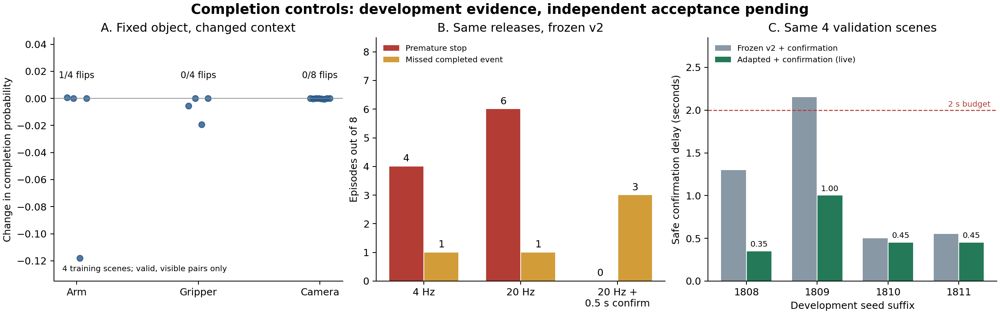

# Completion development controls and adaptation

**Development PASS; independent acceptance is pending.** Two paired controls isolated a limited arm-pose sensitivity and a larger decision-timing problem. Adding real VLA positives and requiring continuous RGB confirmation produced safe stops on all four development validation episodes. The previous [v2 holdout remains NO-GO](../completion_v2_20260915/README.md).

This is one LIBERO Object task: pick up the tomato sauce and place it in the basket. The four validation episodes were used to select the checkpoint. Their live rerun verifies integration on those same seeds; it is not another four independent test cases.

## Frozen setup

- Controls implementation: `af51d2c00f148c0ec440073336014ce589110a2a`.
- Adaptation implementation: `be019d7a81c9b3b002cff6f7b73161bf8fa9ad73`.
- Controls [protocol](../../configs/completion_development_controls.json) was fixed before collection and intervention scoring. The [adaptation protocol](../../configs/completion_adaptation.json) was fixed after those controls and before training.
- Baseline v2 checkpoint: `80dc22b4e646bb8647a5e211b407ac198a1c64ea5db9db71a309c69ccfcd54c7`.
- Selected adaptation checkpoint: `28482b40e470d932dfe44312d2dbcb7fa732146a2b2f9c7ebf7683b47cdfa7f9`.
- Same architecture, RGB preprocessing, three temporal samples at offsets 10/5/0, and thresholds: complete probability >= 0.95; incomplete probability >= 0.90; otherwise unknown.
- Real X-VLA policy: `lerobot/xvla-libero@12e8783e996944f5c97e490d37d4c145484ed70a`. This run did not rerun Qwen language grounding.
- Existing RTX 5090 and installed environments were reused. No additional server rental was needed.

## Data separation and physical truth

Collected 12 new procedural trajectories: eight training seeds `2026091800` through `2026091807`, and four development validation seeds `2026091808` through `2026091811`. Packaged initial states were disabled. Initial object layouts were checked for duplicates against all 50 original demonstrations, the 20 consumed v2 holdout trajectories, and each other. Old holdout layouts were used only for duplicate rejection; their observations and labels were excluded from fitting and checkpoint selection.

Each trajectory contains 300 actual X-VLA controls and a uniform 60-control hold-arm/open-gripper tail. Both cameras and simulator state are saved at every 20 Hz control, including the initial state: 361 records per episode, 4,332 total. All 12 trajectories eventually satisfy strict completion. Collection never consults the completion model.

The private scorer requires containment, no target contact with either finger pad, basket support, linear speed <= 0.03 m/s and angular speed <= 0.3 rad/s, at every one of 11 consecutive samples spanning 0.5 seconds. Simulator facts and segmentation are evaluator/training-label inputs only. The learned model receives RGB only, and its confirmation gate receives only RGB-derived decisions and control indices.

## Control 1: fixed completed object, varied nuisance factors

Four training episodes supply a completed reference state. All nonrobot object poses are fixed exactly while changing arm pose (reference / initial / late), empty gripper (open / closed), and external camera x position (0 / -0.05 / +0.05 m). This yields 72 static renders. Of these, 52 preserve target support/no-contact and have at least 64 segmented target pixels in one camera.

One-factor comparisons use the reference arm, open gripper, and unshifted camera as the reference. Results below exclude physically invalid or insufficiently visible pairs.

| Changed factor | Eligible pairs | Complete -> other decisions | Largest completion-probability decrease |
| --- | ---: | ---: | ---: |
| Arm pose | 4 | 1 | 0.1181 |
| Empty gripper | 4 | 0 | 0.0192 |
| External camera x +/- 5 cm | 8 | 0 | 0.00052 |

The arm intervention on `train_2026091802` changes completion probability from 0.99781 to 0.87970, causing an unknown output. This supports a limited arm-pose sensitivity. It does not establish a general gripper or camera shortcut: two of the four reference images already predict incomplete, giving those pairs a floor effect. Initial-arm poses often make the target insufficiently visible and are excluded from positive invariance claims.

These are static controlled renders, not physically executed arm transitions. Pixel visibility is a proxy, not proof that semantic completion is observable. Camera translations are small and do not cover major viewpoint changes or natural occlusion.

## Control 2: same release trajectories, different decision timing

The model and three-frame RGB input remain frozen. Sparse evaluation reads a decision every five physical controls (4 Hz); dense evaluation reads one every control (20 Hz). Continuous confirmation requires complete decisions at all 11 consecutive control samples spanning 0.5 seconds. Negative, unknown, or a missing control resets the candidate interval.

For each first proposed stop, a simulator branch restores that state and executes 40 additional controls holding the current arm pose with an open gripper. This measures actual post-stop physics. It is distinct from the later live VLA run, where the candidate controls when the original execution stops.

### Eight training trajectories

| Frozen v2 decision mode | Premature first stops | Missed whole completed events | Maximum safe confirmation delay | Unstable post-stop branches |
| --- | ---: | ---: | ---: | ---: |
| Sparse 4 Hz | 4/8 | 1/8 | 0.30 s | 3 |
| Dense 20 Hz | 6/8 | 1/8 | 0.20 s | 6 |
| Dense + 0.5 s confirmation | 0/8 | 3/8 | 1.10 s | 0 |

### Four development validation trajectories

| Frozen v2 decision mode | Premature first stops | Missed whole completed events | Maximum safe confirmation delay | Unstable post-stop branches |
| --- | ---: | ---: | ---: | ---: |
| Sparse 4 Hz | 1/4 | 0/4 | 0.95 s | 1 |
| Dense 20 Hz | 3/4 | 0/4 | 0.00 s | 3 |
| Dense + 0.5 s confirmation | 0/4 | 0/4 | 2.15 s | 0 |

Delays exclude unsafe first stops and missing confirmations; a small delay by itself is not evidence of a good controller. Post-stop failure is conditional on a stop; missing stops are counted separately. A later correct prediction on a recorded trajectory never erases an earlier premature first-stop error.

Increasing the observation rate exposes transient false confidence earlier. Continuous confirmation removes premature stops in this small comparison, but the baseline cannot maintain positive evidence for three training episodes and exceeds the predeclared 2-second delay budget on one validation episode. This supports improving positive-state coverage while retaining continuous confirmation.

## Adaptation based on the controls

Keep all 2,257 original v2 training clips. Add 568 clips from the eight new VLA training trajectories at five-control spacing: 224 incomplete and 344 complete. Of the 344 positives, 248 come from the actual VLA execution phase and 96 from its settling extension. All sampled clips pass the target visibility proxy. Add 52 physically valid, visible static nuisance positives after the eligible arm-pose flip was observed.

Total training data: **2,877 clips = 1,724 incomplete + 703 complete + 450 unknown**. The 620 added clips come exclusively from the eight new training episodes. No validation clip enters the optimizer.

Warm-start the frozen v2 weights. Train 20 epochs / 2,400 optimizer steps with batch size 24, AdamW at 0.00003, weight decay 0.01, inverse-frequency cross entropy, BF16, and gradient clipping. A real backward/optimizer step and exact save/reload comparison passed before full training. No architecture, threshold, or confirmation-duration search was performed.

Checkpoint selection first requires zero premature stops, zero missed completed events, zero post-stop failures and maximum safe confirmation delay <= 2 seconds on the four new development validation trajectories. Auxiliary regressions require zero false completes on 342 original validation physical negatives and abstention on 150 camera-blackout clips. Remaining ties prioritize the predefined event/error ordering and smaller maximum delay; exact ties retain the earliest epoch.

**Epoch 1 was selected.** Nineteen of 20 epochs pass the development gates. Selection has used these four validation trajectories, so they are now consumed development data.

## Actual VLA continue/stop validation

Load the frozen selected checkpoint and rerun the same four validation seeds with actual X-VLA inference and actions. After ten controls of RGB history, evaluate every physical control and stop only on continuous confirmation. On stopping, hold the current arm pose and open the gripper for 40 more physical controls (2 seconds). Truth stays in the independent scorer.

| Seed | Strict completion control | First confirmed stop | Confirmation delay | Stable for all 40 post-stop controls |
| --- | ---: | ---: | ---: | --- |
| 2026091808 | 143 | 150 | 0.35 s | Yes |
| 2026091809 | 136 | 156 | 1.00 s | Yes |
| 2026091810 | 147 | 156 | 0.45 s | Yes |
| 2026091811 | 145 | 154 | 0.45 s | Yes |

- Premature stops: **0/4**.
- Missed whole completed events: **0/4**; all four physically completed and produced a stop.
- Confirmation delay: median **0.45 s**, maximum **1.00 s**.
- Post-stop stability: **4/4** stable throughout the measured 2 seconds.
- Auxiliary physical-negative false completion: **0/342**; camera-blackout confident output: **0/150**.

The selected model's raw dense decisions on the full four recorded validation trajectories still include **11 false completes / 531 negative observations**. Positive clip recall is **860/873 = 98.51%** (eight incomplete and five unknown positives). These are diagnostics. Continuous confirmation is necessary for the observed stopping result; an individual high-confidence output is insufficient.

This live loop is paced by simulated controls. Its 20 Hz observation cadence does not establish a 50 ms wall-clock inference deadline on physical hardware. It uses the task's language instruction and actual X-VLA policy; language parsing/Qwen grounding and other tasks were not revalidated here.

## Evidence verification

Run `python reports/completion_development_20260915/verify_evidence.py` from the repository. The standard-library replay imports none of the production model, truth, or confirmation code. It recomputes physical labels, probability thresholds, consecutive confirmation, first-stop/event metrics, nuisance pairs, data separation, selected epoch, and content hashes. It checks 4,332 collected control records, 4,212 baseline predictions, and 780 live control/post-stop records.

A separate simulator audit restored all 4,952 saved collection/live states and recomputed the physical scorer. Seventeen controls have contact/containment differences between directly stepped and restored/forwarded state caches. **Zero strict completion labels change**, and velocities match exactly. The differing controls all remain incomplete. Raw differences and reconstructed facts are retained in `state-replay-audit`; this check does not restore post-stop states, which were not separately saved.

Raw JSON journals are stored losslessly in each stage's `raw_records.tar.gz`; summaries, manifests, protocols and exact executed source snapshots remain readable. Images, simulator state arrays, data shards and weights remain outside ordinary Git, with hashes in manifests. The selected checkpoint is also backed up locally. The GPU server remains running.

Implementation CI passed at `be019d7`: [run 34942989266](https://github.com/Yanagisawa2002/ActionStream/actions/runs/34942989266) and [run 34942985008](https://github.com/Yanagisawa2002/ActionStream/actions/runs/34942985008). The focused local suite passed 86 tests, including nine new continuous-confirmation/event-metric tests. Automated checks establish code behavior; they do not replace independent model acceptance.

## Next acceptance boundary

Freeze this checkpoint, thresholds and confirmation policy before collecting another unused holdout. Score premature first stops, per-event detection/confirmation delay, missed whole completed events and post-stop stability as primary closed-loop outcomes. Include real VLA releases, regrasp, held-above-basket, wrong object, natural occlusion and later escape/drop conditions. Retain clip recall as a diagnostic.

This development set contains one eventual stable completion per episode; the current event summary is episode-level. Separate multiple completion/release/escape intervals explicitly when the acceptance set contains them. Two seconds of stable stopping does not imply indefinite stability. Four development episodes are insufficient to estimate rare premature-stop risk. No independent GO or deployment claim is made by this report.

## Subsequent independent acceptance

The checkpoint and confirmation policy above were later frozen and evaluated on twenty additional unused trajectories. That separate [acceptance report](../completion_acceptance_v3_20260915/README.md) records GO within the predeclared finite simulation scope. This development report and its original evidence remain a record of the preceding selection stage.
