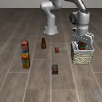
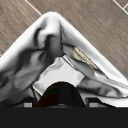
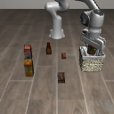
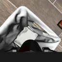
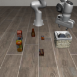
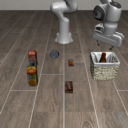
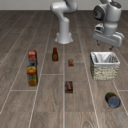

# Frozen completion candidate evaluation

## Decision

**NO-GO for completion acceptance.** The epoch-4 candidate produces false completions on the untouched demonstration split and controlled failure fixtures. The separately authorized simulator experiment uses this frozen candidate for diagnosis.

No weights, thresholds, split membership, or examples were changed after the predictions. The test split is now consumed; a subsequent model selected using these findings needs new evaluation trajectories.

## Frozen inputs

- Checkpoint SHA-256: `35c122539730783bc4c61a65d7515a075385a5ac81a0dd8fa2a34c445a55e7c5`.
- Data manifest SHA-256: `7ae52ff3c456c94368e3c8b1f4b3641982349e615ebd46db2dde1d19253c59c3`.
- Pre-execution protocol SHA-256: `2a65fea1efe4d8222dddbbf8a6466581834d14f0223f2d16ffc701a553d06d85`.
- Candidate: shared ImageNet ResNet18, fixed external/wrist camera slots, epoch 4.
- `p <= 0.1`: incomplete; `p >= 0.9`: complete; otherwise unknown.
- New inference output matched the frozen trainer exactly on one **training** image before test inference. Heldout and stress inference used the original training environment. VLA/LLM dependencies use a separate environment retaining Torch 2.8.0+cu128.
- Native observations are vertically flipped in both views, then resized from 360 to 128 using PIL bilinear interpolation. The legacy Qwen camera rotation is a different convention.

## 1. Untouched trajectories

Sources: [summary](heldout/summary.json), [all 485 predictions](heldout/predictions.jsonl), [pre-execution protocol](heldout/protocol.json).

| Measure | Result |
|---|---:|
| Whole heldout trajectories | 10 |
| Frames | 485 |
| False complete / native-negative frames | **2 / 435 (0.46%)** |
| Confirmed complete / native-positive frames | 45 / 50 (90%) |
| Missed native-positive completion, including unknown | 5 / 50 |
| Confident incomplete on native-positive frames | 0 / 50 |
| Unknown, all frames | 11 / 485 (2.27%) |
| Unknown, positive / negative frames | 5 / 6 |
| Trajectories with any false completion | 1 / 10 |

Frames in one trajectory are correlated. These fractions describe this finite split; they do not establish an independent-trial generalization bound.

### Post-test error diagnosis

Both false completions are in `demo_1`: frame 138 (`p=0.996623`) and frame 147 (`p=0.994270`). The simulator confirms bilateral finger contact with the target and no basket contact at both frames. The first sampled native success is frame 141. Native success returns to false at frame 147.

The [private state audit](post_test_diagnostics/summary.json) also finds that frames 141 and 144 remain grasped although native success is true. Release occurs by frame 150; basket contact is present by frame 153. This is a **label-definition mismatch**: LIBERO's goal tests containment and does not require release or stable placement. The heldout table retains its frozen native labels; this additional audit is not a replacement score.

| Error view | External RGB | Wrist RGB |
|---|---|---|
| Frame 138 |  |  |
| Frame 147 |  |  |

## 2. Predeclared difficult fixtures

Sources: [summary and probabilities](stress/summary.json), [private simulator truth](stress/private_truth.json), [construction receipt](stress/build_receipt.json).

Five fixed training demonstrations generated 45 image pairs. No heldout example or model score selected these fixtures. Each physical intervention was checked against the simulator, then only RGB entered the model. The raw RGB-only NPZ remains on the server; its hash is in the construction receipt.

| Fixture | N | False complete | Unknown |
|---|---:|---:|---:|
| Target still grasped before native success | 5 | **2** | 0 |
| Target 0.20 m above successful pose | 5 | **4** | 1 |
| Target and BBQ sauce positions exchanged | 5 | **5** | 0 |
| Target displaced outside after a successful state | 5 | **5** | 0 |
| Unmodified negative control | 5 | 0 | 0 |
| Unmodified native-positive control | 5 | 0 | 0 |
| External camera fully obscured, positive state | 5 | 0 | 0 |
| Wrist camera fully obscured, positive state | 5 | 0 | 4 |
| Both cameras fully obscured, positive state | 5 | 0 | 5 |

The four physical failure groups contain **16 false completions in 20 native-negative fixtures**. All five native-positive controls are confirmed. Two controls (`demo_23` and `demo_37`) still have bilateral finger contact, providing training-source examples of the label mismatch.

Wrong-object probabilities remain 0.996827–0.999851. After moving the target outside, they remain 0.999704–0.999997. Keeping arm/camera state fixed while changing target identity or position therefore leaves strong completion claims. This supports reliance on arm/view context as a possible shortcut; it does not isolate an exact neural feature.

| Same arm/camera state | Positive control | Wrong object | Target outside |
|---|---|---|---|
| External camera, demo_32 |  |  |  |

The drop fixture is a controlled state displacement after a positive state, not a spontaneously observed policy drop. Camera blackout is a synthetic observability test; natural occluders and partial object occlusion require further coverage. Both-hidden abstention does not establish correct single-view reasoning.

## 3. Diagnostic closed loop

The runner uses real pinned Qwen inference, complete-utterance authorization, official X-VLA action conversion, the frozen dual-camera checker, and a separate simulator truth journal. Initial states 10/11/12, seeds and three utterances were fixed before evaluation. It checks every 30 controls, stops on unknown, and caps execution at 300 controls. Complete claims while still grasped are counted separately from native containment. All-unknown or native-boundary stops cannot pass end-to-end acceptance.

The RTX 5090 VLA smoke passed with raw shape `(1,30,20)` and converted action shape `(30,7)`. All three real Qwen parser calls accepted the complete utterances. The diagnostic run completed in 50.02 seconds after asset setup.

| Initial state / instruction | Controls | Visual decisions | Final native success | Complete while held | Outcome |
|---|---:|---|---|---:|---|
| 10: Please put the tomato sauce in the basket. | 128 | 4 incomplete, then complete | true | 0 | Confirmed at stop |
| 11: Move the tomato sauce container into the basket. | 120 | 3 incomplete, then unknown | false | 0 | Unknown stop, unfinished |
| 12: Pick up the tomato sauce and place it in the basket. | 127 | 4 incomplete, then complete | true | 0 | Confirmed at stop |

Sources: [run receipt](closed_loop/run_receipt.json), [episode 1 score](closed_loop/episode_1/independent_score.json), [episode 2 score](closed_loop/episode_2/independent_score.json), [episode 3 score](closed_loop/episode_3/independent_score.json). Each episode directory includes real parser output, authorization, actions, paired RGB snapshots, runtime and private oracle journals.

There were 375 physical controls, 14 checks and **zero false complete claims** in these three episodes. The two complete claims match native success and no bilateral grasp at that exact stop; both coincide with the simulator's native termination boundary. No post-stop stability horizon was evaluated. One task remains unfinished, so the predeclared three-episode acceptance is **FAIL**, despite trace-integrity scores passing. This small successful-subset observation does not override the heldout and stress failures.

## Reproduction

Use the retained server training inputs under `/root/autodl-tmp/actionstream-agent-20260915`. From the repository root set `PYTHONPATH=src`. The scripts expose the required checkpoint/data/output/protocol arguments via `--help`:

- `scripts/engineering/evaluate_visual_completion.py`: immutable holdout inference.
- `scripts/engineering/stress_visual_completion.py prepare`: simulator fixture construction without model access.
- `scripts/engineering/stress_visual_completion.py score`: RGB inference followed by private truth joining.
- `scripts/engineering/diagnose_completion_errors.py`: post-test simulator audit.
- `scripts/engineering/run_completion_closed_loop.py`: real Qwen/X-VLA diagnostic execution.

Each output is single-use. Reproduction must select a fresh output and preserve the first reported results. The runtime asset manifest pins X-VLA, Qwen and BART files by revision and SHA-256. Materialize BART's pinned snapshot in the Hugging Face cache and set `HF_HUB_OFFLINE=1`, `TRANSFORMERS_OFFLINE=1`, `MUJOCO_GL=egl`, and `PYOPENGL_PLATFORM=egl` for native execution. Full weights/data/fixture blobs remain on the server; compact predictions, truth, image examples and fingerprints are retained here.

## Engineering validation and next candidate

- 66 targeted tests passed: frozen thresholds, camera orientation and abstention accounting, plus existing training, finite-controller, language-authorization and independent-evidence checks.
- Ruff checks and formatting passed. New regression tests are included in CI's explicit list.
- GitHub's full [CI passed on implementation commit e200e7a](https://github.com/Yanagisawa2002/ActionStream/actions/runs/34935838590). Compact metrics and retained source/protocol hashes independently replayed locally.
- All three closed-loop scores were recomputed locally from the raw runtime and oracle journals; the stored scores and all episode observation bindings matched. The selected checkpoint and both thresholds remained frozen throughout.
- The next candidate needs released-and-stable supervision, balanced hard negatives that preserve arm/background while changing target identity/position, and temporal evidence before confirming success. Any selection based on these findings requires new evaluation trajectories.
